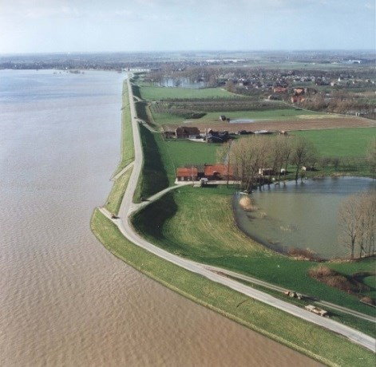
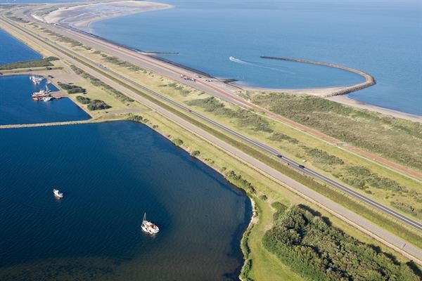
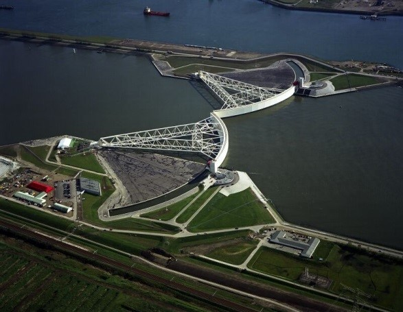
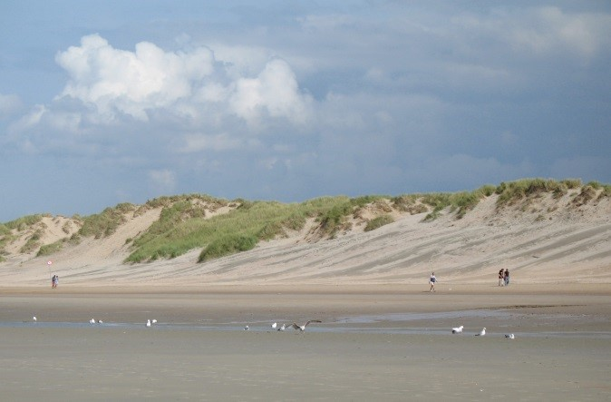
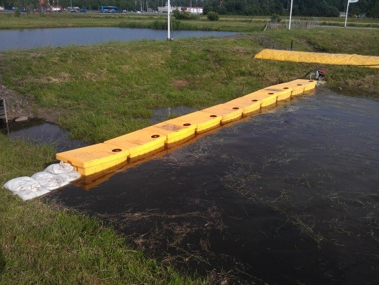
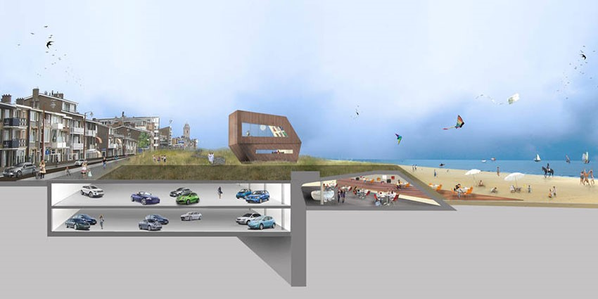
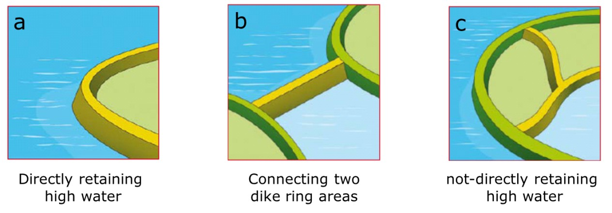

(sec-types-of-flood-defences)=
# 1.1 Types of Flood Defences

(fig-flood-defences-temp)=
Flood defences are of great importance to prevent flooding of low-lying areas. A flood defence is a hydraulic structure with the primary objective to provide protection against flooding along the coast, rivers, lakes and other waterways. Different types of flood defences exist. The most important ones are (see also [Figure 1.1](#fig-flood-defences)):

- A **dike** is a water retaining structure consisting of soil with a sufficient elevation and strength to be able to retain the water under extreme circumstances.
- A **dam** 1 is another type of water retaining structure which separates two water bodies. The difference with a dike is that behind a dam water is located and behind a dike land. The Afsluitdijk (the closure dam) in the IJsselmeer (Lake IJssel) is in fact a dam. Other examples of dams along the Dutch coast are the Brouwersdam and the Haringvlietdam, which are a part of the Deltaworks.
- A **storm surge barrier** is a partly movable flood defence in a river or an estuary. A storm surge barrier can be temporarily closed by means of gates during high water levels to prevent high water level in the basin behind the barrier. Under normal circumstances the barrier is open to discharge water from the hinterland and/or to allow shipping. Well-known examples of storm surge barriers in the Netherlands are the Maeslantkering near Hoek van Holland and the Eastern Scheldt storm surge barrier (Ooster- scheldekering).
- A **dune** is a ridge of sand along the coast, which is general formed by natural processes. Dunes pro- vide protection against storm surges especially through their large sand volume and resistance against erosion. During high water levels and waves, a part of the dune will erode (dune erosion).
- A **flood wall** is a water retaining structure which generally consists of concrete, and sometimes also out of steel. Due to the high horizontal forces on the flood wall, a solid foundation is necessary.
- **Temporary flood defences** are used during high water levels to strengthen dikes or other vulnerable objects. Examples of temporarily flood defences are sandbags, synthetic-bellow barriers or box barriers that are filled with water for the purpose of stability, and various types of beams and stop logs.
- **Hydraulic structures**, such as sluices,siphons and pumping stations are structures that can be a part of a flood defence system. In this case they provide other functions, but also protection against flooding. Therefore they have to meet very strict safety requirements.
- **Multifunctional flood defences**:In this case a structure that has other purposes,e.g.a house or parking garage, is located in the flood defence and often has a water-retaining function. An example is a parking garage that is constructed in the seawall in Katwijk.

(fig-flood-defences)=
<figure>
    

        

            
            <figcaption style="text-align: center; font-size: small;">(a) Dike along the Waal near Ochten during high water in 1995 (image database: Rijkswaterstaat)</figcaption>
        

        

            
            <figcaption style="text-align: center; font-size: small;">(b) Brouwersdam in Zeeland (image database: Rijkswaterstaat)</figcaption>
        

    

    

        

            
            <figcaption style="text-align: center; font-size: small;">(c) Maeslant Barrier along the New Waterway, near Rotterdam (Netherlands)</figcaption>
        

        

            
            <figcaption style="text-align: center; font-size: small;">(d) Dune at Koksijde, Belgium (source: Wikimedia)</figcaption>
        

    

    

        

            
            <figcaption style="text-align: center; font-size: small;">(e) Concrete floodwall during construction in New Orleans (LA, USA)</figcaption>
        

        

            
            <figcaption style="text-align: center; font-size: small;">(f) Temporary flood defences: Box barriers consisting of synthetic boxes filled with water (Picture by Ilse van den Bosch, 2013)</figcaption>
        

    

    

        

            
            <figcaption style="text-align: center; font-size: small;">(g) Multifunctional flood defence, Parking garage proposed in the seawall in Katwijk (source DP6)</figcaption>
        

    

    <figcaption style="text-align: center; margin-top: 10px;">
        Figure 1.1: Overview of different types of flood defences
    </figcaption>
</figure>

Apart from these interventions, other measures can be implemented to reduce the probability of flooding. Examples are interventions in the river bed to increase the discharge capacity of the river (Room for the River). Also measures can be taken to reduce the consequences of flooding, such as adaptation of buildings, evacuation and emergency plans – see [Chapter 3](ch-flood-risk-analysis) for further discussion.

The remainder of this section and the lecture notes will focus on (earthen) dikes as that is the primary focus of this course. Information on other types of flood defences (hydraulic structures such as barriers and dunes) can be found in other courses in the educational program of hydraulic engineering at TU Delft. 

::: {admonition} **Textbox: a note on terminology – levees, dikes and embankments**
:class: tip

In literature and guidelines on flood defences, several terms are used, especially for water-retaining soil structures. In the Netherlands and many other countries, these are indicated as **dikes** (sometimes spelled as dykes). In the United States, the word **levee** [^2] is often used, also for structural solutions such as floodwalls, but also for earthen flood protections. In the United Kingdom, the word **embankment** is mostly used.

Throughout these lecture notes, the words levee and dike will be used interchangeably when referring to water-retaining structures consisting of soil.  
[^2]: Wikipedia indicates: The word *levee*, from the French word *levée* (from the feminine past participle of the French verb *lever*, “to raise”).
:::

## Primary and regional defences
It is common, at least in the Netherlands, to distinguish between primary and regional defences. Primary defences are the Flood Defences that directly or indirectly protect a low-lying area against flooding from the main external source of water (in dutch: “Buitenwater”). In the present definition that is being used in The Netherlands, this external source is either the sea or the large rivers.
These primary defences can be any of three types. The first type consists of flood defences that are directly protecting low-lying areas against flooding from rivers, lakes or coasts.. The second type is when flood defences are connecting two protected areas, so they have water on both sides. The main purpose of these defences is to prevent a rise of water in the water bodies behind the defence. These are called “voorliggende keringen” in dutch. Examples of are dams and storm surge barriers in the Netherlands, such as the Afsluitdijk (Closure Dam) and Maeslant storm surge barrier. 
Finally, a third type of defences are not directly located along the main water bodies, but can have a function if other defences fail. An example is the Diefdijk which functions as a compartment dike which prevents that flooding of the Betuwe can cascade to the west to the Alblasserwaard. These compartment dikes are categorized as primary defences if they are of national importance. All three types of defences are considered in the safety assessment.

<figure>
    
         <figcaption style="text-align: center;">
        Figure 1.2: Types of primary flood defences in the Netherlands (Inspectie Verkeer en Waterstaat, 2011).
    </figcaption>
</figure>

In addition the primary flood defences, so-called regional or secondary flood defences can be distinguished. These are flood defences along canals and other regional water ways. Also, local (“dry”) compartment dikes or summer dikes in the river bed can be characterized as a regional flood defence. The regional flood defences are inspected and maintained by water boards or provinces. 
Failure of regional flood defences can lead to flooding and serious consequences. The failure of the dike at Wilnis in the year 2005 led to local flooding and millions of damages. The mechanism was a horizontal sliding of a dike that mainly consisted of peat. During a dry period in the summer the peat became dry and lighter than normal. In such a case the peat dyke can weigh less than the resulting water force (van Baars, 2005).
These regional flood defences are not treated in detail in this course or these lecture notes, but most of the basic concepts presented here will also be applicable.

