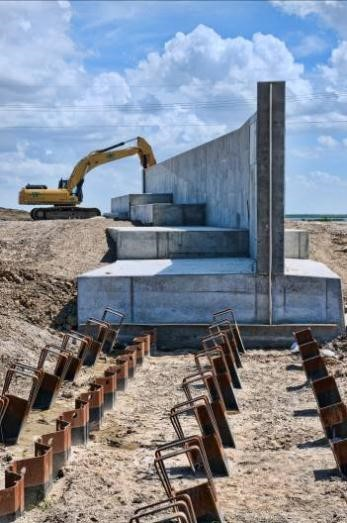

## 1.1 Types of Flood Defences

Flood defences are of great importance to prevent flooding of low-lying areas. A flood defence is a hydraulic structure with the primary objective to provide protection against flooding along the coast, rivers, lakes and other waterways. Different types of flood defences exist. The most important ones are (see also 1.1):

- A **dike** is a water retaining structure consisting of soil with a sufficient elevation and strength to be able to retain the water under extreme circumstances.
- A **dam** 1 is another type of water retaining structure which separates two water bodies. The difference with a dike is that behind a dam water is located and behind a dike land. The Afsluitdijk (the closure dam) in the IJsselmeer (Lake IJssel) is in fact a dam. Other examples of dams along the Dutch coast are the Brouwersdam and the Haringvlietdam, which are a part of the Deltaworks.
- A **storm surge barrier** is a partly movable flood defence in a river or an estuary. A storm surge barrier can be temporarily closed by means of gates during high water levels to prevent high water level in the basin behind the barrier. Under normal circumstances the barrier is open to discharge water from the hinterland and/or to allow shipping. Well-known examples of storm surge barriers in the Netherlands are the Maeslantkering near Hoek van Holland and the Eastern Scheldt storm surge barrier (Ooster- scheldekering).
- A **dune** is a ridge of sand along the coast, which is general formed by natural processes. Dunes pro- vide protection against storm surges especially through their large sand volume and resistance against erosion. During high water levels and waves, a part of the dune will erode (dune erosion).
- A **flood wall** is a water retaining structure which generally consists of concrete, and sometimes also out of steel. Due to the high horizontal forces on the flood wall, a solid foundation is necessary.
- **Temporary flood defences** are used during high water levels to strengthen dikes or other vulnerable objects. Examples of temporarily flood defences are sandbags, synthetic-bellow barriers or box barriers that are filled with water for the purpose of stability, and various types of beams and stop logs.
- **Hydraulic structures**, such as sluices,siphons and pumping stations are structures that can be a part of a flood defence system. In this case they provide other functions, but also protection against flooding. Therefore they have to meet very strict safety requirements.
- **Multifunctional flood defences**:In this case a structure that has other purposes,e.g.a house or parking garage, is located in the flood defence and often has a water-retaining function. An example is a parking garage that is constructed in the seawall in Katwijk.

## 1. Flood Defences: Basic Concepts /

<figure>
    

        

            
            <figcaption style="text-align: center; font-size: small;">(a) Dike along the Waal near Ochten during high water in 1995 (image database: Rijkswaterstaat)</figcaption>
        

        

            
            <figcaption style="text-align: center; font-size: small;">(b) Brouwersdam in Zeeland (image database: Rijkswaterstaat)</figcaption>
        

    

    

        

            
            <figcaption style="text-align: center; font-size: small;">(c) Maeslant Barrier along the New Waterway, near Rotterdam (Netherlands)</figcaption>
        

        

            
            <figcaption style="text-align: center; font-size: small;">(d) Dune at Koksijde, Belgium (source: Wikimedia)</figcaption>
        

    

    

        

            
            <figcaption style="text-align: center; font-size: small;">(e) Concrete floodwall during construction in New Orleans (LA, USA)</figcaption>
        

        

            
            <figcaption style="text-align: center; font-size: small;">(f) Temporary flood defences: Box barriers consisting of synthetic boxes filled with water (Picture by Ilse van den Bosch, 2013)</figcaption>
        

    

    

        

            
            <figcaption style="text-align: center; font-size: small;">(g) Multifunctional flood defence, Parking garage proposed in the seawall in Katwijk (source DP6)</figcaption>
        

    

</figure>

---

**Figure 1.1**: Overview of different types of flood defences

