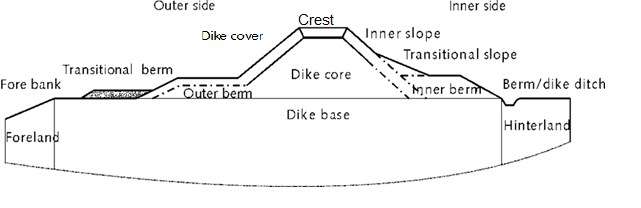
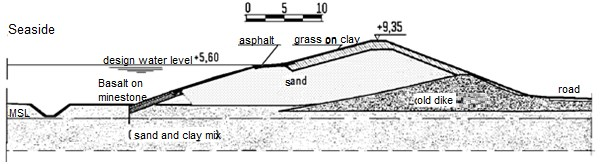
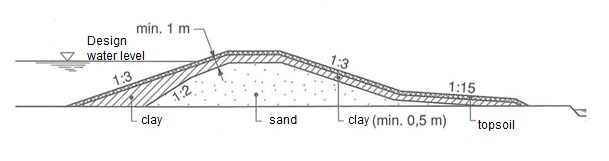
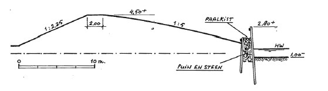
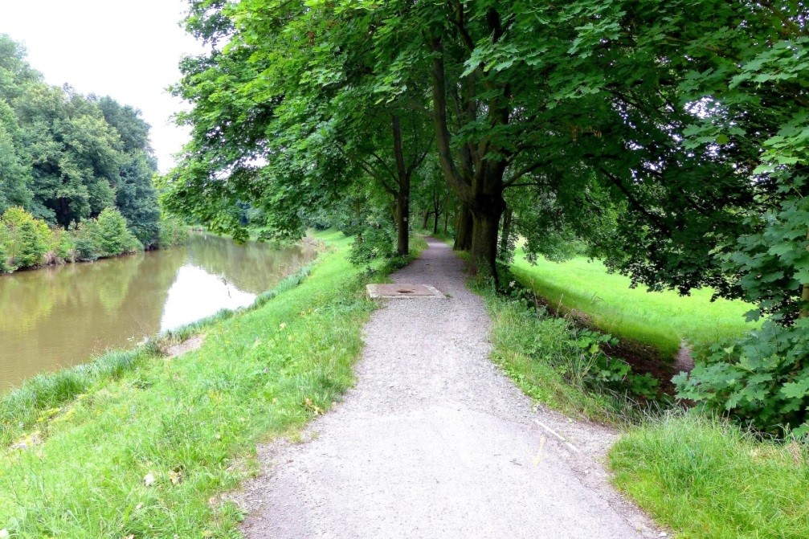

## Dikes: basic technical aspects

Since the main focus in this course will be on dikes, some basic technical aspects are introduced in this section.
### General
The most important function of a dike is to retain the water. This means that a dike needs to be sufficiently high to withstand high water levels and wave run-up, be resistant against wave attack and overtopping and be stable and impermeable. 

[Figure 1.3](#fig-general-dike-profile) shows the most important elements of a typical dike. An important variable is the **crest level** of the dike. It should be sufficiently high to withstand extreme water levels. The dike revetment on the outside can consist of grass, concrete elements, stones or asphalt and should be able to withstand the expected wave attack. In some cases an outer berm can be implemented to break and slow down the waves. On the inside of the dyke, an inner berm can also be applied to prevent instability and piping. The slopes on the inside and outside have an effect on the wave run-up and the stability. 

The **composition** of the dike core and base is related to the properties of the different types of soil. No single type of soil possesses all the characteristics that are desired for a dike structure; sand and gravel are stable but also very permeable. Peat is impermeable but is soft and easily compressed which makes it insufficiently stable for dike structures. In addition, peat shrinks when it becomes dry. Clay is maybe the most suitable. It is very impermeable but deforms easily when it gets wet. Many of the older dikes fully consist of clay. Nowadays a dike is constructed out of a combination of different types of materials, for example a dike core of sand with a cover layer of clay.

<figure>
    
    <figcaption style="text-align: center; font-style: italic; font-size: small; margin-top: 5px;">
        <strong>Figure 1.3</strong>: General dike profile showing the most important elements of a dike.
    </figcaption>
</figure>

Based on the geometry of the dike specific management zones can be assigned which is used to manage the dike by water boards or other management organizations. The core zone (kernzone in Dutch) is the area from berm to berm. Around it a larger protection zone (beschermingszone) – e.g. 20 meter on both sides – is distinguished. Within this zone no new activities are allowed that could have an effect on the strength and stability of the dike. The core and protection zones are enforced by the water board. 

### Dike designs
The chosen dimensions of a dike will strongly depend on the design loads. For sea dikes due to the high waves formed during a storm at sea, a shallow outer slope, an outer berm and / or a dike revetment of stones or asphalt can be applied. [Figure 1](#fig-sea-dike-reinforcement) shows an example of sea dike constructed out of a core of sand with a cover layer of clay, and asphalt and concrete revetments at locations where wave attack can be expected.

The waves along the rivers are generally smaller and outer berms are not applied. For river dikes an inner berm or a relatively flat inner slope is applied (usually smaller than 1 over 3) to provide sufficient stability during long periods of high water. [Figure 2](#fig-profile-of-river-dike) shows an example of a river dike with an inner berm and a core of sand. When dimensioning a dike, the footprint and the land use in the surroundings should be taken into consideration (see also [Figure 3](#fig-dike-with-pile-coffer)).

<figure>
    
    <figcaption style="text-align: center; font-style: italic; font-size: small; margin-top: 5px;">
        <strong>Figure 1</strong>: Example of a profile of a sea dike reinforcement.
    </figcaption>
</figure>

<figure>
    
    <figcaption style="text-align: center; font-style: italic; font-size: small; margin-top: 5px;">
        <strong>Figure 2</strong>: Example of a profile of a river dike (<cite>Leusen Velden</cite>).
    </figcaption>
</figure>

The Dutch dikes have evolved over history and dike constructions were adapted over time due to experiences and events. For a long time timber pile coffers were used as defence, but after the appearance of the ship-worm around 1730 AD, this design was abandoned.

<figure>
    
    <figcaption style="text-align: center; font-style: italic; font-size: small; margin-top: 5px;">
        <strong>Figure 3</strong>: Dike with pile coffer (<cite>Agema, 1982</cite>).
    </figcaption>
</figure>

<figure>
    
    <figcaption style="text-align: center; font-style: italic; font-size: small; margin-top: 5px;">
        <strong>Figure 4</strong>: Typical cross section of a Vietnamese sea dike (<cite>Mai et al., 2008</cite>).
    </figcaption>
</figure>

The previous examples mainly focused on typical examples of dikes that are found nowadays in the Netherlands. However, internationally many other types are found. These local designs are often influenced by factors such as typical loads on the dike, subsoil conditions, material availability and cost and local traditions and experience w.r.t. dike construction. As an example a typical sea dike that is found in the north of Vietnam is shown in [Figure 4](#fig-vietnamese-sea-dike). It includes revetments, but no berm. However, this design is under consideration and discussion in Vietnam as some massive dike breaches occurred during recent typhoons.

### Non-water retaining objects
Since flood defences have several functions (see previous sections) several objects can be presented within the dike profile that do not have a water retaining functions. These are indicated as so-called non-water retaining objects (in Dutch: niet waterkerende objecten – sometimes abbreviated as NWO’s). Examples are the presence of trees or houses in the profile of the dike (see figures below). If such objects are present in or near a flood defence, each case must be checked for possible failure mechanisms. The presence of non-water retaining object can introduce or affect several failure mechanisms, for example in the following ways. 
- Trees and shrubs blown over and uprooted by the wind, creating a hole that can initiate erosion mechanisms. Also, grass cover near or under a tree might be less good, reducing the overflow resistance of the dike. Tree roots can introduce canals that can increase the likelihood of piping.
- Buildings on a dike or in the slopes leading to high local concentration of velocities in case of overflowing or overtopping water;
- Roads on top of a dike can introduce traffic loads, which can cause instability;
- Structures often do not show the same settlement behaviour as the surrounding soil and so affect the integrity of the flood defence.
- Pipelines can start to leak, leading to instability of the dike (see the case of Steijn), erosion or even an explosion. 

The consequences for the long-term management of the flood defence must also be considered when designing or allowing other objects or functions within the dike. Non-water retaining objects may also affect the maintenance or inspection of the flood defence.
In the case of multifunctional flood defences, features necessary for “other” functions, can even play a role in the flood protection function. For example, the wall of a house or parking garage can also be a part of the flood defence. 

<figure>
    

        

            
            <figcaption style="font-size: small; font-style: italic;">
                (a) Trees present in the dike profile Orlice in Czech Rep. (Source: M.Z. Voorendt)
            </figcaption>
        

        

            
            <figcaption style="font-size: small; font-style: italic;">
                (b) House present in the dike profile at Ammerstol (Source: M.Z. Voorendt)
            </figcaption>
        

    

    <figcaption style="text-align: center; margin-top: 10px; font-weight: bold;">
        Figure 1.8: Non-water retaining objects
    </figcaption>
</figure>

