## Functions of flood defences

### General
The primary and most important function of a flood defence is to retain (high) water. However, a flood defence may have a variety of other functions which are discussed in more detail in the remainder of this subsection, for example:
- Inlet or discharge function for waterways crossing the water defence;
- Traffic route on, along or through the flood defence;
- Living and working function in case houses or buildings are present near, in or on the flood defence;
- Agricultural function, e.g. cattle grazing on grass dikes;
- Recreational function, e.g. touristic routes on dikes and through dunes;
- Cultural-historical value. For example in the city of Dordrecht, the flood defence is part of a street (the Voorstraat) in the historical city center –

<figure>
    

        

            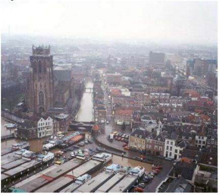
            <figcaption style="font-size: small; font-style: italic;">
                (a) Flood defense in the center of Dordrecht (Voorstraat).
            </figcaption>
        

        

            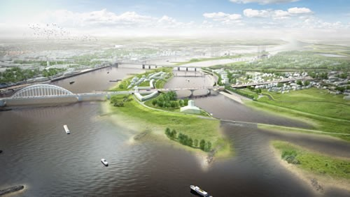
            <figcaption style="font-size: small; font-style: italic;">
                (b) Room for Rivers near Lent (source: Ruimte voor de rivier).
            </figcaption>
        

    

    <figcaption style="text-align: center; margin-top: 10px; font-weight: bold;">
        Figure 1.9: Examples of other functions for Flood Defences
    </figcaption>
</figure>

These functions are being given a lot of attention in dike reinforcement programs. In principle, the lack of safety determines whether a flood defence is reinforced, but the other functions determine how it is reinforced. Much experience has been gained for incorporating planning functions such as housing, traffic, agriculture, industry and recreation on and around the flood defence. In some cases a project initiated as a flood protection measure, becomes a much more integrated planning project. An example is the Room for Rivers project near Lent (Nijmegen) in the east of the Netherlands, see figure below. Here, the construction of an additional flood channel is combined with the development of a part of the city and realization of different types of infrastructures.

### Living and working functions
Water management authorities (Water Boards and Rijkswaterstaat) try to ban housing from their water defences as a policy. However, over history, a lot of situations have developed in which houses are present in or very near the dike. Human activity like gardening, extension of houses, construction of cellars and access ways to the dike often conflict with the flood protection function. This may be particularly the case when a dike reinforcement is planned and the footprint of a dike becomes wider.

<figure>
    

        

            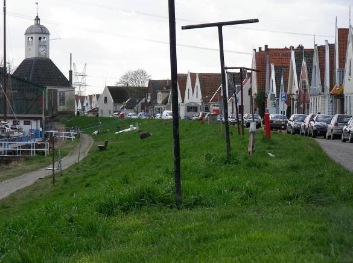
            <figcaption style="font-size: small; font-style: italic;">
                (a) Durgerdam, houses on inner slope.
            </figcaption>
        

        

            
            <figcaption style="font-size: small; font-style: italic;">
                (b) Apartment buildings on eroding dunes.
            </figcaption>
        

    

    <figcaption style="text-align: center; margin-top: 10px; font-weight: bold;">
        Figure 1.10: Living and working functions
    </figcaption>
</figure>

### Traffic routes
Dikes form a suitable location place for local or regional roads, either placed on the crest or on the inland side, e.g. on the stability berm. The dike crest could also be the location for walking or cycling paths. Crossing infrastructure should in principle go over the dike crest, and not cut the water defence structure itself, unless moveable gates are present. 

<figure>
    

        

            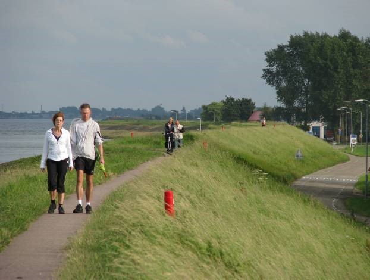
            <figcaption style="font-size: small; font-style: italic;">
                (a) Foot and bicycle path on the dike crest between Edam and Volendam.
            </figcaption>
        

        

            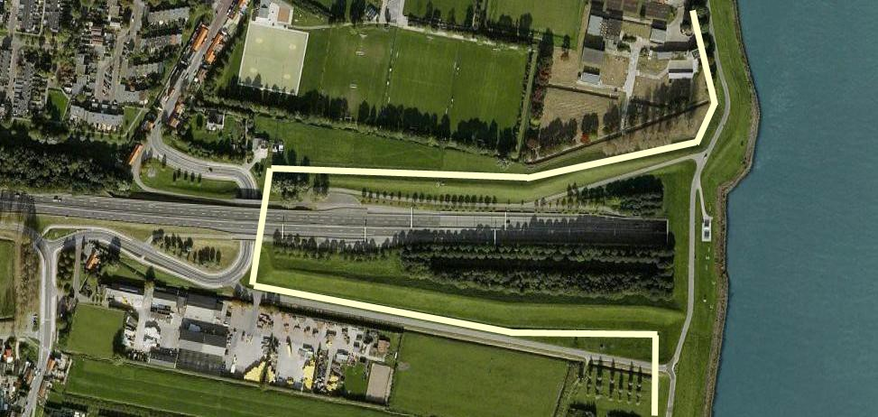
            <figcaption style="font-size: small; font-style: italic;">
                (b) Kiltunnel crossing the flood defense. A dike is constructed on the left side of the river (white line) which ties into the existing river dikes.
            </figcaption>
        

    

    <figcaption style="text-align: center; margin-top: 10px; font-weight: bold;">
        Figure 1.11: Traffic routes on dikes
    </figcaption>
</figure>

### Other infrastructures 
Waterways, water inlets, sluices, pumping stations, pipelines and cables may need to cross the flood defence system at some points. Navigation routes, or waterways usually require a cut in the flood defence for which special structures such as ship locks or sluices are constructed. The elevation of these structures are generally in line with the surrounding flood defences. Important design issues for structures in the flood defence include the strength and stability. In the case of moveable gates (e.g. lock doors) the reliability of closure has to be considered as well. Especially old navigation locks and discharge sluices often lack sufficient data on the foundation and construction material to make a complete assessment of the strength. 

As a policy, dike authorities try to prevent that pipelines run through the dike. When pipelines are present in the dike body, subsidence and settlement patterns of the pipeline will be different than of the earthen part of the dike. This could have a negative effect on the safety. 

<figure>
    

        

            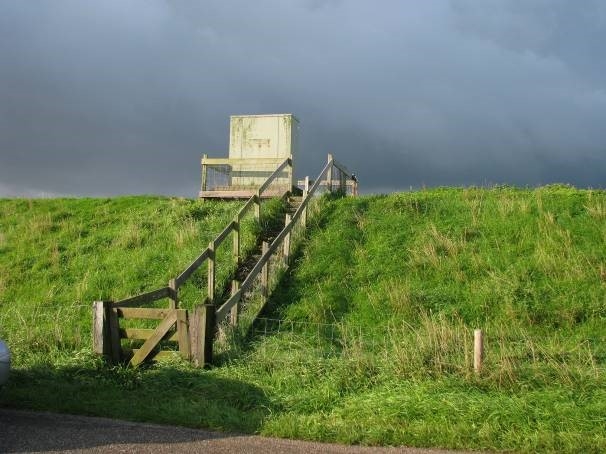
            <figcaption style="font-size: small; font-style: italic;">
                (a) This little case on top of the dike indicates the crossing of a pipeline.
            </figcaption>
        

        

            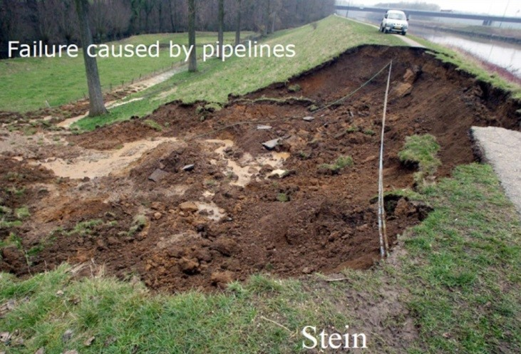
            <figcaption style="font-size: small; font-style: italic;">
                (b) Dike instability at Stein (Juliana Canal, Limburg). Due to a leakage of water pipeline, instability occurred.
            </figcaption>
        

    

    <figcaption style="text-align: center; margin-top: 10px; font-weight: bold;">
        Figure 1.12: Other infrastructures
    </figcaption>
</figure>

### Agricultural function
Dikes in rural areas often have an agricultural function. Along the rivers dikes mostly have a grass cover that need to be maintained. 

<figure>
    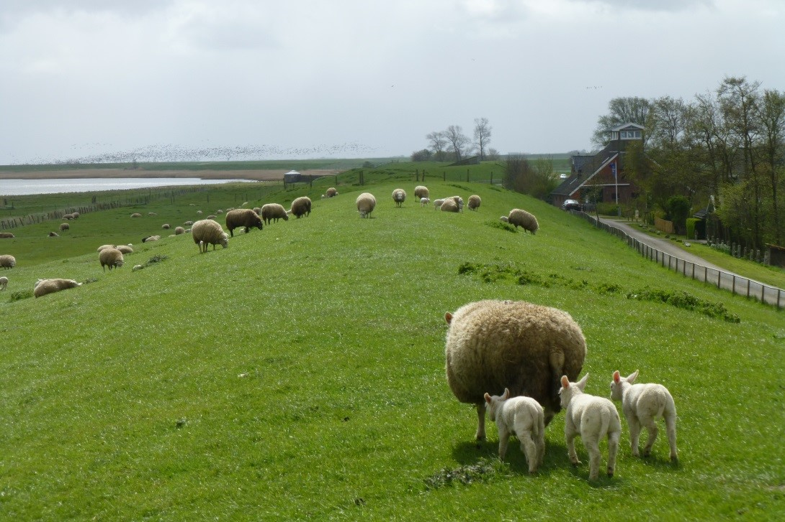
    <figcaption style="text-align: center; font-style: italic; font-size: small; margin-top: 5px;">
        Sheep are in principle ideal cattle for dike maintenance: lightweight, cut the grass with their teeth (M.Z. Voorendt).
    </figcaption>
</figure>

### Landscape, nature and cultural values
Flood defences also have value in terms of landscape, nature and cultural heritage. These values are also referred known as LNC-values (LNC waarden in Dutch) and are taken into account in designing dike reinforcement. Guidelines, policy documents and regulations take into account LNC values of flood defences. As a result architects, biologists, archaeologists and environmental specialists play a role in dike reinforcements and the associated project teams. 

<figure>
    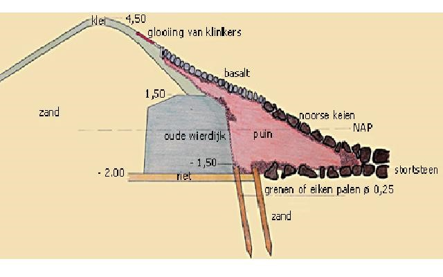
    <figcaption style="text-align: center; font-style: italic; font-size: small; margin-top: 5px;">
        Old dikes hidden in the existing dike form part of archaeological and cultural heritage.
    </figcaption>
</figure>

#### Landscape values

The landscape value of a flood defence is determined by its positioning in the landscape. Several aspects may play a role in considerations with respect to the role of a dike in the landscape. Factors that could play a role are:
- The type of landscape: open water or fields near to the dike with far sights, or nearby forests or rows of trees leading to a different landscape
- Visual lines: sight from houses over the dike to the water, and visual lines reaching the other bank or the next village
- Winding or straight: the curves in the dike tell the history of dike construction and past events such as old breaches. 
- Steep or gentle slopes will have an effect on perception by cyclists, walkers etc. 

Overall, dikes have formed in a specific environment that could be rural, urban or natural. An urban dike may be located in between houses and therefore consist of a lot of structural elements. Dikes in a rural or natural areas generally consist of soil structures.

<figure>
    

        

            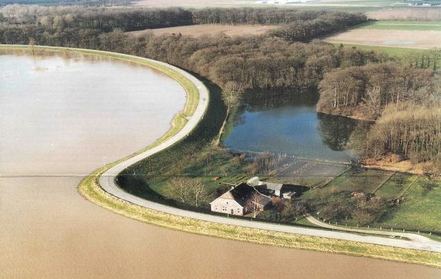
            <figcaption style="font-size: small; font-style: italic;">
                (a) Every bend in the dike has its history, often a dike breach leaving a deep pit filled with water. It tells the history of the spot, but it also alerts the geotechnical engineer as it represents most probably a weak spot in the dike underground.
            </figcaption>
        

        

            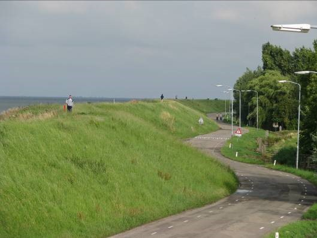
            <figcaption style="font-size: small; font-style: italic;">
                (b) Straight or winding? Winding dikes appear to be attractive for recreation and tourism. In reinforcement projects, efforts are being made to preserve this character in spite of the increasing cross section.
            </figcaption>
        

    

    <figcaption style="text-align: center; margin-top: 10px; font-weight: bold;">
        Figure 1.13: Landscape values
    </figcaption>
</figure>

#### Cultural values

The flood defence and surrounding landscape can also have a cultural value. In general three aspects are formally taken into account in Dutch dike reinforcement projects:
- Geographical-historical value: the dike may have a historical significance, like a former military defence line (Hollandse Waterlinie), or a curve in the dike alignment indicating a former dike breach;
- Architectural value: the presence of monuments (formal denomination for valuable houses, pumping stations,sluices, locks or other elements on national, provincial or local level);
- Archaeological value: presence of archaeological places in or around the dike; since dikes are commonly many centuries old, man-made and safe dwelling places, they are likely to contain archaeological elements.

<figure>
    

        

            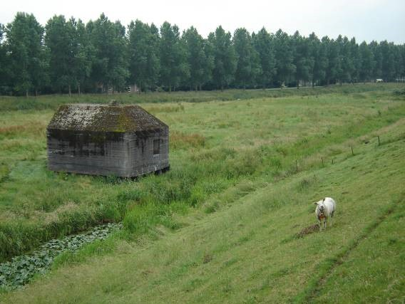
            <figcaption style="font-size: small; font-style: italic;">
                (a) Diefdijk, part of the military defence line Hollandse Waterlinie.
            </figcaption>
        

        

            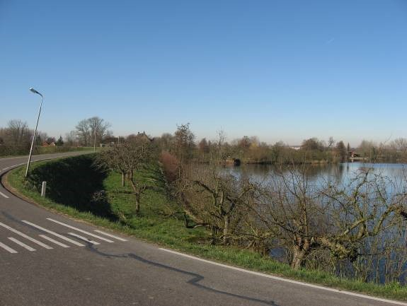
            <figcaption style="font-size: small; font-style: italic;">
                (b) Diefdijk, Wiel van Bassa: dike re-built around a dike breach (1573).
            </figcaption>
        

    

    <figcaption style="text-align: center; margin-top: 10px; font-weight: bold;">
        Figure 1.14: Cultural values
    </figcaption>
</figure>

#### Nature values
Flood defences and the surrounding areas often have an important nature value. Examples are the presence of vegetation or animals in the flood defence zone. The preservation of nature is enforced through several laws and policies. Examples are the Dutch National Ecological Network (Ecologische Hoofdstructuur EHS) and the implementation of the European Birds and Habitats Directive into the Dutch Natura 2000 areas. The Nature Preservation Act (Natuurbeschermingswet) and the Flora and Fauna Act pose requirements when reinforcing flood defences.

In general these laws make sure that a dike or dune reinforcement does not significantly affect the habitat of legally protected species or the species itself. If this would happen, the intervention will have to be justified and mitigation and compensation for the loss of this natural value is legally mandatory.

<figure>
    

        

            
            <figcaption style="font-size: small; font-style: italic;">
                (a) Vegetation on dike slope.
            </figcaption>
        

        

            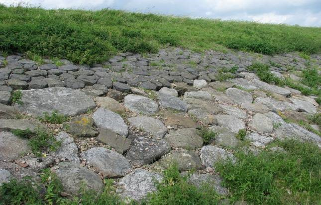
            <figcaption style="font-size: small; font-style: italic;">
                (b) The dike between Edam and Amsterdam (Markermeerdijk) is popular with the grass ringed snake, which could be sheltering or hibernating between the stones of the revetment.
            </figcaption>
        

    

    <figcaption style="text-align: center; margin-top: 10px; font-weight: bold;">
        Figure 1.15: Nature values
    </figcaption>
</figure>
