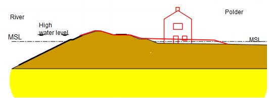
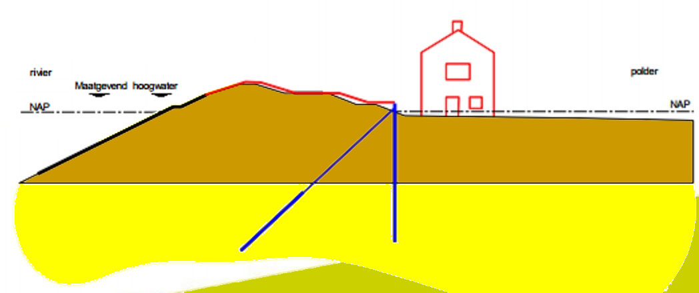
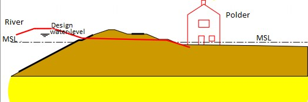

## 1.5 Dike reinforcements – general aspects

The construction or reinforcement of a dike has many implications on the landscape in flood-prone and flat country like the Netherlands. This influence is not necessarily negative. Dikes and the other flood defences determine the typical landscape of the Netherlands. New dikes are rarely constructed in the Netherlands, but dike reinforcements are often executed. 
In many locations in the country populated areas are present nearby the flood defences and sometimes even buildings are constructed in the dike profile. When planning a dike reinforcement, the land use in the surrounding areas is therefore carefully taken into account and it is often even decisive for the chosen alternative for reinforcement. However in some cases buildings and houses have to be demolished and inhabitants have to be bought out as part of dike reinforcement program. Further details of dike (reinforcement) design are treated in more detail in part III of these lecture notes. Below, some general aspects are briefly treated.

In the design of dike reinforcement several aspects need to be taken into account:
- The required heightening and widening of a dike to fulfil the safety standards;
- The effects on the surrounding areas, for example the existing buildings, land purchases and effects on nature values.
- The costs of these interventions depend on the construction method, the materials and equipment used and the need to take additional measures in the surroundings.

Dike reinforcement often comprises heightening and also widening of a dike. To maintain a similar dike slope (which is necessary for stability) when a dike is heightened, the width of the dike needs to increase as well. The measures and the interventions associated with failure mechanisms such as piping and instability, mainly take place on the inside (or land side) of the dike. The possibilities to find extra space are as follows:
- On the inside of the dike: however this can lead to conflict with existing buildings;
- On the outside of the dike: along the coast this is generally a good solution but in riverine areas this is often not desired because large-scale application would limit the discharge capacity;
- Other solutions with less use of space: for example structural solutions such as the placement of sheet piles or diaphragm walls in or just behind the dike. In general the costs of these interventions are higher than the reinforcements with soil on the inside or outside of a dike.

When choosing a location and a method for dike reinforcement, the bearing capacity of the subsoil should also be taken into consideration. Many locations in our country have weak layers in the subsoil, such as peat, necessitating additional measures to provide sufficient stability.
The eventual choice for a dike reinforcement strategy requires an integral and often complex consideration of solutions, costs and effects on the surroundings. The landscape, nature and cultural values (LNC values, see previous sections) and the associated policies and regulations play an important role. 

For example, for the dike reinforcements along the river Lek between the towns of Kinderdijk and Schoon-hovenseveer, different types of solutions have been implemented over a trajectory of several kilometers. These have been chosen based on the considerations such as safety, costs and effects on the surroundings (see also {numref}`alternatives_for_dike_reinforcements`). 
At several locations the dike reinforcements took place on the inside of the dike and sometimes the buildings that were present had to be removed. At locations with valuable (often historical) buildings, more expensive but space saving measures were applied such as sheet piles. At several other places, the dike has been reinforced on the outside.

<figure>
    

		

            
            <figcaption style="font-size: small;">
                (a) Dike reinforcement on the inside: applied at many locations, existing buildings are demolished.
            </figcaption>
        

		

            
            <figcaption style="font-size: small;">
                (b) Dike reinforcement on the inside with sheet piles for stability.
            </figcaption>
        

        

            
            <figcaption style="font-size: small;">
                (c) Dike reinforcement on the outside.
            </figcaption>
        

    

    <figcaption style="text-align: center; margin-top: 10px;">
        Figure 1.18: Alternatives for dike reinforcements applied on several parts of the trajectories between the towns of Kinderdijk 
        and Schoonhovenseveer (Source: Waterboard Rivierenland).
    </figcaption>
</figure>

In the execution of the dike reinforcement, the effects on the surroundings should be taken into account. Aspects that play a role are the accessibility of houses and companies and hindrance of traffic to the construction site and the execution. In some cases a different construction or execution method is chosen that causes less hindrance. For example, driving sheet piles causes a lot of noise, so an alternative construction method can be chosen in which they are pressed into the ground. In general, it is not allowed to do construction work on or around flood defences during the autumn and winter periods, since this is the season in which high water levels generally occur in the Netherlands.

A further and more detailed explanation of design, construction and execution aspects of dike reinforcements is found in part III of these lecture notes. 

[^1]:  In many places around the world dams are applied in river systems for the purposes of water management, navigation, energy generation or agriculture. These dams retain water but they have other primary functions.

[^2]:  Wikipedia indicates: The word levee, from the French word levée (from the feminine past participle of the French verb lever, "to raise").
