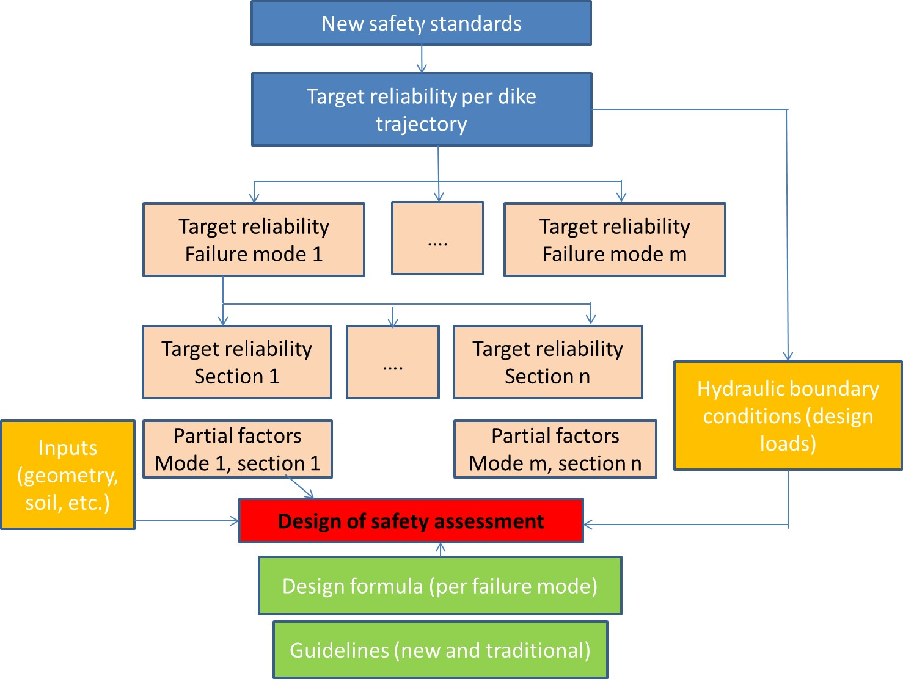
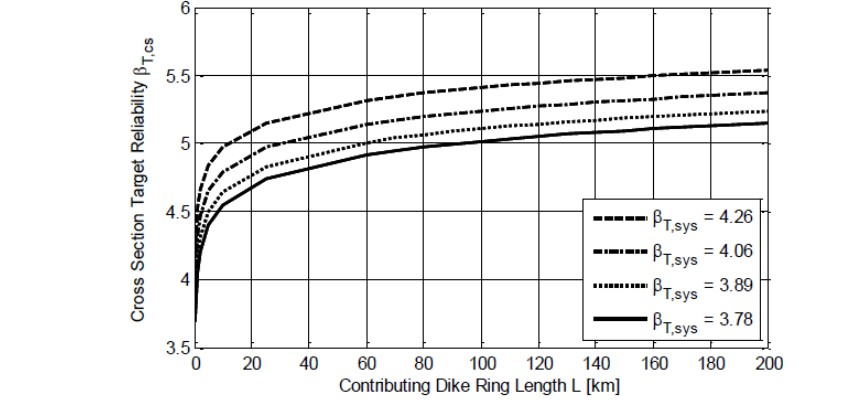
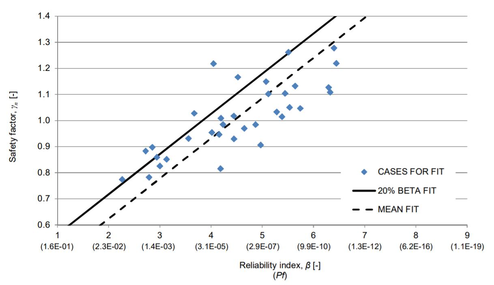
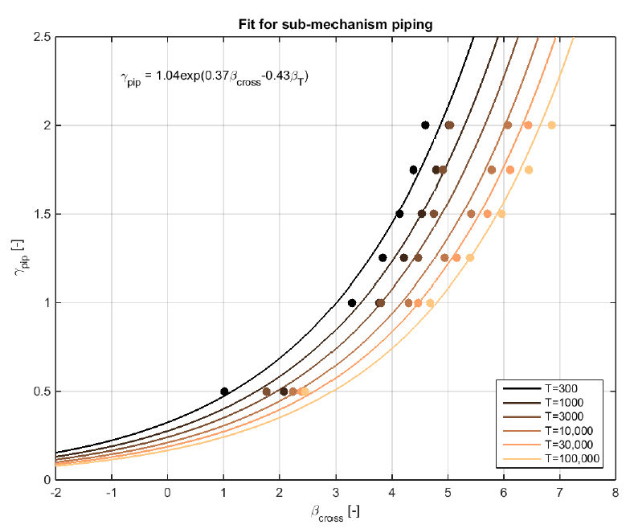

(Sec:rel-bas_req)=
# 10.2 Reliability-based requirements for flood defences

(Subsec:RBR-intro)=
## 10.2.1 Introduction

One important aim of assessment and (re-)design of a flood defence system is to make it fulfil a certain reliability requirement. A number of steps can be distinguished to derive specific reliability requirements for individual components and failure mechanisms (see {numref}`Fig:framework_old_new`). It is based on the framework introduced in the previous paragraph and assumes that an acceptable failure probability (or an equivalent target reliability) at the system level has been established,

<figure>
    
    <figcaption style="text-align: center;">
        Figure 10.6: Framework for derivation of design values and link to safety standards and guidelines.
    </figcaption>
</figure>


The principles of system reliability analysis are fairly universal. The application within the context of these lecture notes however is dedicated to the Dutch approach for flood protection. The flood defence system is defined as a dike trajectory and the system components are the individual dike sections. The steps from a target system reliability to design values for loads and strengths per component are discussed in more detail below: the distribution of the failure probability over the failure modes ({numref}`Subsec:Distr_fail_mod`), over sections and length ({numref}`Subsec:Distr_sect`) and the derivation of design values using characteristic values and partial factors ({numref}`Subsec:Der_designvalues`). 

For the new safety standards, the first two steps are incorporated in the following formulae {cite}`Schweckendiek_et.al.2012` which shows how a failure probability for a section i of a flood defence for a specific failure mechanism j can be derived. More background information on the parameters in these formulae is given in the following sections.

$$
P_{req,i,j}=\frac{\omega_{j}}{N_{j}}\cdot{P_{req}}
$$ (Eq:Req_ann_fail)

$$
N_{j}=1+\frac{a_{j}\cdot{L}}{b_{j}}
$$ (Eq:Length_eff)

In which:
- $P_{req,i,j}$ - required annual failure probability for section i and failure mechanism j $[-]$
- $\omega_{j}$ - maximum contribution of failure mechanism j to the system failure probability $[-]$
- $N_{j}$ - length effect factor $[-]$
- $P_{req}$ - required annual failure probability for the dike trajectory $[-]$
- $a_{j}$ - fraction of the trajectory’s length that is sensitive to failure mechanism j $[-]$
- $L$ - length of the trajectory $[m]$
- $b_{j}$ - length of a typical independent section for failure mechanism j $[m]$

In the guideline for design of flood defences based on flooding probabilities (\cite{Rijkswaterstaat2015} – Handreiking ontwerpen met overstromingskansen in Dutch), default values for $\omega_{j}$ and the determination of $N$ are suggested for various mechanisms. These defaults values are practical values for dike reinforcements and assessments. But default values are typically conservative and can be deviated from, if can be demonstrated by means of reliability analysis that the system meets the target probability of failure ($P_{req}$). 

The guideline mentioned above creates the link between the new safety standards and the traditional guidelines based on the preceding safety standards. The new safety standards are translated into safety factors and design loads and strengths as shown in {numref}`Fig:framework_old_new`.

This means that – unless stated otherwise in the new guideline – the reliability models for the various failure modes from the traditional guidelines still can be used, but with other safety factors and design loads and strengths.

(Subsec:Distr_fail_mod)=
## 10.2.2 Distribution over failure modes

A flood defence system (dike trajectory) can fail due to different failure modes, see {numref}`Ch:FailMechs`. The target probability per failure mode ($\omega_{j} \cdot{ P_{req}}$) accounts for the fact that each failure mode can lead to system failure (i.e. breaching of the flood defence structure). This is characterized as series system in terms of system reliability theory.

The default values of the maximum contributions per failure mode ($\omega_{j,i}$) are based on the conservative assumption that the failure modes are statistically independent (or strictly speaking mutually exclusive), implying that the sum of these contributions needs to be smaller or equal to one ($\Sigma\omega_{j} \leq 1$). In this way we ensure that, if the failure modes comply with their individual target probabilities, also the system target probability is met with certainty. 

In principle, finding the optimal values for $\omega_{j}$ is an optimization problem, in which the largest part of the system failure probability would be assigned to the failure mode that is the most expensive and/or the most difficult to reduce. The larger the maximum contribution of a failure mode to the total failure, the lower the required target for that failure mode can be. In practice different distributions of the failure probability over the failure modes are possible to reach the overall requirement. For example, a relatively high dike with a small footprint could have the same failure probability as a lower, wider dike.

Since this optimization is time consuming and hardly practicable for everyday applications, the default set of $\omega_{j}$ is proposed. {numref}`Tab:Distr_target_reliab` gives the recently proposed distribution as issued in the guideline for the new safety standards {cite}`Rijkswaterstaat2015`. For structures that are a part of a dike trajectory, an 8\% reservation has been made. Some of these structures, like culverts, are hidden in the dike and they are there only designed for internal erosion (2\%), stability (2\%) and reliability closure operation (4\%). Other structures like crossings and locks do have a crest level of their own that needs to be designed based on wave overtopping. For this failure mechanism, the same 24\% reservation is used as for a regular dike, using the same length-effect ($N_{overtopping}=$ 1, 2 or 3 depending on the orientations within the dike trajectory).

A full list of all dike trajectories in the Netherlands along with some recommended values for the target probability per failure, parameters to account for the length effect, contribution of each failure mode and Factors of Safety are given in Appendix A of \citet{Rijkswaterstaat2015}. An online map is also available at [waterveiligheidsportaal.nl](https://waterveiligheidsportaal.nl/#/nss/nss/norm).

\begin{table}[htb]
\centering
{
\begin{tabular}[width=0.8\textwidth]{|l|l|l|l|l|l|l|l|l|l|}
\hline
\multirow{2}{*}{\begin{tabular}[c]{@{}l@{}}Type of \\ structure\end{tabular}} & \multicolumn{8}{l|}{Failure mechanism}                                                                                                                                                                                & \multirow{2}{*}{Total} \\ \cline{2-9}
                                                                              & \begin{tabular}[c]{@{}l@{}}Overflow or \\ overtopping\end{tabular} & \begin{tabular}[c]{@{}l@{}}Internal \\ erosion\end{tabular} & Stability & Revetments & \begin{tabular}[c]{@{}l@{}}Dune \\ erosion\end{tabular} & Structure & Other & \begin{tabular}[c]{@{}l@{}}Reliability \\ closure \\ operation\end{tabular} &                        \\ \hline
Dike                                                                          & 0.24                                                               & 0.24   & 0.04      & 0.10       & Na           & 0.08      & 0.30  & Na                                                                          & 1.00                   \\ \hline
Structure                                                                     & (0.24)                                                             & 0.02   & 0.02      & Na         & Na           & -         & Na    & 0.04                                                                        & 0.08                   \\ \hline
Dune                                                                          & Na                                                                 & Na     & Na        & Na         & 0.70         & Na        & 0.30  & Na                                                                          & 1.00                   \\ \hline
\end{tabular}}
\caption{Distribution of target reliability per failure mechanism (default set of $\omega_{j}$, Na = Not Applicable)}
\label{Tab:Distr_target_reliab}
\end{table}

However, for a redistribution to be effective it must be significant. To determine the potential effect of redistributing the values of $\omega_{j,i}$ the following must be considered. Within the semi-probabilistic approach the unity check ($R_{d}/S_{d}>1$) included the use of one or more safety factors: $\gamma_{R}=R_{k}/R_{d}$. The reliability index $\beta$ generally has a linear influence on the design load and thus on the factor of safety. However, $\beta$ is not linear with the target probability for the failure mode (see Textbox 10.1). The example in Textbox 10.3 shows that redistribution can be effective if significant changes to the 	default set of $\omega_{j	}$ can be applied.

\fcolorbox{black}{white}{
\begin{minipage}{1.0\textwidth}
**Textbox 10.3:
Example of the effects of redistribution of $\omega_{j}$ for the failure mode ‘macro-stability’**\\
The target reliability required failure probability for a given dike trajectory is $10^{-4}$ per year. Using the default set of $\omega_{j}$ (4\%) the target reliability for this failure mode is $4*10^{-6}
$ per year. The corresponding target reliability index $\beta$ equals to 4.47. 

If the default value for of $\omega_{i}$ is doubled to 8\%, the target reliability for this failure mode is $8*10^{-6}$ per year. The reliability index $\beta$ equals to 4.31. This reduction of 3.6\% can be applied to the safety factor $\gamma$, but it is not very likely that the results of the safety assessment or the design will change very significantly compared to the initial and default value of $\omega_{j}$. 

If the failure mode internal erosion can be considered to be not relevant because of the type of subsoil or a structural measure that prevents internal erosion from happening at all, the redistribution can be made much more effective. Now, $\omega_{j}$ for macro-stability can be increased to 28\%, the target reliability goes up to $2.8*10^{-5}$ per year. The reliability index $\beta$ goes down to 4.03. And now a reduction of nearly 10\% can be applied to the safety factor $\gamma$!
\end{minipage}
}

(Subsec:Distr_sect)=
## 10.2.3 Distribution over sections: accounting for the length effect

The next step is to account for the length effect (i.e. failure probability increases with the length of the flood defence system considered, see {numref}`Subsec:calc_fail_prob`) in order to derive the target reliability for a specific dike section. This is achieved by introducing the length-effect factor $N$. A flood defence system (dike trajectory) can be considered as a series system, not only in terms of the failure modes but also in terms of the sections within the dike trajectory. Failure of each section can lead to breaching and, hence, system failure. 

The length-effect can be caused by both hydraulic loads and (geotechnical or structural) resistance. For example, the length-effect for wave overtopping is caused by variation of wind direction, wave direction (foreshore), orientation of the dike section, cross-section profile and types of revetment. For geotechnical failure modes the length-effect can be caused by spatial variation of the soil parameters that are relevant for the resistance (density, permeability, etc.).

The length effect is relatively small for failure modes with a high level of dependence / correlation. This for example the case for overtopping which is characterized by a large auto-correlation in space since dike elevation along a trajectory will often be similar. The value of the length effect factor is in the order of N=1\ldots3 for overflow / overtopping.

The length effect is larger for failure modes that are considered to behave more independently, such as stability and internal erosion. For these mechanisms there is little dependence between sections (and less auto-correlation in space). For the latter type of failure modes, the additive effect of individual probabilities of the section on the segment reliability is stronger than for overtopping. For these mechanisms the value of the length effect factor can be much higher– in the order N = 10\ldots100. For the latter mechanisms the length effect factor N can be determined with as follows.

$$
N_{j}=1+\frac{a_{j}\cdot{L}}{b_{j}}
$$ (Eq:Length_eff2)

In which:
- $N_{j}$ - length effect factor $[-]$
- $a_{j}$ - fraction of the trajectory’s length that is sensitive to failure mechanism j $[-]$
- $L$ - length of the trajectory $[m]$
- $b_{j}$ - length of a typical independent section for failure mechanism j $[m]$

Default values for $a_{j}$ and $b_{j}$ for Dutch dikes are shown in {numref}`Tab:Default_param_length_eff` for the mechanisms of internal erosion and instability. 

```{table} Default parameters for determining the length-effect {cite}`Rijkswaterstaat2015`.
:name: Tab:Default_param_length_eff
| Failure mode            | Location                 | $a_{j}$ $[-]$ | $b_{j}$ $[m]$ \\ \hline|
| :--- | :--- | :--- | :--- |
| \multirow{2}{*}{internal erosion} | Upper parts of the Rhine | 0.9     | 300     \\ \cline{2-4}|
```

Using the formula above, the effects of the length of the trajectory and the target reliability is graphically shown in {numref}`Fig:rel_length_relindex`. For a longer dike trajectory, the target failure probability for an individual section becomes smaller (and the equivalent required $\beta$ becomes larger). 

<figure>
    
    <figcaption style="text-align: center;">
        Figure 10.7: Relation between length of dike trajectory and target reliability index (internal erosion, upper parts of the Rhine).
    </figcaption>
</figure>

Again, the application of default values for especially $a_{j}$ and to some extent $b_{j}$ can lead to conservative estimates of the actual reliability or required dimension to meet the target reliability. Subsoil investigation may give more detailed information on the sensitivity of the trajectory’s length for the mechanism internal erosion. By default, 90\% of this length is considered to be sensitive to internal erosion, but geotechnical investigations may show that this percentage can be lowered considerably. Not only subsoil investigations can be applied. Also, historical maps of earlier dike failures and/or river courses may yield relevant information. 

\fcolorbox{black}{white}{
\begin{minipage}{1.0\textwidth}
**Textbox 10.4: Example: derivation of the required failure probability for a dike section**\\
We consider a dike trajectory with a safety standard $P_{req} =1/1000$ per year. This would for example be the case for dikes along the river IJssel. The length of the trajectory is assumed to be $L=10,000$ meters. The target failure probability at the dike section level is determined for the mechanisms of overtopping, internal erosion and instability.

The default maximum contribution for **overflow / overtopping** is 24\% of the system failure probability, i.e. $\omega_{j}=0.24$. The length effect factor is $N=1$ {cite}`Rijkswaterstaat2015`, as strong dependence between the sections is assumed. It follows that the target failure probability of a section is $P_{req}=1/4166$ per year and the corresponding $\beta=3.49$. Amongst other aspects, the crest elevation of these dikes needs to be designed for hydraulic loads with this probability. More specifically, the designer needs to show that the probability that the critical overflow discharge is exceeded is smaller than this value. 

For the mechanism of **internal erosion** also 24\% of the total failure probability is assigned, i.e. $\omega_{j}=0.24$. The variables to determine the length effect are given in {cite}`Rijkswaterstaat2015` and {numref}`Tab:Default_param_length_eff` $a=0.4$ (for “other” areas) and $b=300$ meters. It follows that the length effect factor equals $N=14.3$ and the target failure probability for internal erosion at the section equals $P_{req}=1.67*10^{-5}$ per year with a corresponding reliability index $\beta=4.14$. 

A smaller maximum contribution of the target probability is assigned to **instability**, $\omega_{j}=0.04$. The factors that determine the length effect are $a=0.033$ and $b=50$ meters. It follows that the length effect factor is $N=7.6$ and the target failure probability for stability at section level is $P_{req}=5.26*10^{-6}$ per year with a corresponding reliability index of $\beta=4.4$.
\end{minipage}
}

The final step in the semi-probabilistic approach is the translation into design values and safety factors. This step is discussed {numref}`Subsec:Der_designvalues`. 

(Subsec:Der_designvalues)=
## 10.2.4 Derivation of design values

The acceptable failure probability for a given section and mechanism can be directly used in full probabilistic assessments and designs. For semi-probabilistic assessments, the final step is the derivation of design values for load and resistance using partial safety factors ($\gamma$). Examples of design values include the design water levels and waves, or the design values of the soil strength parameters. 

The process of derivation of design values based on probabilistic information is treated in more detail in the course CIE4130 “Probabilistic design”, but the applications to (Dutch) flood defences are introduced here. The general approach has already been outlined in {numref}`Sec:gen_approach`. Based on given probabilistic distributions of load and strength variables, design values need to be chosen such that the failure probability is sufficiently small and in accordance with requirements. 

The traditional approach for flood defences is that the **design load** is generally given as a water level with a certain probability of exceedance (e.g. 1/100 or 1/10,000 per year), which is related to the target reliability of the flood protection system. This design load is used in the various reliability analysis for the different failure modes. A distinction must be made between the analyses for failure modes that are dominated by water and wave action (wave run-up, wave overtopping and erosion of revetments) and the analysis for the geotechnical failure modes (internal erosion, stability), as described below.

### Failure modes dominated by water level and wave action
For failure modes dominated by water and wave action, the design and safety assessment is carried out in a nearly full probabilistic fashion. The hydraulic loads are analysed using a **full probabilistic model** and a **design resistance** is used to test the structure (or the design) against the target reliability.

The failure mode ‘overflowing’ is straightforward: the water level is the only stochastic variable and if that water level exceeds the minimum crest level within the dike trajectory the flood protection structure fails. 

The failure mode ‘wave run-up or overtopping’ is already a little bit more complicated since different combinations of water levels and wave loads have to be taken into account. Models are provided by the Dutch government (e.g, HYDRA-NL) for calculating the design hydraulic load (wave run-up or wave overtopping discharge) at every location in the Netherlands, taking into account water level, wave direction, wave period, properties of the foreshore, orientation of the dike and the cross-section of the dike (slope, berm, revetment). A design resistance is expressed as a critical wave run-up (often taken at 2\%) or a critical overtopping discharge, which is determined based on quality of the revetment on the inner dike slope, intensity of the hydraulic load (e.g. wave height and period) and required access during critical conditions.

The new safety standards are based on Ultimate Limit State criteria and therefore the critical overtopping discharge is supposed to be equal to the overtopping discharge causing a breach in the dike and flooding of the dike ring. The critical overtopping discharges related to the new safety standards are therefore higher than the critical overtopping discharges related to the preceding safety standards. The preceding safety standards were based on Service Limit State criteria and no breaching or flooding were allowed. 

Note that the limit state functions for overflow and overtopping are defined in terms of discharge, which can be are dependent on the freeboard. In addition, the EurOtop Manual (\citeyear{EUROTOP2018}) includes recommendations for calculating the discharge over a dike crest as the water level rises above the crest (i.e., the transition from positive to negative freeboard). As such, it is technically possible to combine both limit state functions into a single function when evaluated with reliability analysis software. However, this should be done with care, as such a non-smooth limit state function can lead to numerical problems that cause unrealistic results or non-convergence (especially FORM). Currently the standard Dutch assessment procedure considers any amount of overflow to be failure of the flood defence, however, this can be addressed with a more detailed custom analysis (see, e.g., the most recent WBI document Schematiseringshandleiding Grasbekleding, available at [Helpdesk Water](https://www.helpdeskwater.nl/algemene-onderdelen/structuur-pagina/zoeken-site/)).

The failure mode ‘wave action leading to damaged revetments’ is treated similarly to ‘wave run-up or overtopping’ albeit that the design hydraulic loads (wave action at different water levels) are determined using another target reliability index. Again, the design resistance is taken into account in a deterministic fashion.

### Geotechnical failure modes
For geotechnical failure mechanisms, the **design load** is generally given as a water level associated with the safety standard for the flood protection system (dike trajectory), which has a certain probability of exceedance (e.g. 1/100 or 1/10,000 per year). There is no additional safety factor required or extra freeboard added in the final design crest height to account for uncertainty. 

For geotechnical mechanisms, the **design value of resistance** is based on the characteristic value of the resistance, typically a 5\% probability of exceedance (lower or upper bound, depending on what is conservative). The safety factor for the resistance $\gamma_{R}$ is a combination of partial safety factors ($\gamma$’s). The partial safety factors are determined based on the length of the dike trajectory and the required safety level. As an illustration, it is shown below how the $\gamma_{R}$ for the failure modes slope instability and internal erosion are determined.

(Sec:factorsmacrostability)=
### Determination of safety factors for the failure mode macrostability

This approach and the recommended values for partial factors are described in the WBI2017 document Schematisering macrostabiliteit (current version available at [Helpdesk Water](https://www.helpdeskwater.nl/algemene-onderdelen/structuur-pagina/zoeken-site/)) and underlying documents, such as {cite}`Barneveld07`, or {cite}`Kanning17`, provide a good overview in English. Stability can be evaluated with various models, such as finite element models or analytical limit equilibrium approaches (e.g., Bishop or Spencer). The criterion for the occurrence of an instability can be formulated as follows, where 
In the implementation, design values of load and strength are used.

$$
\gamma_{stab} = \frac{1}{\gamma_d}\frac{M_R}{M_S}
$$ (Eq:crit_occ)

In which:
- $\gamma_{stab}$ - factor of safety for macrostability
- $\gamma_d$ - model factor
- $M_{R}$ - resisting moment
- $M_{S}$ - driving moment 

The model factor is dependent on the limit-equilibrium method used for example, $\gamma_d = 1.06$ for Uplift-Van and $\gamma_d = 1.07$ for Spencer. Macrostability is typically evaluated using limit-equilibrium slope stability software, for example D-Stability. Current design guidelines incorporate uncertainty in the resistance by using 5\% design values for strength parameters in the stability model, along with specific recommendations for groundwater conditions. A stochastic subsoil schematization has been developed for all primary flood protection structures in the Netherlands (except for the dunes) to characterize material properties. This schematization consists of a number of scenarios, each with an estimated likelihood, based on the available soil investigation results and the general knowledge of the geological character of the subsoil. Once $\gamma_{stab}$ is found, it must be used to derive an equivalent reliability index and compared to the required reliability for the dike section for macrostability. The equivalent reliability index is derived using a calibration equation ({numref}`Subsec:Calibration`).

(Sec:factorsinternalerosion)=
### Determination of safety factors for the failure mode internal erosion

A similar approach can be followed for internal erosion, where the procedure for WBI2017 is found in the document Schematiseringshandleiding piping (current version available at [Helpdesk Water](https://www.helpdeskwater.nl/algemene-onderdelen/structuur-pagina/zoeken-site/)), with an English overview available in {cite}`Teixeira16`.

As outlined in {numref}`Ch:Piping`, the internal erosion process is dependent on three mechanisms heave, uplift, piping that are usually assumed to be fully dependent when assessing flood defences. In previous assessment guidelines, safety factors for the individual sub-failure modes were required to satisfy specific threshold values, assessed individually for each sub-mechanism. Current standards specify instead that the internal erosion mechanism is assessed on the condition that *all* sub-mechanisms meet the target reliability index. This is implicit due to the conservative assumption of full dependence between the three sub-failure mechanisms, as the reliability of a fully dependent system of parallel components is bounded by the largest component reliability index (or, conversely, the smallest probability).

The criterion for the occurrence of internal erosion is based on the calculation of a factor of safety for each of the three sub-mechanisms: $\gamma_{uplift}$, $\gamma_{heave}$ and $\gamma_{piping}$. Equations have been provided in {numref}`Ch:Piping`. The design value for each random variable in is either the 5\% or 95\%-quantile, depending on whether it acts as a load or resistance in the limit state function, although there are three exceptions: the outside water level is chosen with an exceedance probability equal to the maximum allowable failure probability of the dike trajectory; the critical heave gradient, $i_c$, is 0.3 (assessed by expert judgement); and, model uncertainty factors are set to 1.0. Once each $\gamma$ is found, they must be used to derive an equivalent reliability index for each sub-mechanism and compared to the required reliability for the dike section (i.e., the same target reliability is used to assess each sub-mechanism). The equivalent reliability index for each sub-mechanism is derived using a calibration equation ({numref}`Subsec:Calibration`).

(Sec:factorsmacrostability)=
### Determination of safety factors for the failure mode macrostability

This approach and the recommended values for partial factors are described in the WBI2017 document Schematisering macrostabiliteit (current version available at [Helpdesk Water](https://www.helpdeskwater.nl/algemene-onderdelen/structuur-pagina/zoeken-site/)) and underlying documents, such as {cite}`Barneveld07`, or {cite}`Kanning17`, provide a good overview in English. Stability can be evaluated with various models, such as finite element models or analytical limit equilibrium approaches (e.g., Bishop or Spencer). Here, we focus on the derivation required safety factor $\gamma_{R,i}$ for instability using the Bishop model (based on Mohr Coulomb). The criterion for the occurrence of an instability can be formulated as follows, where 
In the implementation, design values of load and strength are used.


$$
M_{R,design} \geq M_{S,design}
$$ (Eq:crit_occ)

In which:
- $M_{R,design}$ - resisting moment
- $M_{S,design}$ - driving moment 

The safety format approach requires that the critical head difference is calculated using the characteristic values (5\% probability of exceedance) of all variables involved, such as the cohesion, the angle of internal friction and the water pressure. No additional safety factors are to be included. Then, the overall calculated required factor of safety ($M_{R}/M_{S}$) should be smaller than the overall required factor of safety $\gamma_{R,i}$. This latter factor is determined by four partial safety factors.

$$
\gamma_{R,i}=\gamma_{d}*\gamma_{m}*\gamma_{b}*\gamma_{n}
$$ (Eq:csafety_factors)

In which:
- $\gamma_{d}$ - partial factor for model uncertainty
- $\gamma_{m}$ - partial factor for material uncertainty
- $\gamma_{b}$ - partial factor for uncertainty in the soil layering and hydraulic gradients
- $\gamma_{n}$ - partial factor for length effect and required safety level

For situations without uplift $\gamma_d = 1.0$ and $\gamma_d = 1.1$ for situations with uplift. If a model other than Bishop (e.g., Spencer-van der Meij or Upift-Van) is applied, different values for $\gamma_d$ will apply. For example, $\gamma_d = 1.06$ is commonly used when applying Uplift-Van in conditions with and without uplift {cite}`Kanning17`. 

Uncertainty in soil parameters is incorporated in the value of $\gamma_m$, which depends on the type of soil and the testing method used. For volumetric mass $\gamma_{m}$ is 1.0 and for the compression coefficients (Terzaghi and Buisman-Koppejan) $\gamma_{m}$ is 1.1. For cohesion and internal friction the values of $\gamma_{m}$ are presented in {numref}`tab:gamma_m`. If the tests show significant lower variation coefficients than shown in {numref}`tab:gamma_m` the value of $\gamma_{m}$ can be lowered. For example, for natural non-organic clay with variation coefficients $V_{c}<0.275$ and $V_{\Phi}<0.15$, the value of $\gamma_{m}$ can be reduced to 1.15, both for cohesion and internal friction. The tests used for clay and peat are tri-axial tests (consolidated and undrained) with maximum deformations of 2 to 5\%.


```{table} Values of $\gamma_{m}$, partial safety factor for material uncertainty 
:name: tab:gamma_m
| Type of soil and test             | Parameter                  | Variation Coefficient {[}-{]} | $\gamma_{m}$ \\ \hline|
| :--- | :--- | :--- | :--- |
| \multirow{2}{*}{Clay (TP-CU-5\%)} | Cohesion $c$                 | 0.45                          | 1.25         \\ \cline{2-4}|
| \multirow{2}{*}{Peat (TP-CU-5\%)} | Cohesion $c$                 | 0.80                          | 1.50         \\ \cline{2-4}|
| \multirow{2}{*}{Sand (TP-CD)}     | Cohesion $c$                 | -                             | -            \\ \cline{2-4}|
```

The value of $\gamma_{b}$ is described in previously mentioned documents with a minor modification: the lower limit of this partial safety factor is 1.0 (instead of 1.1). In the value of $\gamma_{b}$ the uncertainties of the soil layering and hydraulic gradients are incorporated. These uncertainties depend on the way soil layering and hydraulic gradients are schematized. Typically, the value of $\gamma_{b}$ ranges between 1.0 and 1.3. To find the appropriate value of $\gamma_{b}$ a number of scenarios need to be tested. The traditional approach is to use only one, conservative scenario. For the new safety assessment procedure, a stochastic subsoil schematization has been developed for all primary flood protection structures in the Netherlands (except for the dunes). This schematization consists of a number of scenarios, each with an estimated likelihood. The scenarios are based on the available soil investigation results and the general knowledge of the geological character of the subsoil. 


The value of $\gamma_{n}$ will depend on the target safety standard and the length of the trajectory. The calibration of the factor of safety $\gamma_{n}$ and the required target reliability for the cross-section is given in {eq}`Subsec:Calibration`. The following formula is applicable for the Mohr Coulomb model for instability:

$$
\gamma_{n}=1+0.13*(\beta_{i,j}-4.0) \text{ \quad with \quad }\beta_{i,j}=-\Phi^{-1}(P_{i,j})
$$ (Eq:partialgamma_n)

In which:
- $P_{i,j}$ - target failure probability for a section i for failure mechanism j $[-]$
- $\beta_{i,j}$ - the corresponding reliability index $[-]$

The value of $\gamma_{n}$ can now be determined as a function of the required reliability index. 

\begin{table}[H]
\centering
\label{Tab:gamma_n}
\begin{tabular}{|l|l|l|l|l|l|l|}
\hline
Reliability index $\beta$  & 4.00 & 4.25 & 4.50 & 4.75 & 5.00 & 5.25 \\ \hline
Partial factor $\gamma_{n}$ & 1.00 & 1.03 & 1.07 & 1.10 & 1.13 & 1.16 \\ \hline
\end{tabular}
\caption{Values of $\gamma_{n}$ as a function of the reliability index}
\end{table}

Using the default of the target reliability per failure mode (default set of $\omega_{j}$) and the formula for the length effect, the of $\gamma_{n}$ can be related to the safety standard and the length of the dike trajectory. {numref}`Tab:val_gamman` below shows the results of such an analysis for instability (valid for the Mohr-Coulomb model). A longer dike trajectory with a higher safety standard will thus have to be designed with a higher $\gamma_{n}$ value. 

```{table} Values of $\gamma_{n}$, partial factor for length effect and required safety level
:name: Tab:val_gamman
| \multirow{2}{*}{Safety Standard $[-]$} | \multicolumn{6}{l}{Length trajectory$[km]$}    \\ \cline{2-7}|
| :--- | :--- | :--- | :--- | :--- | :--- | :--- |
```

This relationship between the partial factor and required reliability levels has been calibrated with full probabilistic calculations (see {numref}`Subsec:Calibration`). If another model (i.e. Spencer-van der Meij, LiftVan) is used to describe the behaviour of the dike for the mechanism instability, the overall factor of safety for the strength may change: some of the partial safety factors change and the partial safety factor $\gamma_{n}$ needs to be recalibrated.

(Sec:factorsinternalerosion)=
### Determination of safety factors for the failure mode internal erosion

A similar approach can be followed for internal erosion, where the procedure for WBI2017 is found in the document Schematiseringshandleiding piping (current version available at [Helpdesk Water](https://www.helpdeskwater.nl/algemene-onderdelen/structuur-pagina/zoeken-site/)), with an English overview available in {cite}`Teixeira16`. The criterion for the occurrence of piping can be formulated as follows:

$$
(\Delta{H}-0.3d) \leq \frac{H_{c}}{\gamma_{Rp}}
$$ (Eq:piping)

In which:
- $\Delta{H}$ - actual head difference over the dike (design water level – polder level)
- $D$ - thickness of the blanket layer
- $H_{c}$ - critical head difference (e.g. determined with the formula of Sellmeijer)
- $\gamma_{Rp}$ - overall factor of safety for the strength for the failure mode piping

The safety guidelines require that the critical head difference is calculated using the characteristic values (5\% probability of exceedance) of all variables involved, such as the permeability $k$, $d_{70}$ and so on. No additional safety factors are to be included. Then, the required overall factor of safety is determined by two partial safety factors.

$$
\gamma_{Rp}=\gamma_{b} \cdot{\gamma_{mp}}
$$ (Eq:gammarp)

In which:
- $\gamma_{b}$ - partial factor to account for uncertainty in the soil layering and hydraulic gradients
- $\gamma_{mp}$ - partial factor for model and parameter uncertainty and required safety level

The value of $\gamma_{b}$ for piping is identical to the value of $\gamma_{b}$ for macro-stability. The value of $\gamma_{mp}$ is determined as a function of the required reliability index. 

$$
\gamma_{mp}= \text{Max}(0.8*\beta_{j}-2.4,1.2) \text{ \quad with \quad } \beta_{j}=-\Phi^{-1}(P_{j})
$$ (Eq:gammamp)

In which:

- $P_{j}$ - target failure probability for a section for failure mechanism j $[-]$
- $\beta_{j}$ - corresponding reliability index $[-]$

The value of $\gamma_{mp}$ can now be determined as a function of the required reliability index. 

```{table} Values of $\gamma_{mp}$ as a function of the reliability index
:name: Tab:gamma_n2
| Reliability index $\beta$  | 4.00 | 4.25 | 4.50 | 4.75 | 5.00 | 5.25 \\ \hline|
| :--- | :--- | :--- | :--- | :--- | :--- | :--- |
```

Using the default of the target reliability per failure mode (default set of $\omega_{j}$) and the formula for the length effect, the of $\gamma_{mp}$ can be related to the safety standard and the length of the dike trajectory. {numref}`Tab:val_gammamp` below shows the results of such an analysis for piping (valid for the Sellmeijer model). A longer dike trajectory with a higher safety standard will thus have to be designed with a higher $\gamma_{mp}$ value

```{table} Values of $\gamma_{mp}$  as a function of the safety standard and the length of the dike trajectory.
:name: Tab:val_gammamp
| \multirow{2}{*}{Safety Standard $[-]$} | \multicolumn{6}{l|}{Length trajectory $[km]$} \\ \cline{2-7}|
| :--- | :--- | :--- | :--- | :--- | :--- | :--- |
```

This relationship between the partial factor and required reliability levels has been calibrated with full probabilistic calculations (see {numref}`Subsec:Calibration`). If another model (i.e. Bligh-Lane) is used to describe the behaviour of the dike for the mechanism piping, the overall factor of safety for the strength may change and the partial safety factor $\gamma_{mp}$ needs to be recalibrated. 


### Summary of steps: derivation of design values
The previous elaborations and examples show how an engineer can take into account the target failure probability level without having to do a full probabilistic analysis for every dike trajectory. The three main steps of this semi-probabilistic approach are as follows.

1. Determine the safety standard for the trajectory $P_{req}$ (from the map or table with safety standards);
1. Determine the target safety standard for a dike section for a mechanism ($P_{i,j}$) and the equivalent reliability index ($\beta_{i,j}$) using the (default) set of values for the distribution over the failure mechanism ($\omega_{j}$) and length effect; 
1. Determine the corresponding values for design load and design value of the resistance using the partial factors for the strength of the mechanism. Some of these partial factors are dependent on the required reliability levels. The design values of loads are usually directly related to the safety standard.

Alternatively, a full probabilistic analysis can be confined performed to evaluate the design case (or safety assessment) as an alternative for step 3. Then a target safety standard for a dike section for a mechanism ($P_{i,j}$) is known and instead of using values for design loads and design resistance a full probabilistic analysis for this section and this mechanism is carried out.

(Subsec:Calibration)=
## 10.2.5 Calibration of partial safety factors

The relationships between the (partial) safety factors and target reliability levels discussed in the previous sections were established by means of 'calibration.' The goal of such a calibration is to derive values of partial factors that are expected to lead to a sufficiently small probability of failure. A designer can thus assume a structure to be sufficiently safe if the value of the design resistance is larger than that of the design load.

Such a calibration process consists of three steps:
1. Identification of the governing variables;
1. Definition of the semi-probabilistic format (i.e. design formula/criteria and partial factors);
1. Derivation of a relationship between factor of safety, $\gamma$, and reliability, $\beta$ for a set of test cases.

The last step essentially entails full probabilistic analysis of a large number of dike sections. The calculated reliability index ($\beta$) per cross-section can then be compared to the corresponding factor of safety ($\gamma$) obtained in a semi-probabilistic analysis. Subsequently, the relationship (i.e., calibration equation) between safety factor and reliability index is chosen such that most of the considered cases are at least as reliable as the relation suggests or estimates (i.e., conservative). Note that when several partial factors are involved, typically one is chosen to be reliability-dependent while the others are defined as constants. The calibration equation is then used to estimate $\beta$ for other cases using only a semi-probabilistic calculation, subject to the same evaluation procedure and partial factors as the original set of cases, which is then compared to the target reliability, $\beta_{i,j}$. In general, this is a fast approach for evaluating a dike, but may lead to an over-designed cross section. In many cases, for example, internal erosion, it is relatively easy to evaluate $\beta$ directly with a reliability analysis. Full details of the derivation of calibration equations for use in semi-probabilistic analyses can be found in {cite}`Kanning17` and {cite}`Teixeira16` for macrostability and internal erosion, respectively. Calibrations for both of these failure mechanisms are also described briefly in the sections below.

### Calibration equation for macrostability
As an example, figure {eq}`Fig:cal_safetyfactor` shows the results for a number of cross sections from three Dutch dike rings for instability of the inner slope, using undrained shear strength models for most of the cases. The continuous black line is the proposed safe relation between $\gamma_{stab}$ and $\beta_{stab}$, which can be expressed as formulas by (assuming model factors equal to 1):

$$
\gamma_{stab}= 0.15\beta_{stab} + 0.41
$$ (Eq:gamma_nbeta)

It is important to note that geotechnical software packages like D-Stability by Deltares calculate the factor of safety $\gamma_{stab}$ by means of the momentum. Therefore, to be able to compare against the required partial safety factor that accounts for the length effect and required safety level, it is necessary to correct the calculated safety factor $\gamma_{stab}$ from the software dividing by the model factor $\gamma_d$ (equation {eq}`Eq:crit_occ`)..

<figure>
    
    <figcaption style="text-align: center;">
        Figure 10.8: Calibrated relation between reliability index and safety factor for instability of the inner slope {cite}`Kanning17`.  
        The safety factor $\gamma_n$ in this figure is $\gamma_{stab}$ in the text.
    </figcaption>
</figure>

{numref}`Fig:cal_safetyfactor` also illustrates that for most dike sections the actual reliability index is (significantly) higher than the one obtained by the proposed relation. This is, in fact, by design, as the calibration equation is chosen such that the actual reliability (i.e., if calculated directly) is higher than the value estimated by the equation for approximately 80\% of cases. If the consequences of a negative assessment result are very costly a full probabilistic analysis can be carried out to avoid potentially unnecessary dike reinforcements. Further details regarding the calibration of semi-probabilistic assessment and design rules for macrostability are discussed in the report by {cite}`Kanning17`.

### Calibration equations for internal erosion

The calibration equations for internal erosion are presented below, with further details regarding the calibration of semi-probabilistic assessment and design rules for internal erosion discussed in the report by {cite}`Teixeira16`. 


$$
\begin{split}
    \beta_{uplift} &= \frac{1}{0.46} \Bigg(\ln\Big({\frac{\gamma_{uplift}}{0.48}\Big) + 0.27  \beta_{norm}}\Bigg) \\
& \\
    \beta_{heave} &= \frac{1}{0.48} \Bigg(\ln\Big({\frac{\gamma_{heave}}{0.37}\Big) + 0.30 \beta_{norm}}\Bigg) \\
& \\
    \beta_{piping} &= \frac{1}{0.37} \Bigg(\ln\Big({\frac{\gamma_{piping}}{1.04}\Big) + 0.43 \beta_{norm}}\Bigg) \\
\end{split}
$$

Note that these equations calculate a safety-level dependent reliability index for each sub-mechanism, which is why the reliability index for the trajectory, $\beta_{norm}$ appears in the equations. This is illustrated in {numref}`fig:calibrationpiping`. Safety factors for each sub-mechanism are determined as described in the previous section.

<figure>
    
    <figcaption style="text-align: center;">
        Figure 10.9: Example calibrated relationship between reliability index and safety factor for different trajectory target reliability index for the failure mode piping {cite}`Teixeira16`.
    </figcaption>
</figure>


[^1]: In the lecture notes of probabilistic design (CIE4130), $R^{*}$ and $S^{*}$ are used for the formulation of the design point instead of $R_{d}$ and $S_{d}$.