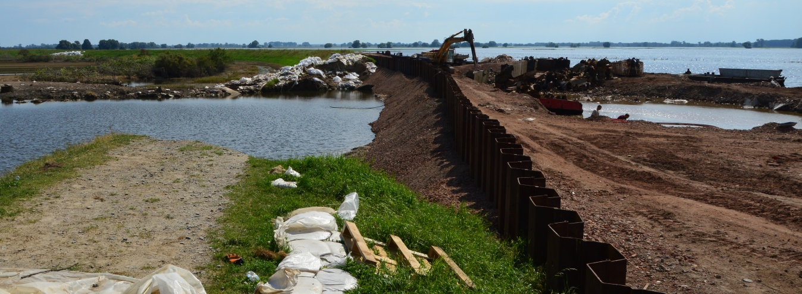

# 2.1 What is failure?
Understanding failure processes does not only enable us to assess flood defences or to predict failures; it also enables us to design them properly and to take appropriate counter-measures in case of imminent failure. In this chapter, we focus on the aspects relevant for flood protection and provide an overview of relevant failure modes for dikes, hydraulic structures and dunes. The subsequent chapters give more in-depth descriptions. The main structure of the chapters related to failure mechanisms is:
- phenomenological or process description of the mechanism (qualitative)
- computational models, i.e. rules of thumb as well as advanced models (quantitative)
- design and counter-measures
- emergency measures (if applicable)

The considerations of failure mechanisms in these lecture notes are fairly motivated by Dutch safety assessment and design standards, though most of the material is applicable internationally as well. For more information on international approaches refer to the International Levee Handbook (ILH; {cite}`LeveeHandbook`). Realize though, that the ILH was a collaborative effort of several countries, representing the common ground the authors could agree on. That means that not all approaches presented in the ILH are not directly or literally applicable everywhere.

<figure>
    
    <figcaption>Figure 2.1: Dike repairs at Fischbeck after failure during Elbe floods in June 2013.</figcaption>
</figure>

To better understand failure processes, the International Levee Performance Database (ILPD)  was developed as part of the NWO-funded SAFElevee project and is available at [leveefailures.tudelft.nl](https://leveefailures.tudelft.nl/). It is an open-access, online searchable database with over 1500 levee failure and performance cases that has attracted interest from a variety of end users, and has a proven capacity to support research on flood risk and flood defences {cite}`ozer20,kool20`. Interested students, researchers and practitioners are referred to the ILPD website to learn more, as well as a short film and technical article from Flows Productions ([leveeperformance.flowsproductions.nl](https://leveeperformance.flowsproductions.nl/)) justifying the need for such a database {cite}`Gooijer21,Rijcken21`.

