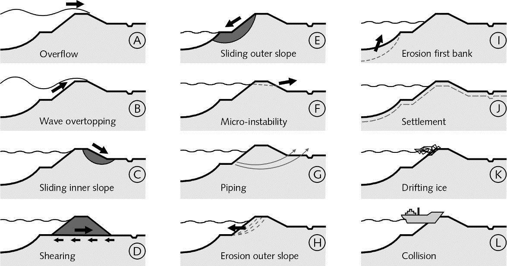

(sec-overview-of-failure-mechanisms)=
# 2.2 Overview of failure mechanisms

(fig-failure-mechanisms-overview)=
<figure>
    
    <figcaption>Figure 2.2: Schematic overview of the most relevant failure mechanisms of flood defences.</figcaption>
</figure>

[Figure 2.2](#fig-failure-mechanisms-overview) contains the most commonly encountered failure mechanisms for dikes. Most of them are also relevant for hydraulic structures like flood gates, locks, sluices or storm surge barriers. Below we will give short descriptions or definitions of each one with reference to the chapter or section, where the mechanism is treated in more detail (if applicable). Hydraulic structures and dunes are not included in the list.

## A - Overflow

Overflow of a dike or levee means that the still water level (i.e. without waves or the average level considering waves) is higher than the crest level of the flood defence and the water flows into the protected area. The overflow discharge itself can lead to flooding and, usually worse, the water flowing down the inner slope can lead to damage and ultimately breaching through erosion and or infiltration. For details refer to Chapter 5(Ch:Overtopping).

## B - Wave overtopping
In contrast to overflow, with wave overtopping the still water level remains below the crest level. The overtopping is purely due to waves running up the slope of dikes or directly overtopping vertical structures like flood walls. The limit state for wave overtopping is usually defined in terms of critical discharges, which themselves depend on the sensitivity of the inner slope to (surface) erosion. Wave overtopping is typically relevant for sea dikes. For details refer to Chapter 5(Ch:Overtopping).

<figure style="text-align: center;">
    <table>
        <tr>
            <td>
                
            </td>
            <td>
                
            </td>
        </tr>
    </table>
    <figcaption>Figure 2.3: Overflowing levee (left, source: Beeldbank RWS) versus wave overtopping at Hartlepool, UK (right, source: HR Wallingford).</figcaption>
</figure>

## C - Sliding inner slope

The most common (mechanical) stability problem with dikes is the instability or sliding of the inner slope. As the outside (e.g. river) water level rises, water infiltrates leading to saturation of the dike body and to increasing pore pressures. The effective stresses reduce and so does the shear strength of the soil, which can lead to the development of sliding planes in the slope. The mechanism is usually analysed with classical limit-equilibrium methods for slope stability such as Bishop or Spencer. Sliding of the inner slope is typically an issue for river dikes, where the water levels come close to the crest level and flood durations are long (i.e. days or weeks).
For details refer to Chapter6(Ch:Stability).

<figure style="text-align: center;">
    <table>
        <tr>
            <td>
                
            </td>
            <td>
                
            </td>
        </tr>
    </table>
    <figcaption>Figure 2.4: Breach of a dike along the Elbe river at Breitenhagen in June 2013 due to sliding of the inner slope (left: before breach; right: after breach).</figcaption>
</figure>

## D - Shearing (horizontal sliding)
(Fig-Wilnis-temp)=
Similarly to sliding of the inner slope, sliding or shearing can also occur along the base of the dike body. In this case, the main driving force is the horizontal force of the water exerted on the outer slope. This mechanism is typically an issue for dike and levees made of relatively light material such as peat, where the effective stresses at the base are very low. The problem usually exacerbates in long drought periods, when the pore water evaporates from the dike body and it becomes even lighter. The failure of the peat dike at Wilnis (2003) is a classical example (see [Figure 2.5](#Fig-Wilnis)). For details refer to Chapter 6(Ch:Stability).

(Fig-Wilnis)=
<figure>
    
    <figcaption>Figure 2.5: Failure of a peat dike at Wilnis (NL) in 2003 (source: snipreview.com).</figcaption>
</figure>

## E - Sliding outer slope

Sliding of the outer slope can occur, if the outside water level drops very quickly - also called *sudden drawdown*. The pore water inside the dike body cannot follow at the same pace and the pressure of the water inside the dike causes the outer slope to slide towards the water (e.g. river or canal). While this process can cause severe damage to the dike, it will seldom lead to inundation as the water level is usually already dropping and rather low at the moment of failure. On the other hand, a second flood wave would be a major concern. For details refer to Chapter 6(Ch:Stability).

## F - Micro-instability
(Fig-micro-lab-temp)=
Micro instability occurs, when the seepage water causes the phreatic surface to rise and reach the inner slope of a dike. In case of impermeable cover layers (e.g. clay) on the inner slope, the increased pressure inside the dike body can just push off that cover. If in turn the inner slope consists of permeable, granular material, internal erosion can be initiated (see [Figure 2.5](#Fig-micro-lab)).

(Fig-micro-lab)=
<figure style="display: flex; justify-content: center; gap: 10px;">
    <figure>
        
    </figure>
    <figure>
        
    </figure>
</figure>
<figcaption style="text-align: center; font-size: small; margin-top: 5px;">
    Figure 2.6: Experiments on micro-instability in slopes of granular soils. Material is eroded at the bottom of the slope.
</figcaption>

The term "micro" is used to distinguish the stability problems related to this phenomenon from the "macro-instability" which essentially concern the whole dike body directly, like sliding of the slopes or at the base. Though the initial damage may be minor, the progressive nature of micro-instability mechanisms can endanger the integrity of the entire structure. 

## G - internal erosion (piping)
As with micro-instability, internal erosion starts to develop at the land-side of the dike. If the hydraulic gradients in the subsoil towards the land-side are sufficiently high, soil particles start eroding, leading to the formation of cavities or channels in the subsoil - the so-called *pipes*. These pipes can grow until reaching the water side of the dike (hence the commonly used name 'backward' internal erosion), undermining its foundation, which can lead to collapse or sliding of the dike body. It is noteworthy that pipes needs a so-called *roof*, a cohesive layer top of erodible and permeable subsoil, in order for the pipes not to collapse. The entire process is often subdivided into sub-mechanisms; for details refer to Chapter 7(Ch:Piping).

<figure>
    
    <figcaption style="text-align: center; font-size: small; margin-top: 5px;">
        Figure 2.7: Artist impression of the internal erosion mechanism (piping).
    </figcaption>
</figure>

## H - Erosion outer slope (revetment failure)
(Fig-revetments-Hondbossche-temp)=
The erosion of the outer slope or the failure of revetments can initiate the collapse of a dike. Dike are often protected against erosion from currents and waves by a revetment (i.e. strong cover layer). For river dikes and other dikes in the wave run-up zone usually a grass cover on top of a clay layer is sufficient protection for the limited loads. Where the loads are considerable, e.g. for sea dikes in the zone of wave attack, stronger revetments are employed, such as asphalt, rock or concrete blocks (see e.g. [Figure 2.8](#Fig-revetments-Hondbossche)). For details refer to Chapter 8(Ch:Revetments).

(Fig-revetments-Hondbossche)=
<figure>
    
    <figcaption style="text-align: center; font-size: small; margin-top: 5px;">
        Figure 2.8: Different types of revetments on a sea dike (Hondsbossche zeewering).
    </figcaption>
</figure>

## I - Erosion foreshore (or *first bank*)
Slope failures of foreshores often occur due to the slopes becoming steeper and steeper by erosion processes due to river currents or tidal currents in estuaries. The actual failure then is not an erosion process in the classical sense, but a so-called *flow slide*. There are two main processes which can take place in flow slides, both alone and together. The first one is liquefaction of the soil and subsequent slope failure and happens very fast (i.e. seconds to minutes). Liquefaction typically occurs in loosely packed sands. The second one is called *unstable breaching*, where material braking off the slope turns into a sand-water mixture, after which the resulting density current running down the slope causes surface erosion. Unstable breaching occurs in densely packed sands and is slow compared to liquefaction (i.e. hours to days). Both types have in common that the post-slide slopes are very shallow (i.e. 1V:10H to 1V:20H), resulting in The most measure to prevent flow slides is the stabilization of the slopes by dumping rocks or rip rap, sometimes on top of geotextile or granular filters. For details refer to Chapter 6(Ch:Stability).

<figure>
    
    <figcaption style="text-align: center; font-size: small; margin-top: 5px;">
        Figure 2.9: Artist impression of a flow slide in the foreshore of a dike.
    </figcaption>
</figure>

## J - Settlement
Dutch soils, just like soils in any Delta area, are highly compressible and thus susceptible to consolidation, creep and settlements. After construction or reinforcement dikes often settle in the order or decimeters or meters in the years and decades after completion of the works. Rather than a failure mechanism in the sense of the definition provided in the beginning of this chapter, settlements are an aspect to be taken into account, such that, for example, the dike is not just high enough to prevent overflow right after construction but during its entire design lifetime (typically 50 years). For details refer to Chapter 13(Ch:construction).

## K - Drifting ice
(Fig-ijsdam-temp)=
Drifting ice used to be one of the most important threats for dikes, having caused more then half of the historically known breaches in river dikes. Excessive amounts of ice on rivers can cause so-called *ice dams* blocking the river channel ([Figure 2.10](#Fig-ijsdam)) and forcing the water to overflow the dike sideways. Furthermore, ice shells can be pushed up and against the outer slope causing serious damage to the revetment. The latter is potentially also an issue for lake and sea dikes.

(Fig-ijsdam)=
<figure>
    
    <figcaption style="text-align: center; font-size: small; margin-top: 5px;">
        Figure 2.10: Painting of an ice dam on the river Waal ("Gezicht van de bezetting van het ijs tegen den dijk" by Cornelis de Jonker, 1799; copyright: Atlas van Stolk).
    </figcaption>
</figure>

Due to warming of the surface water, ice on the rivers Rhine and the Meuse have not caused a problem for Dutch dikes in the last century. The problem may re-appear, though, due to several reasons. The obvious possible reason is climate change, another reason is the decrease of the amount of cooling water into rivers, as production and power plants become more efficient and energy is generated by alternative sources (e.g. wind or solar energy).

## L - Collision (by vessels)
Though collision of a vessel with a dike is a theoretical possibility, it is seldom considered as failure mechanism in design and assessment of dikes. The mechanism is more relevant for hydraulic structures like locks and sluices.

## Other mechanisms
Other failure mechanisms sometimes considered in assessments and designs, yet not treated here in more detail, are:
- **Transitions** between dikes and hard structures like buildings or locks are particularly vulnerable and need to be designed carefully in order not to form weak links.
- **Vegetation** in general is not a failure mechanism on its own, but can have a considerable influence on other failure mechanisms. For example, the role of grass for improving erosion resistance is well-known and specifically accounted for in dike design, maintenance and inspection practices. However, the role of other types of vegetation is less studied, thus this is an area of active research in the Netherlands and internationally \citet(shields19), especially to support the increasing demand for building with nature type approaches. 
- **Trees** in particular are worrisome as they can blow over in storms and the resulting hole may lead to damage and even failure of a flood defence during flood events \citet(lanzafame18).
- **Pipelines** can (a) explode or (b) leak, leading to increased pore pressures and stability problems. Furthermore, internal erosion can initiate along pipes, because the voids around them are preferential flow paths.
