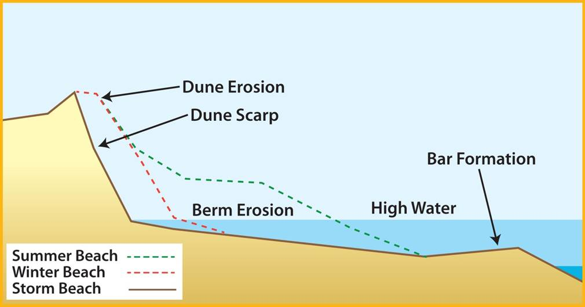
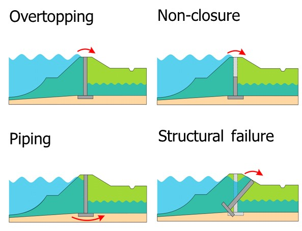

## Failure mechanisms for other types of flood defences
Although other types of flood defences than dikes are not discussed in detail in this version of the lecture notes, it is useful to briefly treat the main mechanisms for the types of defences that are often found in the Netherlands. For sand dunes the analysis focuses on the consideration of dune erosion. It is verified whether sufficient sand volume is present in the profile to prevent a full breach during extreme conditions. 

<figure>
    
    <figcaption style="text-align: center; font-style: italic; font-size: small; margin-top: 5px;">
        Figure 2.11: Schematic representation of dune erosion (i.e., dune profiles before and after storm).
    </figcaption>
</figure>

For hydraulic structures with moveable gates, such as storm surge barriers or sluices, the following failure mechanisms are considered in the current Dutch design guidelines (TAW, 2003). The requirements are related to the current safety standard (i.e. the safety standard formulated as a probability of exceedance).
- Failure due to overflow / overtopping: in this case also the retention / storage of the water behind the structure has to be considered. The requirement for the probability of failure is generally equal to the safety standard ($P<P_{req}$), which implies that the elevation of the structure is determined in the same way as for dikes.
- Failure due to non-closure: in this case flooding due to non-closure of the gates is considered. The reliability of closure, the number of demands and the storage capacity of inflowing water behind the barrier has to be considered. The requirement in the Dutch guidelines is $P < 0.1 P_{req}$.
- Structural failure: in this case the structure fails due to various (sub)failure modes for structural failure, such as sliding, instability or piping. The requirement is as follows: $P < 0.01 P_{req}$. In general it is assumed that this requirement will be met if the structure is designed according to the NEN or Eurocode guidelines.

<figure>
    
    <figcaption style="text-align: center; font-style: italic; font-size: small; margin-top: 5px;">
        Figure 2.12: Typical failure mechanisms for a hydraulic structure with moveable gates.
    </figcaption>
</figure>
