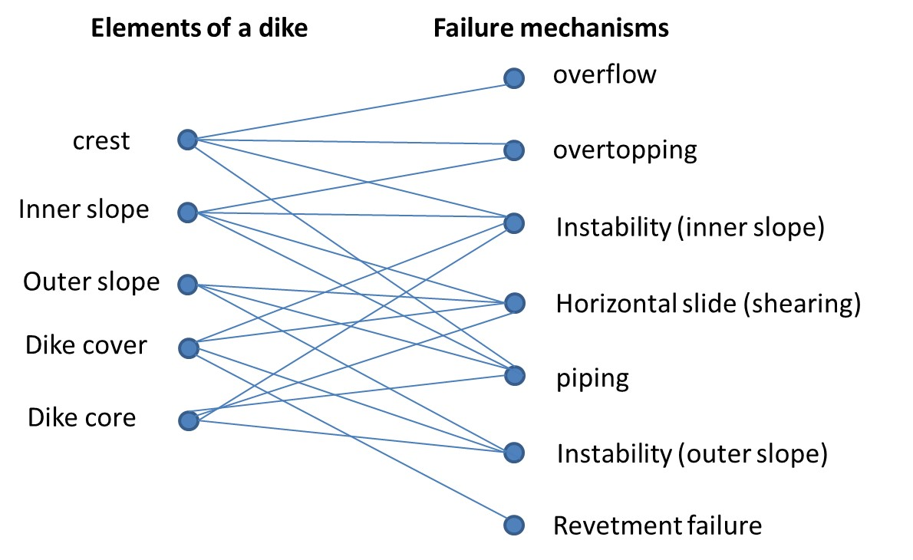

# 2.4 Relationship between failure mechanism and elements of the dike
(Fig-RelationElementsFailmechs-temp)=
The previous sections have given an overview of the typical failure mechanisms of a dike. For purposes of design and analysis it is useful to indicate the relationship between the elements of the dike and the failure mechanism. [Figure 2.13](#Fig-RelationElementsFailmechs) presents these relationships at a general level.

(Fig-RelationElementsFailmechs)=
<figure>
    
    <figcaption style="text-align: center; font-size: small; margin-top: 5px;">
        Figure 2.13: Relationship between elements of a dike and failure mechanisms (only most important relationships indicated).
    </figcaption>
</figure>

Given the above relationships, it is not surprising that certain changes in the dike design will have an effect on multiple failure mechanisms. For example, a change in the inner slope of the dike will influence the safety for both piping and instability. In the final dike design, also the costs of various interventions and available space have to be considered.

The chapters of part II provide more in-depth discussions of the most relevant failure mechanisms for dikes.