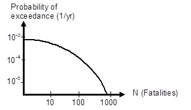
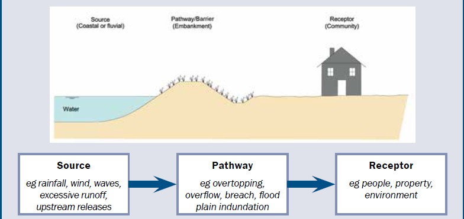

# 3.1 Introduction
(subsec-gen-intro)=
## 3.1.1 General

In general the word risk refers to the probability of loss or harm. The definition adopted by the European Commission (2007) of flood risk is the following:

*"flood risk" means the combination of the probability of a flood event and of the potential adverse consequences for human health, the environment, cultural heritage and economic activity associated with a flood event.*

In the context of flood risk management and often-used definition considers flood risk as expected value:

*Risk is the probability of a flood event multiplied by the consequences*

The unit of risk now depends on the units of probability and consequences. The probability of a flood event is generally expressed as the probability per unit time, for example per year. The consequences of an undesired event are often multi-dimensional, i.e. they can consist of different types of consequences, such as material, ecological damages, injuries and fatalities (see the above definition of the EU and [Section 3.6](sec-flood-dam-ass) for more information). In many applications, consequences are expressed by means of a monetary value. The unit of the risk (or expected value $E(d)$) then becomes € per year. For a case with one event scenario $i$ with probability $p_{i}$, it yields: $E(d)= p_{i}\cdot{d_{i}}$.

A more general definition of risk has been given by Kaplan and Garrick (\citeyear{KaplanGarrick}): Risk is a set of scenarios ($s_{i}$), each of which has a probability ($p_{i}$) and a consequence ($d_{i}$). 

This definition of Kaplan and Garrick allows the use of various so-called risk metrics (or risk measures) to quantify or depict the risk. Similar to the above equation the expected value of the damage for a set of multiple discrete scenarios {1,. . . ,n}, can be expressed as: 

$$
E(d)=\sum\limits_{s_{i}=1}^n=p_{i}\cdot{d_{i}}
$$ (Eq:exp_value)

(Fig-FN-curve-temp)=
The expected value does not give insight in the magnitude of probability and consequences and the contribution of individual scenarios. Therefore, an often-used alternative risk metric is the risk curve. It shows the probability of exceedance of a certain magnitude of consequences. A well-known example of such a risk curve is the FN curve, which displays the probability of exceedance of $N$ fatalities. The values on both axes are generally shown on a logarithmic scale, see  [Figure 3.1](#Fig-FN-curve) for an example. The FN curve was originally introduced for the assessment of the risks in the nuclear industry (\cite{Farmer1967};\cite{Kendall_et.al.1997}) and is now used to display and limit risks in various countries and sectors. Further information on the use of FN curves and a simple example of how to construct such a curve are included in section Flood risk quantification. Similar to the FN curve, a so-called FD curve can be compiled which shows the probability of exceedance of a certain damage value.

(Fig-FN-curve)=
<figure>
  
  <figcaption>Figure 3.1: FN-curve, showing the probability of exceedance of a certain number of fatalities N</figcaption>
</figure>

<figure id="Fig:SP-receptor">
  
  <figcaption>Source-pathway-receptor conceptual model <a href="#Morris_et.al.2007">{Morris et al., 2007}</a></figcaption>
</figure>

## 3.1.2 Other definitions of Flood Risk

In the remainder of these lecture notes the definitions from the previous paragraph will be used. However, it is informative to consider some alternative definitions and concepts that are also used in this field.

In the context of flood risk management also the terms hazard, vulnerability and exposure are often used. Hazard refers to the source of danger, i.e. the (probability of) flooding. Vulnerability relates to potential consequences in case of an event. Exposure relates to people, property, systems, or other elements present in hazard zones that are thereby subject to potential losses.

(Fig-FR-analysis-scheme-temp)=
Another approach, proposed in the International Levee Handbook defines flood risk in terms of three components: source, pathway and receptor, [Figure 3.3]((Fig-FR-analysis-scheme)) for further information.