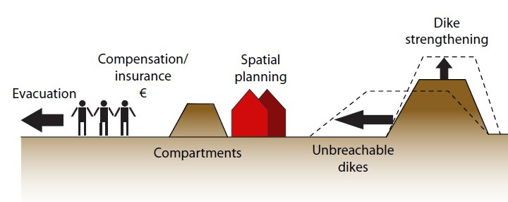
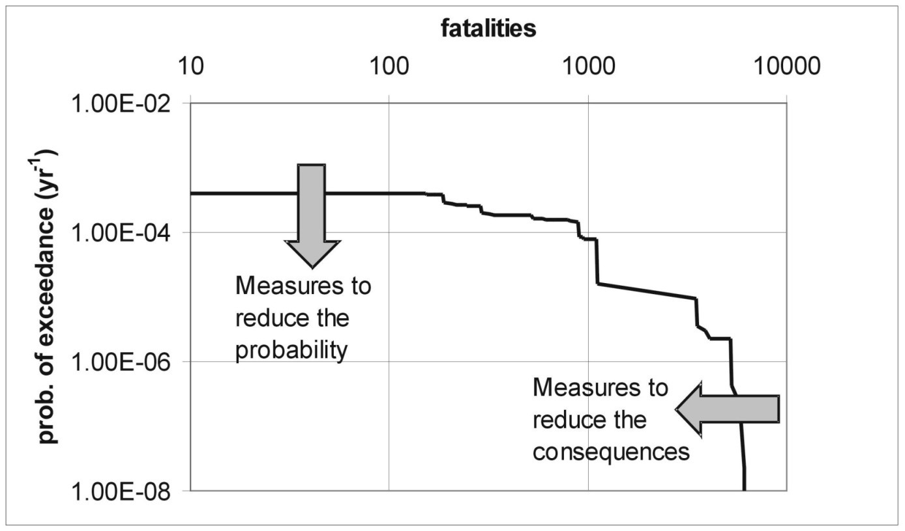
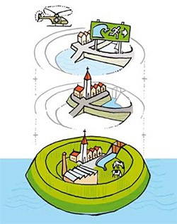
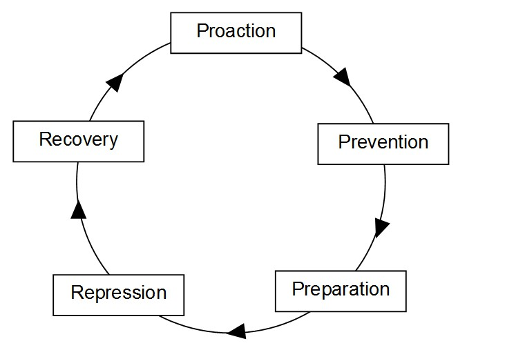
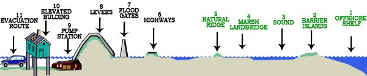
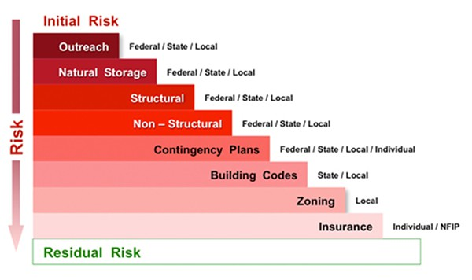

# 3.10 Measures and strategies for flood risk reduction
(subsec-general-floodriskreduction)=
## 3.10.1 General

(Fig-schem-overview-temp)=
If the level of flood risk is not acceptable, flood risk reduction is necessary. Several measures can be taken to reduce flood risks, from measures that focus on load reduction (room for rivers, foreshores), prevention with dikes, reduction of consequences or compensation through insurance (see [Figure 3.37](#Fig-schem-overview) for an overview).

(Fig-schem-overview)=
<figure>
    
    <figcaption style="text-align: center; font-size: small;">
        Figure 3.37: Schematic overview of several measures to reduce flood risks <a href="#Jonkman2009">[Jonkman (2009)](#ref-98)</a>
    </figcaption>
</figure>

(Fig-effect-FN-temp)=
Following the definition of risk as a function of probabilities and consequences of a set of scenarios, two types of interventions can be distinguished: those that reduce the probability of flooding (prevention) or those to reduce the consequences. These two types of interventions can be displayed in an FN curve ([Figure 3.38](#Fig-effect-FN)).

- Prevention measures include the reduction of loads on a flood defence (e.g. room for rivers or foreshores for wave reduction) or an increase the strength of the flood defence (dike reinforcement). They will reduce the probability of flooding and lead to a downward shift of the FN curve.
- Examples of measures that focus on reducing the consequences of failure of a flood defence (sometimes called mitigation measures) are the following: adaptation of existing or new buildings (e.g. by raising), the construction of internal compartment dikes to limit the flooded area, and emergency and evacuation plans.

A special category of measures concerns insurance or government compensation as it will not reduce the damage given flooding, but lead to compensation or redistribution after damage has occurred. Specific measures can have an effect on both the failure probability as well as the consequences. For the example, the design of overflow resistant dikes that are not expected to breach up to very high water levels, will affect the probability of failure but also the consequences since inflow in the polder is affected as a kind of weir is created for events that lead to overflow but not to breaching. Both effects can be included in the flood risk analysis and displayed in the FN curve, since various interventions can be assessed by means of their effects on the risk profile. Other categorizations of measures have been proposed in literature on flood risk management. An often used distinction is those between structural and non-structural measures, see textbox below. However, this distinction could be debated as adaptation of building structures are here seen as “non-structural”. Also, structural measures are discussed with a negative connotation in some literature sources, see for example http://www.fao.org/docrep/008/ae929e/ae929e08.htm (Accessed Feb 20, 2015).

(Fig-effect-FN)=
<figure>
    
    <figcaption style="text-align: center; font-size: small;">
        Figure 3.38: Effect of preventive and mitigation measures on flood risk in an FN curve <a href="#Jonkman2007">[Jonkman (2007)](#ref-97)</a>
    </figcaption>
</figure>

::: {admonition} **Textbox 3.10: Structural vs. non-structural measures**
:class: tip

- **Structural measures**: Any physical construction to reduce or avoid possible impacts of hazards, or application of engineering techniques to achieve hazard-resistance and resilience in structures or systems.

- **Non-structural measures**: Any measure not involving physical construction that uses knowledge, practice, or agreement to reduce risks and impacts, in particular through policies and laws, public awareness raising, training, and education.

**Comment**:  
Common structural measures for disaster risk reduction include dams, flood levies, ocean wave barriers, earthquake-resistant construction, and evacuation shelters. Common non-structural measures include building codes, land use planning laws and their enforcement, research and assessment, information resources, and public awareness programs. Note that in civil and structural engineering, the term “structural” is used in a more restricted sense to mean just the load-bearing structure, with other parts such as wall cladding and interior fittings being termed non-structural.

**Source**:  
UN ISDR - UN Office for Disaster Risk Reduction (15 January 2009), [http://www.preventionweb.net/english/professional/terminology/v.php?id=505](http://www.preventionweb.net/english/professional/terminology/v.php?id=505), (accessed Feb 8, 2015)
:::

Another often used concept in literature on flood risk management and reduction concerns resilience [De Bruijn (2005)](#ref-84);[Simonovic (2014)](#ref-113)). No uniform or unambiguous definition is available but in general it refers to the ability of a system to survive, cope and recover after flood events. Several studies have attempted to develop sets of indicators for resilience. In an engineering context, the concept of resilience is also applied to the design of flood defence systems [PIANC (2014)](#ref-110). It then often relates to the ability of a structure or system to withstand overflow and/or overtopping without catastrophic breaching. For example, in the redesign of the flood protection system of New Orleans after hurricane Katrina, the elevation of the dikes was based on the 100 year return period, but the foundations and scour protection of the system were designed to withstand conditions with a 500 year return period. This was a pragmatic choice and a fully developed risk-based design framework that incorporates resilience is not yet available.

## 3.10.2 Cost effectiveness of flood risk reduction

Eventually, an important aspect of the evaluating of measures concerns their (cost) effectiveness. It can be expressed with different metrics, e.g. the level of probability or flood risk reduction achieved. Since budgets for flood management are limited, an often-used indicator concerns the cost effectiveness, which is basically the level of risk reduction divided by the costs. For a measure to be cost effective, the investments should be smaller than the risk reduction expressed in monetary terms.

$$
I<\Delta{E(D)}
$$ (Eq:cost_effec)

This formula can also be used to calculated the benefit/cost ratio, i.e. $\Delta{E(D)}/I$. This ratio should be greater than 1 for cost-effective projects. Note that all costs and the risk reduction are given in terms of present value with a unit of \euro. For investments that focus on prevention (i.e. reducing the failure probability of the system) equation {eq}`Eq:cost_effec` can be formulated as follows:

$$
I<(P_{f,0}-P_{f,new})D
$$ (Eq:cost_effec_prob)

In which:
- $P_{f,0}$ is the initial failure probability $[-]$;
- $P_{f,new}$ is the failure probability after risk reduction investment$[-]$.

For measures that focus on the reduction of consequences (e.g. compartment dikes or adaptation of houses), the following formulation can be used:

$$
I<P_{f,0}(D_{0}-D_{new})
$$ (Eq:cost_effec_cons)

In which:
- $D_{0}$ is the initial damage $[\text{\euro}]$;
- $D_{new}$ is the damage after investments in reducing the consequences $[\text{\euro}]$.

The foregoing assumes that both the costs and benefits are expressed in the same unit, generally in the form of a present value $[\text{\euro}]$. The nett present value represents the sum of the present values of the benefit and cost cash flows over a period of time. In engineering we often deal with situations with larger initial investments, whereas the risk reduction benefits are spread out over a longer time period. For example, when a government invests this year in flood protection, the costs are made in year 0, but the benefits will be spread over the coming decades. The net present value of cost or benefit values over a future range of years can be calculated with formula. To calculate the nett present value $NPV [\text{\euro}]$ a discount rate $r$ should be used. The discount rates represents a required return on an investment.

$$
NPV=\sum_{i=1}^{T} \frac{C_{i}}{{(1+r)}^t}
$$ (Eq:NPV)

In which:
- $C_{i}$ is the costs in year i $[\text{\euro}]$;
- $T$ is the reference period [years].

For an infinite time horizon it can be shown that $\sum 1/(1+r)^t \approx 1/r$. This approximation can be used in evaluating engineering projects with a long life time. \\
This approach can be applied to compare the cost effectiveness of different (combinations of) prevention and mitigation measures, see for example [Hoss et al. (2012)](#ref-94) for an analysis of different interventions for Dordrecht. For the case of dike ring areas in the Netherlands, with high protection levels (i.e. a low value of $P_{f,0}$) and large damages ($D_{0}$ values), data from several cases shows that prevention is generally more cost effective than investing in reduction of consequences. However, different outcomes could be found for different systems, e.g. in rural communities in less densely populated deltas, e.g. in the Mekong river. 

## 3.10.3 Frameworks for flood risk reduction and flood risk management

Several frameworks have been developed for managing flood risks and evaluating portfolios of flood risk reduction measures. Many of these frameworks attempt to combine the different risk reduction measures and the various actors involved. Eventually, all the different interventions can also be expressed by means of their contribution to the reduction of flooding probability or flooding consequences, and thus be evaluated for risk reduction and cost effectiveness.

The Dutch government is using the concept of “multi-layer safety” (meerlaagsveiligheid in Dutch). It entails the combination of prevention, land use planning and emergency management. This framework has already been introduced in [section 3.10.1](subsec-general-floodriskreduction). 

<figure>
    
    <figcaption style="text-align: center; font-size: small;">
        Figure 3.39: Multi-layer safety (meerlaagsveiligheid) concept used by the Dutch government
    </figcaption>
</figure>

Another alternative is the so-called safety chain that various governments use to structure their efforts in the field of risk management for low-probability disasters. The safety chain typically consists of the following components: pro-action, prevention, preparation, repression. While the terminology suggests that the safety chain should be interpreted a series system, the safety chain more closely resembles a parallel system. This has important implications: the safety chain is not as weak as its weakest link; unreliable links need not always be strengthened as it will often be more efficient to rely on a few layers of protection, or just one. To avoid misguided efforts caused by the confusing terminology ‘safety chain’, it is more accurate the use of the term ‘layers of protection’, as is currently the case in the Dutch flood safety policy [Jongejan et al. (2012)](#ref-95).

<figure>
    
    <figcaption style="text-align: center; font-size: small;">
        Figure 3.40: Graphical representation of the safety chain
    </figcaption>
</figure>

Several other frameworks and concepts exist for grouping flood risk reduction measures. After the flooding of New Orleans, Lopez (2006) has introduced the multiple lines of defence strategy, which distinguishes various measures that could be taken to reduce levee failure probabilities or consequences.

<figure>
    
    <figcaption style="text-align: center; font-size: small;">
        Figure 3.41: Multiple lines of defence <a href="#Lopez2006">[Lopez (2006)](#ref-105)</a>
    </figcaption>
</figure>

The Unites States Army Corps of Engineers (the American Rijkswaterstaat) uses a framework under the title “buying down risk”. It includes the different interventions and actors, [Figure 3.42](#Fig-buy_down_risk), involved in risk reduction.

<figure>
    
    <figcaption style="text-align: center; font-size: small;">
        Figure 3.42: Buying down risk concept used by USACE
    </figcaption>
</figure>
