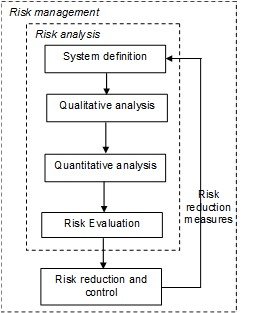

## 3.2 General approach for flood risk analysis

Flood risk management is defined in these lecture notes as an approach to systematically identify, analyse, evaluate, control and manage the flood risks in a given system. A general scheme for flood risk management is presented in {numref}`Fig:FR-analysis_scheme`.

<figure>
  
  <figcaption>Figure 3.3: General scheme for (flood) risk analysis <a href="#Jonkman_et.al.2015">{Jonkman et al., 2015}</a></figcaption>
</figure>

The following steps are identified within flood risk analysis:
1. System definition and setting the scope and objectives of the analysis;
1. Qualitative analysis of undesired events;
1. Quantitative analysis of the flood risk;
1. Risk evaluation (of the acceptability of the risk)

In addition to the steps in risk assessment of a given system, flood risk management also includes the element ‘risk reduction and control’. Depending on the results of the former phase measures can be taken to reduce the risk. This will lead to changes in the system configuration and the risk level. If the risk analysis is used in the design of systems, the steps are often repeated several times with adjusted system specifications to obtain an optimal design. Optimization may be aimed at reaching a minimum risk level and low costs or an acceptable risk value (see [Section 3.8](sec-floodrisk-eval)). It should also be determined how the risks can be controlled, for example by monitoring, inspection or maintenance.

{numref}`Fig:Steps_FR_analysis` summarizes the most important steps of flood risk analysis for areas protected by flood defences. Such areas are found in the Netherlands and many other regions in the world. The following paragraphs will focus on these steps and outline principles and available methods. It is largely based on information developed and applied in the project VNK (“Veiligheid Nederland in Kaart”) in the Netherlands. This entailed a detailed flood risk analysis that included all these five steps.

For areas without flood defences (e.g. sloping areas near a river) the analysis of failure probability and breaching of the defences will not be required, but the other steps will be similar to a large extent. In {numref}`appendix_catchments_without_defences` a short explanation is given of the typical analyses for situation without flood defences.

<figure>
  
  <figcaption>Steps in quantitative flood risk analysis for areas protected by flood defences</figcaption>
</figure>

  <strong>Textbox 3.1: Further information on flood risk analysis</strong> 
  A number of recent publications provide further background, information and examples with a focus on flood risk analysis for dike ring areas in the Netherlands.
  <ul>
    <li>Jonkman S.N., Vrijling J.K., Kok M. (2008) Flood risk assessment in the Netherlands: A case study for dike ring South Holland, Risk Analysis Vol. 28, No. 5, pp.1357-1373</li>
    <li>VNK (Veiligheid Nederland in Kaart) (2012) Flood risk analysis in the Netherlands. VNK2 - the method in brief.</li>
    <li>VNK-Veiligheid Nederland in Kaart (2014) Eindrapportage Veiligheid Nederland in Kaart. Rapport HB 2540621 FG- 0</li>
    <li>VNK-Veiligheid Nederland in Kaart (2014) The National Flood Risk Analysis for the Netherlands, Final report.</li>
    <li>R.B. Jongejan, B. Maaskant (2015) Quantifying Flood Risks in the Netherlands. Risk Analysis. DOI: 10.1111/risa.12285</li>
    <li>CIRIA (2013) International Levee Handbook. CIRIA, London, UK ISBN: 978-0-86017-734-0</li>
  </ul>

