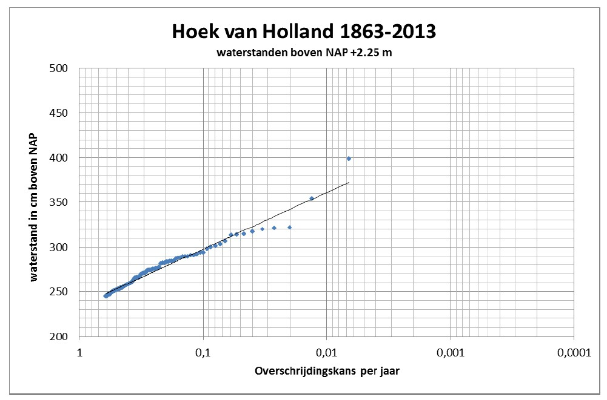
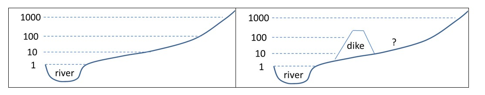

# 3.3 Flood hazard analysis

The first step is to analyse the relevant hydraulic conditions based on the (natural) system.
- For river dikes the main hydraulic loads will be associated with high river discharges
- Along the coast the hydraulic loads will be caused by storms, leading to storm surge and waves. The effect of tide have to be included as well.
- Areas in a delta (the transition area) can be affected by combinations of high river discharges and storm surges
- High water levels and waves on lakes are generally caused by wind set-up, sometimes in combination with inflow from rivers.
- Canal dikes within a dike ring system (“boezemkaden”) are generally characterized by a relatively constant load since water levels in the canal are controlled by pumping stations.

Depending on the region in the world different phenomena can occur. At regions relatively near the equator tropical storms (hurricanes / typhoons / cyclones) can occur, whereas other types of storms can occur at mid altitudes of the earth, see textbox 3.2 below. 

::: {admonition} **Textbox 3.2: Comparison of storms and storm surges from tropical and extratropical storms**
:class: tip

Tropical cyclones typically form over large bodies of relatively warm water, from which they derive their energy. They form near the equators and generally occur in tropical areas. Mid-latitude storms, such as Nor’easters in the US and windstorms in Europe, occur due to horizontal temperature contrasts1.

The table below compares two well-known storms, the 1953 storm surge (Watersnoodramp) and Hurricane Katrina. This illustrates that both storms can lead to destructive surges. There are differences in the pressure (lower for hurricanes), maximum windspeeds (larger for hurricanes), and duration (smaller for hurricanes). Both storms can be particularly catastrophic when the peak of the storm surge coincides with high tide.

|                            | North Sea storm surge    | Hurricane Katrina                            |
|----------------------------|--------------------------|---------------------------------------------|
| **Date**                   | February 1, 1953         | August 29, 2005                             |
| **Region**                 | North Sea                | Gulf of Mexico, Louisiana and Mississippi   |
| **Type of storm**          | Extratropical (storm surge) | Tropical (hurricane)                     |
| **Minimum pressure**       | 970 mbar                 | 902 mbar                                    |
| **Highest windspeed**      | 144 km/h                 | 280 km/h                                    |
| **Surge (m vs MSL)**       | +4.55 at Vlissingen      | +6 at Lake Borgne                           |
| **Typical duration**       | 24-48 hours              | 6-12 hours                                  |
| **Fatalities**             | 1835 in the Netherlands and hundreds in the UK and Belgium | Hundreds in New Orleans, more than 1000 along the Gulf Coast |
:::

1 Text of the first two lines is based on Wikipedia.

  
For quantitative flood risk analysis it is required to characterize the hydraulic loads in probabilistic terms. To do so, the annual probability of exceedance (or its inverse the return period) of certain hydraulic load levels need to be determined. This probability is derived based on an extrapolation of observed water levels (see  [Figure 3.5](#Fig:Prob_exceedance) for an example), sometimes supplemented with model calculations. According to the current statistics the 1953 storm surge disaster has a probability of exceedance of about 1/400 per year. This example, shows the probability of exceedance, but for the purposes of reliability analysis the distribution function and related probability density function have to be characterized as well. It is noted that new realizations of high water level events can lead to changes in the distribution. For example, after the high discharges in the Rhine river in 1993 and 1995, the distribution was fitted again and a higher design discharge resulted due to a shift of the distribution function.

<figure>
  
  <figcaption>Figure 3.5: Probability of exceedance of the water level near Hoek van Holland (source: HJ Verhagen)</figcaption>
</figure>

(Fig-Prob-exceedance-river-temp)=
For areas without flood defences the probability of flooding of a location can be directly found by combining the elevation of the terrain and the hydraulics, see [Figure 3.6](#Fig-Prob-exceedance-river)(left) for an example of a river system. This will for example be a useful for the approach for relatively steep catchments where no flood defences are present. 

For an area with flood defences, the probability of failure and / over overflow needs to be determined. The hydraulic loads on a defence are taken into account in the reliability analysis, safety assessment and design of a dike. These so-called hydraulic boundary conditions include the relevant loads, such as water levels, waves and currents. In a simplified analysis the probability of flooding is assumed to be equal to the likelihood of overflow or overtopping of defences. However, it is more realistic to take into account the (additional) probability that the defences will fail - for example due to geotechnical failure modes, such as instability - when flood levels are still below the crest of the dike. The analysis of the probability of failure of flood defences is discussed in more detail in the next sections.

(Fig-Prob-exceedance-river)=
<figure>
  
  <figcaption>Figure 3.6: Analysis of the probability of flooding for a river system without defences (left) and with defences (right)</figcaption>
</figure>

In many countries, for example in the Netherlands and US, a so-called design water level is used for the design and safety assessment of flood defences. The design water level corresponds to a probability of exceedance of these load conditions. For example, the flood defences in the dike ring of South Holland have a safety standard of 1/10,000 per year. Thus, the dikes around the dike ring should be designed to safely withstand a hydraulic load level (consisting of water levels and waves) which is exceeded on average once every 10,000 year. The above focused on the analysis distribution for one variable (e.g. water level).

In many cases, multiple hydraulic loads could be dependent. For example, water levels and waves along the coast are caused by storms and thus high water levels and waves are expected to coincide. In such situations, a probabilistic analysis of multiple variables is needed. For further information on hydraulic boundary conditions, see [Chapter 4]Ch:HydraulicLoads on hydraulic boundary conditions in these lecture notes.
