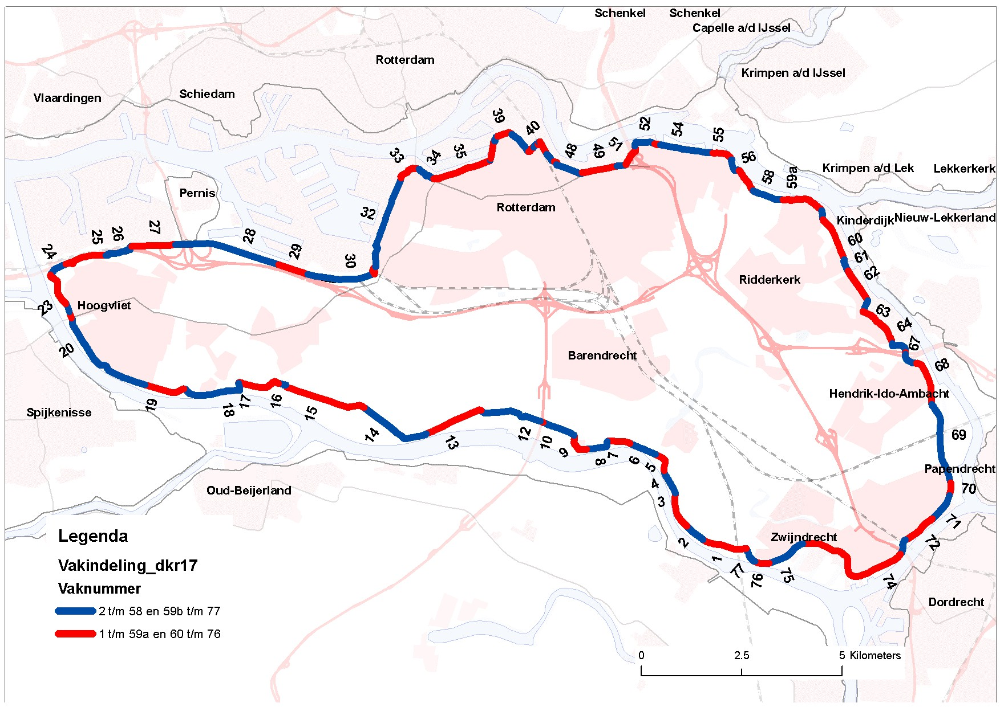
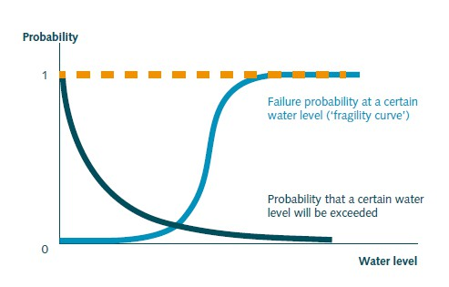
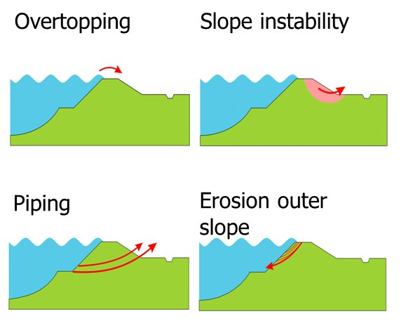
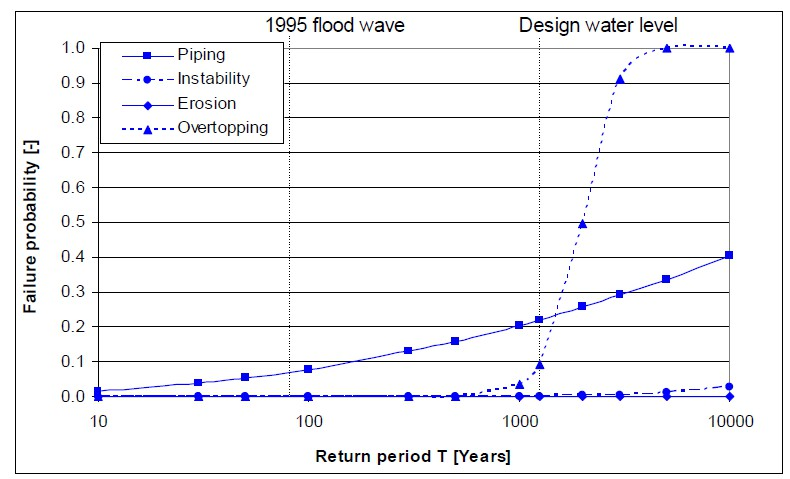
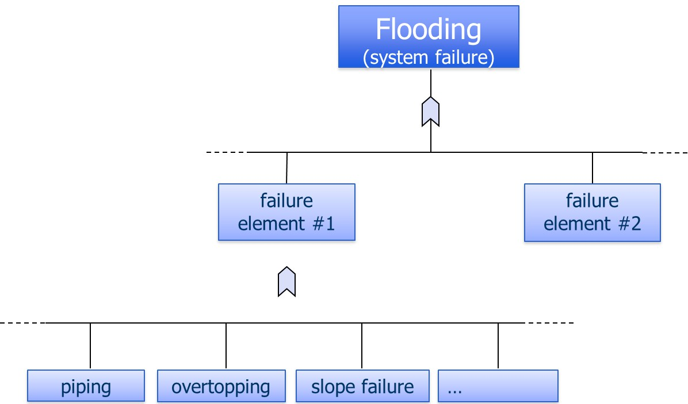
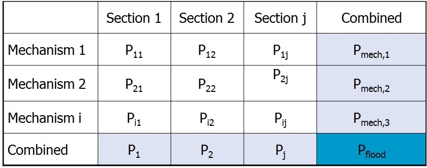
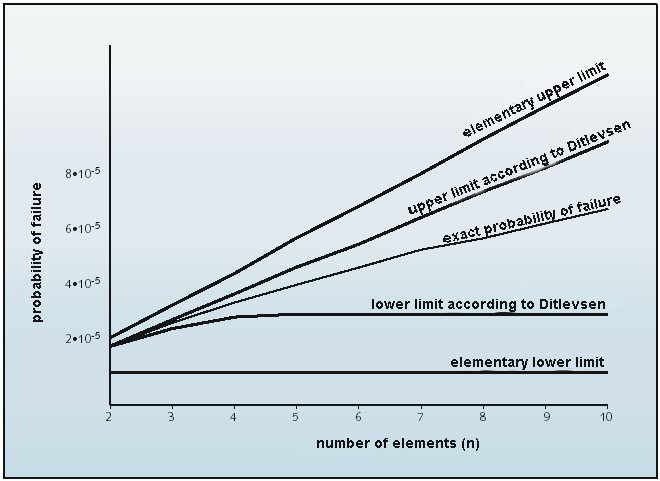
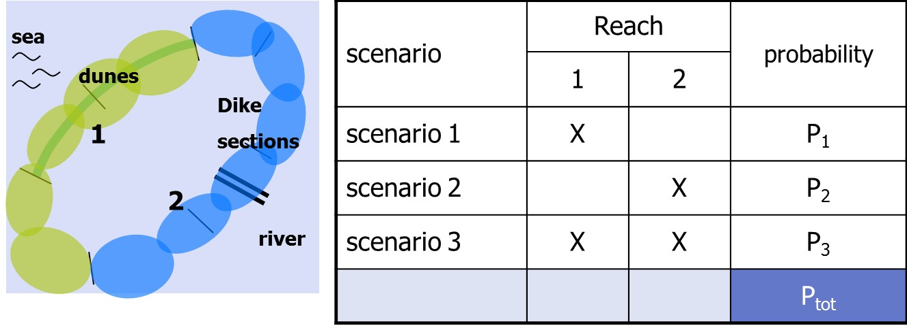
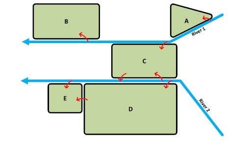

# 3.4 Probability of failure of flood defences

After the system definition and analysis of hydraulic boundary conditions, the probability of failure of flood defence system needs to be analysed. The calculation of the failure probability of a flood defence system can be divided in a number of steps that are treated in more detail in the coming paragraphs. These include the decomposition of the flood defence system in sections, the calculation of the failure probabilities per section and failure mechanism and the determination of flood scenario probabilities.

## 3.4.1 Decomposing a flood defence system

A flood defence system typically consists of different types of flood defences, such as dikes, hydraulic structures, and dunes, with different geometries, orientations, and subsoils. To facilitate the computation of failure probabilities (and later, scenario probabilities), each dike system is decomposed into (largely) statistically homogeneous sections. Sections are generally around 750 m long, though they can range from 150 m to over 2 km depending on circumstances. Dune sections can be several kilometers long. Hydraulic structures, such as sluices and culverts, are treated as individual sections[^2]. 

(Fig-dike-sections-temp)=
An example of a schematisation into dike sections is shown in [FIgure 3.7:](#Fig-dike-sections) below for the dike ring IJsselmonde in the Southwest of the Netherlands. The total length of the dike ring is 62km and 77 dike sections are distinguished.

(Fig-dike-sections)=
<figure>
  
  <figcaption>Figure 3.7: Dike sections for dike ring IJsselmonde (Source: Havinga, 2010)</figcaption>
</figure>

(subsec-calc-fail-prob)=
## 3.4.2 Calculation of the failure probability

### General
When a system or part of it no longer fulfils one or more desired functions, this is known as failure. In the case of a flood defence it refers to the water retaining function of the defence. A limit state is a condition of a structure beyond which it no longer fulfils the relevant design criteria (\cite{Eurocode2001}). In the case of exceedance of ultimate limit state (ULS) failure or collapse of a system or structure occurs. Exceedance of the Serviceability limit state (SLS) leads to temporary failure or disturbance.

A limit state $Z$ can be assessed by considering the resistance $R$ and the loads $S$, i.e.

$$
Z=R-S
$$ (Eq:Limstate)

Failure occurs when $R<S$, so when $Z < 0$. The probability of failure, i.e. $P_{f}(Z < 0)$, can be computed as follows:

$$
P_{f}=P(Z<0)=\int_{0}^{\infty} f_{H}(h)\cdot F_{R}(h) \,dh
$$ (Eq:prob_fail)

In which: 
- $f_{H} (h)$ - probability density function of hydraulic load levels; 
- $F_{R}(h)$- cumulative distribution of resistance given a certain hydraulic load level.

Note that this formulation assumes the water level to be the only load. In general, except for simple cases, the limit state function cannot be expressed purely in terms of loads and resistances.

(Fig-schem-repres-temp)=
[Figure 3.8](#Fig-schem-repres) gives a schematic and representation of this process for a simplified case where the water level is the only load variable that is considered. This is representative for a river dike. The probability density function (pdf) of water levels $f_{H}(h)$ follows from a statistical analysis of hydraulic loads. The probability of exceedance of a certain water level can be directly derived from this pdf. The cumulative distribution of strength $F_{R}(h)$ is also referred a the fragility curve. It indicates the conditional failure probability of the dike given a certain load level.

(Fig-schem-repres)=
<figure>
  
  <figcaption>Figure 3.8: Schematic representation of the calculation of failure probabilities based on a water level distribution and fragility curve; based on <a href="#VNK2_2012">VNK2, 2012</a></figcaption>
</figure>

The probability of failure of flood defences $P_{f}$ is generally expressed per unit of time, in most cases a failure probability per year. In many cases the failure probability is expressed by means of a reliability index $\beta$. See [Chapter 10]CH:Saf_stand_ass_design` for more information.

### Failure mechanisms
(Fig-fail-mech-temp)=
For every section of flood defence system different failure mechanisms (or failure modes) have to be considered. For example, a dike can fail due to overtopping, but also due to geotechnical failure mechanisms such as instability or piping. The most common failure mechanisms for a dike are shown in [Figure 3.9](#Fig-fail-mech) below and these are further discussed in later chapters in these lecture notes. For every failure mechanism both the load terms and strength need to be characterized in probabilistic terms, i.e. by means of probability density functions (see [Figure 3.8](#Fig-schem-repres)). For example, for wave overtopping a critical discharge is identified at which a grass cover on the inner side of the dike will fail to characterize the strength. The permissible discharge depends on the grass quality (e.g. 5 l/s/m for a good quality of grass). A probability distribution can be used to account for uncertainties in the critical overtopping discharge.

The load term will be determined by the probability of an actual amount of the overtopping, and this in turn will be determined by the characteristics of the dike (slope, revetment, elevation) and the probability of surge and wave events. Other failure mechanisms will be applicable to other types of elements, for example to dunes (erosion) and hydraulic structures, and these will be discussed elsewhere in these lecture notes.

(Fig-fail-mech)=
<figure>
  
  <figcaption>Figure 3.9: Typical failure mechanisms for a dike (Source: VKN)</figcaption>
</figure>

(Fig-frag-curve-temp)=
The different failure mechanisms will exhibit a different dependence on the water level. This is shown by means of fragility curves in [Figure 3.10](#Fig-frag-curve). Failure due to overflow / overtopping will be strongly determined by the occurrence of high water levels. The conditional failure probability (or value of the fragility curve) quickly reaches 1 if the dike height (which is generally near the design water level) is exceeded. For the “geotechnical” failure mechanisms (instability, piping) uncertainties in soil characteristics and behaviour will become more important and failure could also occur at lower water levels. This is also shown in the fragility curves for these mechanisms.

(Fig-frag-curve)=
<figure>
  
  <figcaption>Figure 3.10: Fragility curves for the dike in dike ring 43 (Betuwe) along the river Waal <a href="#terHorst_et.al.2006">{terHorst et al., 2006}</a>. Note the horizontal axis shows the return period for a water level</figcaption>
</figure>

### Failure probability of flood defence systems
(Fig-fault-tree-temp)=
A flood defence system can consist of different types of elements, such as dikes, dunes and structures. It is a series system, implying that failure can occur if one of the elements (or sections) in the system fails. The failure probability of flood defence system is thus equal to the probability that one or more sections (dike section, dune section, hydraulic structure) fails. In considering the probability of failure the different failure mechanisms also have to be taken into account. [Figure 3.11](#Fig-fault-tree) schematically shows how the probability of flooding can be determined.

(Fig-fault-tree)=
<figure>
  
  <figcaption>Figure 3.11: Schematic fault tree for a flood defence system</figcaption>
</figure>

(Fig-results-example-temp)=
Firstly, failure probabilities are determined for a certain mechanism for a single section. Consequently, these estimates can be aggregated to probabilities at the section level (by combining the mechanisms) or at the system level (by combining sections). Thereby, insight can be given in the contribution of failure mechanisms to the overall system failure probability (see [Figure 3.12](#Fig-results-example)).

(Fig-results-example)=
<figure>
  
  <figcaption>Figure 3.12: Example of presentation of results of failure probability calculation</figcaption>
</figure>

*Correlations in the space domain are taken into account when combining the failure probabilities per failure mechanism for each section to an overall failure probability for the entire system. The failure probabilities per failure mechanism and section are not simply added. A flood defence system can be regarded as a serial system. A serial system fails if one of its elements fails (as with simple Christmas tree lighting). The lower limit of the failure probability (lowest possible failure probability) in a serial system equals the maximum failure probability of the elements (each with failure probability $P_{i}$). This corresponds to a situation in which failure of elements are dependent. The upper limit of the failure probability (highest possible failure probability) in a serial system equals the sum of the failure probabilities of the elements.*

*Lower limit: $P_{combi}=Max(P_{i})$*\\
*Upper limit: $P_{combi}=\Sigma(P_{i})$*

When failures are independent and failure probabilities are small the probability of failure at the system level will be close to the upper limit[^3].

In practice, the failure probability of a serial system will fall somewhere between these two extremes, depending on the overlap between the combinations of strength properties and loads at which the various elements fail.

The greater the length of a flood defence system, the more likely it is that there will be a weaker spot somewhere. The phenomenon whereby the failure probability increases with the length of the flood defence is known as the **length effect** (\citep{VNK2_2012}). The question is to which extent the failure probability increases with length. For example, if a probability of failure of 1/1000 per year is calculated for a section of 1 kilometer, one can question what the probability of failure will be for a dike ring with a length of 10 kilometers.

For certain failure mechanisms, failures of sections will generally be more dependent and thus closer to the lower limit. An example if the mechanism of overflow. Dike sections in a system are affected by the same load (the high water level) and will have similar resistances (i.e. crest heights) will be relatively similar. In this case failure are dependent. The system failure probability will be determined by the weakest link, for example the section with the lowest crest height. In the case of the above example the failure probability for the 10km dike ring would be equal to that of the section, i.e. 1/1000 per year.

For other mechanisms failures will be more independent and the combined failure probability will be
closer to the upper limit case. This is often the case for geotechnical failures, which are affected by local weak spots in the soil. Since these local weak spots (e.g. old sand layers that cause piping) can occur randomly, the strengths of the sections can be assumed to be independent for a simplified case. For the example, a first approximation for the 10 km long dike ring, would be a failure probability of 10 x 1/1000 per year = 1/100 per year.Obviously, the weak spots in the dike don’t move over time (if there are no reinforcements). So soil investigation may improve the knowledge of weak spots. This would mean that the length effect (and soil characteristics) can be chosen less conservatively.

(Fig-sys-fail-prob-temp)=
The above approximations can be used as a first indicative and rough rule of thumb. Eventually, the system failure probability will depend on the level of correlation between the section failures. A rigorous probabilistic analysis is required to account for these correlations between loads and strengths of sections. [Figure 3.13](#Fig-sys-fail-prob) shows the upper and lower limit, and for a fictitious system consisting of multiple elements. A further discussion of the length effect is included in [appendix E]THE_LENGTH_EFFECT.

(Fig-sys-fail-prob)=
<figure>
  
  <figcaption>Figure 3.13: System failure probability for a system consisting of multiple elements (failure probability of one element is \(10^{-5}\)) <a href="#CUR2015">{CUR, 2015}</a></figcaption>
</figure>

## 3.4.3 Flood scenario probabilities

*A flood scenario is defined as a unique sequence of events following the failure of one or more flood defenses, under specific high-water conditions. In reality, the number of potential flood scenarios is infinite. The infinite range of potential flood scenarios can be characterized by a limited set of representative flood scenarios. To define these representative flood scenarios (simply named scenarios hereafter), the levee system is first divided into so-called consequence segments, each comprising one or more sections. Each consequence segment should be defined such that the flood pattern and consequences of flooding are relatively insensitive to the precise location of a breach within the segment.*
[^4]: Text in Italics adapted from Jongejan and Maaskant (2015).

(Fig-ident-flood-scenandprob-temp)=
This process is illustrated in [Figure 3.14](#Fig-ident-flood-scenandprob). A simplified dike ring is assumed that consists of multiple sections of dunes (left) and dikes (right). Further analysis of the topography and elevation of the dike ring and hydraulic loads shows that the effects and consequences of flooding are the same for all dune sections. The same reasoning applies to all dike sections. This means that two reaches can be formed (1, 2). Therefore three flood scenarios can be distinguished: failure of a dune section (1), failure of a dike section (2), and simultaneous failure of a dike and dune section (1 and 2).

Probabilistic calculation techniques can be used to combine the failure probabilities of sections to the
probability of failure for a reach consisting of multiple sections (see \cite{Jongejan_Maaskant2015} and \cite{Vergouwe2014}) for further background. In that case it also becomes important whether failure of one section lead to “relief” (i.e. lowering of hydraulic loads) on other sections. These interactions are not only relevant at a dike ring level, but also at a higher system level - see textbox below for further discussion.

(Fig-ident-flood-scenandprob)=
<figure>
  
  <figcaption>Figure 3.14: Identification of flood scenarios and scenario probabilities (source: VNK-presentation)</figcaption>
</figure>

A comprehensive flood risk analysis has to take into account both scenarios with single breaches, as well as scenarios with multiple breaches. The floods in New Orleans (2005), Thailand (2011) and Germany (2013) were characterized by a large number of breaches in the flood protection system. Also, other historical events, such as the 1953 storm surge in the Netherlands (more than 100 failures) or the Elbe floods (Germany, 2002) with more than 70 failures (Heyer and Horlacher, 2007), show similar patterns. In all these cases overloading of the system led to multiple failures, exacerbating the extent of the flooding and the damage.

::: {admonition} **Textbox 3.4: Interactions between flooding of dike rings - river system behaviour**
:class: tip

Especially for river systems, considering only an individual dike ring or flood defense system might be insufficient. There can be interdependencies in loads between dike rings, often referred to as system behavior (\cite{van Mierlo et al., 2003}; \cite{van Mierlo & Vrouwenvelder, 2007}).
(Fig-Concept-river-sys-temp)=
There can be both negative and positive interactions, illustrated with a conceptual river system with two rivers and five dike rings (see the following [Figure](#Fig-Concept-river-sys)).

(Fig-Concept-river-sys)=
<figure>
  
  <figcaption>Conceptual river system with two rivers and five dike rings</figcaption>
</figure>

Positive interactions occur when flooding of one dike ring reduces the hydraulic loads on the other. For example, when dike ring D floods from river 2, the storage of water in dike ring D reduces hydraulic loads on dike ring E. Negative system interactions occur when flooding of one dike ring leads to additional hazards for another. For instance, flooding of dike ring D may cascade to dike ring E due to failure of compartment dikes that separate them. Another type of cascade occurs when flooding from one river (e.g., river 1) floods a dike ring (C) and then cascades to river 2, increasing flood hazards for dike rings D and E.

Existing flood risk analyses (e.g., the nationwide flood risk assessment VNK) do not account for these system interactions between dike rings. Preliminary analyses of flood risks in larger systems have been conducted by \cite{Klerk, 2013} and \cite{van Mierlo & Vrouwenvelder, 2007}. These models require extensive computation due to the large number of flood scenario combinations.
:::

