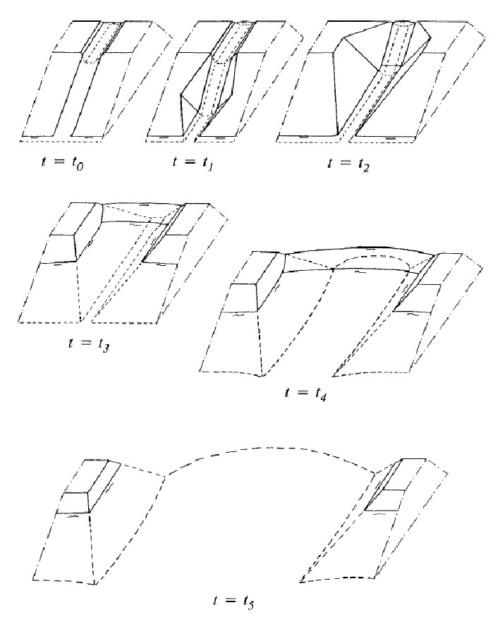
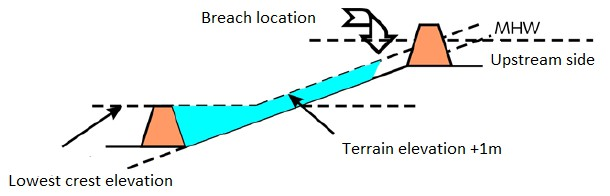
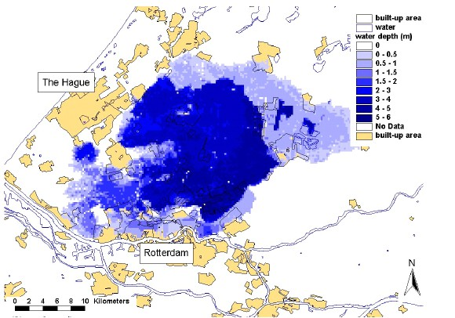
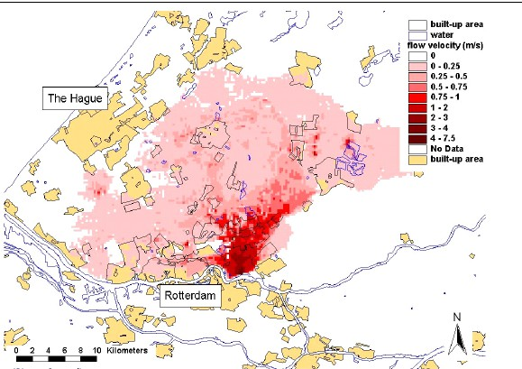
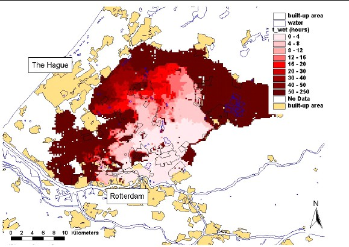
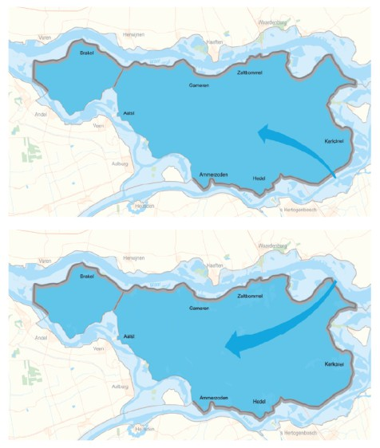
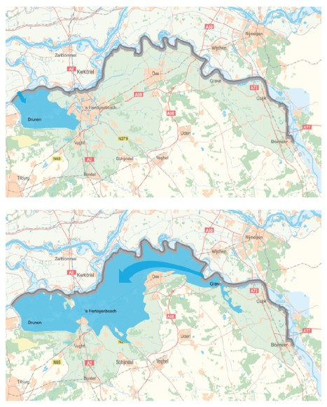
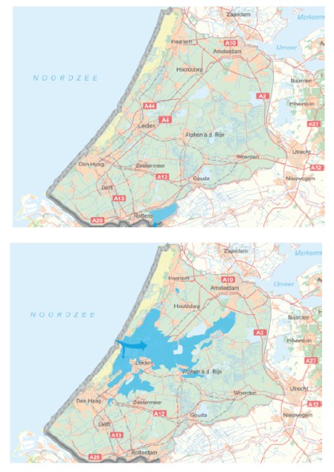

## Breaching and flood scenarios

Once the likelihood of failure of defences is known, the next step is the consideration of breaching of defences and the consequent inflow of water. This will affect the consequences of flooding. This paragraph will discuss the basis of (modelling of) breaching of flood defences and flood simulation.

### Breaching of flood defences

The previous section has discussed the failure mechanisms of flood defences. The next step is to determine how the breach will develop in space and time. This determines the flow velocity, water depth, volume of water that flows into the flooded area, and the flood extent, which are consequently related to the economic damage involved.

Models for the development of dike breaches have amongst others been developed by Visser (1998) and van Damme et al. (2012) for sand dikes and by Zhu (2006) for cohesive dikes.The models distinguish between five stages of breach formation (also see {numref}`Fig:stages_breach`): 0) formation of a small initial breach due to overflow; 1) steepening of the slope angle of the channel on the landside slope; 2) erosion of the landside slope channel; 3) lowering of the top of the dike in the breach; 4) stage in which the flow is critical over almost the whole breach and the breach continues to grow laterally and in the vertical direction; 5) subcritical flow stage in which the breach growths. The breach process stops when the water level within the dike ring levels with the outside water level.

<figure>
  
  <figcaption>Figure 3.15: Stages in the development of a breach <a href="#Vissers1998">{Vissers, 1998}</a></figcaption>
</figure>

Besides computer models, equations have been used to estimate breach growth formation. Although less accurate, the advantage of equations over models is the time needed to obtain an answer. An estimate of the breach growth with time during stages 4 and 5 can be obtained with the the Verheij- van der Knaap formula {cite}`Verheij2003`.

$$
B(t)=1.3\cdot{\frac{g^{0.5}\cdot{\Delta{h}}}{u_{c}}\cdot{\log{\frac{(1+0.4)}{u_{c}}}}\cdot{t}}
$$ (Eq:breach_growth)

In which:
- $B(t)$ - breach width as a function of time $[m]$
- $\Delta{h}$ - difference between the outside (river) water level and the water level in the flooded area $[m]$
- $t$ - time $[s]$
- $g$ - a gravitational constant$[m/s^{2}]$
- $u_{c}$ - critical flow velocity for erosion $[m/s]$($u_{c} = 0.2 m/s$ for sand, and $u_{c} = 0.5 m/s$ for clay).

Further analysis of the formula has shown that it is quite sensitive for the critical flow. If necessary it is possible to simplify the formula and replace the term before the logarithm with a factor of 100 for sand dikes and a factor of 35 for clay dikes {cite}`Verheij2003`.

It should be noted that this formula assumes that a breach has already formed over the full height of the embankment. Moreover is the assumption of a logarithmic decrease in breach growth not founded on a physical explanation but solely based on an assumption that a breach growth will slow under constant velocities and shear stresses applied on the soil. The formula is therefore subject to high levels of uncertainty which are hard to quantify due to the lack of data available.

In practice, breach width levels range from small breaches (10 to 20m) to observed breaches of 150 to 200m for less cohesive materials. 

Several challenges remain in the field of research on breach growth. These include scientific challenges to the study of the processes that determine breach initiation and breach growth, but also the prediction of the number of breaches that will occur and their location as many historical events were characterized by multiple breaches. For the latter more insight is required in the variability in strength of a structure and loading on a structure.

### Flood simulation

The next step is the analysis of flood characteristics in the dike ring for a given breach. Several approaches are available for the simulation of flood characteristics.

The simplest and most conservative form is a purely geometrical approach. The water level is imposed on an elevation model, and it is assumed that all areas that are lower than the water level will be flooded. The approach is utilized in some global studies on coastal flood risk and sea level rise. This approach does not take into account the effects of flood defences, or balances of volume. In the one-dimensional (1D) basin storage approach the development of water depth over time in a confined area is determined as a function of inflow discharge and surface of the flooded area.

$$
\frac{dh}{dt}=\frac{Q(t)}{A(h)}
$$ (Eq:1D_approach)

In which:
- $t$ - time$[s]$;
- $Q(t)$ - discharge entering the area as function of time$[m^{3}/s]$;
- $A(h)$ - surface of the flooded area as function of water depth $[m^{2}]$

From this equation water depth and rate of rising can be directly estimated as a function of breach discharge. In a conservative approach it can be assumed that a dike ring floods to a water level that corresponds to the lowest dike height. For a sloping polder this might not lead to accurate results. For such a case a geometric approach can be used as illustrated in  [Figure 3.16](#Fig:deter_flood_depths).

<figure>
  
  <figcaption>Figure 3.16: Determination of flood depths for a sloping dike ring</figcaption>
</figure>

The 1D approach does not give insight in flood characteristics such as flow velocity and arrival time of the flood wave. More detailed insights of overland flood flow characteristics in two dimensions can be obtained using numerical simulation methods. Several models are available such as Sobek (developed by Deltares) and Mike (developed by DHI). An example of the output of two dimensional flood simulation for South Holland is given in [Figure 3.17](#Fig:flood_characteristics). In the simulation of flood flows it is important to account for the roughness and geometry of the flooded area. Certain line elements, such as local dikes, roads, railways and natural heights, might create barriers that can significantly influence the flood flow and the area, thereby dividing the area in smaller compartments with higher rise rates.

In recent years the so-called three dimensional modelling of flooding has been developed further, for example using the 3Di modelling concept. This is used for the (realistic and attractive) visualization of flood events and public communication.

<figure>
  

    <figure style="width: 40%;">
      
      <figcaption>Water Depth</figcaption>
    </figure>
    <figure style="width: 40%;">
      
      <figcaption>Flow velocity [m/s]</figcaption>
    </figure>
    <figure style="width: 40%;">
      
      <figcaption>Arrival time [hr]</figcaption>
    </figure>
  

  <figcaption>Figure 3.17: Flood characteristics for an extreme flood scenario with breaches near Capelle <a href="#Asselman_Jonkman2003">Asselman & Jonkman, 2003</a></figcaption>
</figure>

Results from the nationwide flood risk assessment study in the Netherlands (VNK) show that the typical flow patterns per dike ring will strongly depend on its geography (elevation and presence of line elements). Examples of typical flood patterns are shown in the figure below. “hot tub” Sloping area Variable Bommelerwaard (dkr. 38). Deep polder that is completely flooded Land van Heusden / de Maaskant (dkr 36). Area is sloping towards the west South Holland (dkr 14), flood pattern depends on breach location.

<figure>
  

    <figure style="width: 40%;">
      
      <figcaption>"hot tub", Bommelerwaard (dkr. 38) Deep polder that is completely flooded</figcaption>
    </figure>
    <figure style="width: 40%;">
      
      <figcaption>Sloping area, Land van Heusden/de Maaskant (dkr. 36). Area is sloping towards the west</figcaption>
    </figure>
    <figure style="width: 40%;">
      
      <figcaption>Variable, South Holland (dkr. 14), flood pattern depends on breach location</figcaption>
    </figure>
  

  <figcaption>Figure 3.18: Examples of typical flood patterns for some types of dike ring areas in the Netherlands (source: VNK-presentation)</figcaption>
</figure>
