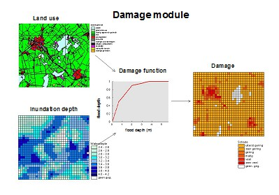
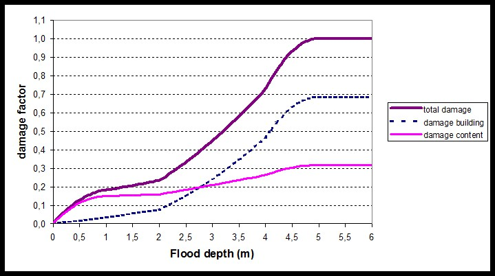
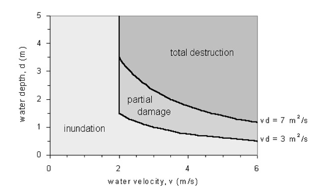
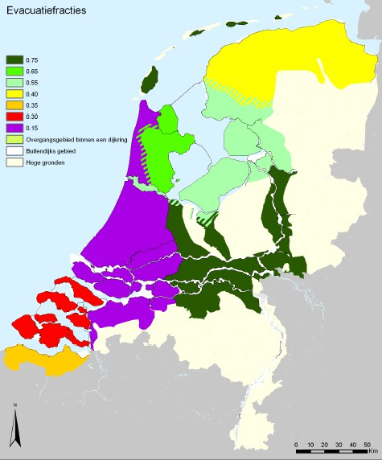
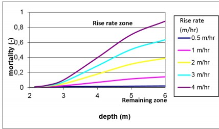

(sec-flood-dam-ass)=
# 3.6 Flood damage assesment

## 3.6.1 General

The term “flood damage“ refers to the various types of harm caused by flooding. It encompasses a wide range of harmful effects on humans, their health and their belongings, on public infrastructure, cultural heritage, ecological systems, industrial production and the competitive strength of the affected economy. All these different types of consequences can be observed after large flood disasters, for example after the flooding of New Orleans due to hurricane Katrina in 2005. In some cases and systems, e.g. the Nile, (seasonal) flooding may also have some benefits such as benefits for fisheries, ecology, land expansion and agriculture. For failure of flood defences the damages are expected to be much larger than potential benefits. 

(tab-classification-flood-damages-temp)=
An overview of different types of damages / consequences is given in [Table 3.1](#tab-classification-flood-damages). The damage is divided into tangible and intangible damage, depending on whether or not the losses can be assessed in monetary values. Tangible damages can be directly priced in monetary terms, because a market value exists for the damaged goods or services. Other types of damages, such as casualties, health effects or damages to ecological goods and to all kind of goods and services which are not traded in a market and those are far more difficult to assess in monetary terms. They are therefore indicated as ‘intangibles’.

Another distinction is made between the direct damage, caused by physical effects of the event, and damages occurring outside the directly exposed area. The latter occurs when companies outside a flooded area experience damages, due to loss of demand from customers in the flooded area. In a risk analysis it is desired to take into account a complete set of impacts. Since a lot of the items from the table cannot be quantified easily, the quantitative analysis and risk evaluation are often focus on economic damages and life loss. Methods for the analysis of economic damage and life loss are treated in more detail in the following two paragraphs.

:::{tab-classification-flood-damages}
**Table 3.1: Classification of flood damages, based on Vrouwenvelder A.C.W.M. (1998)**

|               | Tangible                                                                                                                                                                                      | Intangible                                                                                                                   |
|---------------|-----------------------------------------------------------------------------------------------------------------------------------------------------------------------------------------------|------------------------------------------------------------------------------------------------------------------------------|
| **Direct**    | Residences   Structure Inventory   Vehicles   Agriculture   Infrastructure and other public facilities   Business interruption   Evacuation and rescue operations   Reconstruction of flood defenses   Clean up costs | Fatalities   Injuries   Animals   Utilities and communication   Historical and cultural losses   Environmental losses |
| **Indirect**  | Damage for companies outside the exposed area   Substitution of production outside the area   Temporary housing of evacuees                                                             | Societal disruption   Damage to government                                                                               |
:::

## 3.6.2 Economic flood damages

(Fig-dam-est-app-temp)=
Methods for the estimation of direct economic damage to objects, such as structures, houses are well established, see e.g. \citet{Penning-Roswell_et.al.1977}; \citet{Dutta_et.al.2003}; \citet{Kok_et.al.2005}; \citet{Jonkman_et.al.2008} for further background. To estimate the flood damage there needs to be insight in the following elements ([Figure 3.19](#Fig-dam-est-app))
1. **Flood characteristics:** The area and depth of inundation are the most important information to be sampled here, but also the duration, time of occurrence, velocity of flooding water could have a significant influence on damage depending types of flood. \citet{Thieken_et.al.2005} also investigate the influence of other factors, such as flood duration, contamination and preparedness for flood damage based on data for the 2002 floods in Germany. Information on the intensity of flooding follows from the analysis of flood characteristics (see [Section 3.5.2](sebsec-floor-simul));
1. **The number and type of land use functions affected and their value:** Depending on the number of damage categories that are considered different types of land use that correspond with damage categories are selected to be assessed. For example for damage to properties information on the location, number and type as well as the elevation of properties which could be affected by a certain flood event needs to be gathered. Such information is normally given by land use data. This can be either primary data from field surveys or secondary data, i.e. data from already existing sources.
1. **The damage of land use functions given a certain level of flooding:** In this step it is determined how the level of economic damage is related to the flood conditions. Often, so-called (stage) damage functions are used that relate the level of damage to the flooding conditions. The main parameter that is considered is flood depth, but it is noted that other flood characteristics, such flow velocity or flood duration could be relevant as well.

(Fig-dam-est-app)=
<figure>
  
  <figcaption>Figure 3.19: General approach for flood damage estimation</figcaption>
</figure>

The following general equation describes how the elements in the damage model are combined to estimate the total damage in a flooded area:

$$
D_{i}=\sum_{i=1}^{m}\sum_{r}^{n} \alpha_{i}(h_{r})D_{max,i} n_{i,r}
$$ (Eq:Combine_elements)

In which:
- $D_{max,i}$ - maximum damage amount for an object or land use category $i$ [\euro or other monetary value ]
- $i$ - damage or land use category
- $r$ - location in flooded area
- $m$ - number of damage categories
- $n$ - number of locations in flooded area
- $h_{r}$ - hydraulic characteristics of the flood at a particular location
- $\alpha_{i}(h_{r})$ - stage damage function that expresses the fraction of maximum damage for category $i$ as a function of flood characteristics at a particular location $r$ ($0 \leq \alpha_{i}(h_{r}) \leq 1$)
- $n_{i,r}$ - number of objects of damage category $i$ at location $r$.

For each damage category a specific stage damage function is estimated and used in the physical damage assessment by correlating historical damage data with flood depth.

(Fig-stage-dam-func-temp)=
Damage functions relate the level of damage to the flooding conditions. In different countries such functions have been developed, for example in the Netherlands based on the 1953 flood event, see \citet{Kok_et.al.2005}. An example of a damage function is given in  [Figure 3.20](#Fig-stage-dam-func) for damages to houses and their contents. The figure shows that the flood damage is 100 percent if the water depth exceeds 4.5 meters. As already noted, other damage functions have been developed in other countries. For example, in the United States the Federal Emergency Management Agency (FEMA) has developed the HAZUS model that includes damage functions for different damage categories .

(Fig-stage-dam-func)=
<figure>
  
  <figcaption>Figure 3.20: Example of a stage damage function for houses in the Netherlands <a href="#Kok_et.al.2005">{Kok et al., 2005}</a></figcaption>
</figure>

<figure>
  
  <figcaption>Figure 3.21: Criterion for structural damage (<a href="#Clausen1989">Clausen, 1989</a> adapted from <a href="#Karvonen_et.al.2000">Karvonen et al., 2000</a>)</figcaption>
</figure>

In addition to the direct / physical damages caused by the flood, the business interruption and indirect losses can also be significant. Impacts can not only propagate through physical systems but also social and economic systems. For example, for the flood event in Thailand in 2011, the business interruption losses were estimated to be 125\% of the direct physical damages \citet(Benfield2012). The mean reason was that the floods were long lasting and that major production centers around Bangkok were affected.

::: {admonition} **Textbox 3.5: Further reading about economic damage assessment**
:class: tip

- **Jonkman S.N., Bockarjova M., Kok M., Bernardini P.** (2008) Integrated Hydrodynamic and Economic Modelling of Flood Damage in the Netherlands, *Ecological Economics* 66, pp. 77-90
- **Messner, F., Penning-Rowsell, E., Green, C., Meyer, V., Tunstall, S., Veen, A. van der**, 2007. *Evaluating Flood Damages: Guidance and Recommendations on Principles and Methods*. FLOODsite Consortium, Wallingford, UK.
:::

### Structural damages
The previous damage function mainly focuses on the effect of flood depth on economic damage value. Another important and related indicator is the level of structural damage to buildings. Especially in the case of higher flow velocities, e.g. near breaches or in the case of highly energetic flows, structural damage to buildings is expected. Criteria have been developed that relate the level of structural damage to depth-velocity product $[m^{2}/s]$, see [Figure 3.20](#Fig-stage-dam-func) for an example. The damage criteria will depend much on the type of building structures. For example for wooden houses in New Orleans different thresholds were suggested \citet(Pistrika_Jonkman2009).

## 3.6.3 Loss of life

(tab-coastal-floods-temp)=
The loss of human life is one of the most important consequences of flooding and it is therefore important to take into account this type of impacts in flood risk analysis and decision making. The potential loss of life due to a flood will depend on the physical flood characteristics and possibilities to predict and warn for the event, allowing time for evacuation of people. An analysis of global data shows that loss of life patterns differ between various types of floods. Especially coastal floods can lead to large numbers of fatalities, as the flood conditions (depth, velocity, waves) can be severe, number of people affected are large, and possibilities to warn and evacuate are limited. An overview of some coastal flood events with large numbers of fatalities is given in [Table 3.2](#tab-coastal-floods). A relatively recent event was the flooding of New Orleans due to hurricane Katrina and the associated levee failures. Hundreds of people died in the city of New Orleans, especially in areas near breaches (Lower Ninth Ward neighbourhood) and in areas with larger flood depths. It appeared that the majority of fatalities were elderly.

:::{tab-coastal-floods}
**Table 3.2: Overview of coastal floods (sources: [EMDAT](#), Jonkman, 2007)**

| Date       | Location                        | Cause           | Fatalities | People exposed | Event mortality |
|------------|---------------------------------|-----------------|------------|----------------|------------------|
| 1-2-1953   | Netherlands, Southwest          | Storm Surge     | 1836       | 250,000        | 0.0073          |
| 1-2-1953   | UK: East coast                  | Storm surge     | 315        | 32,000         | 0.0098          |
| 26-9-1959  | Japan, Ise Bay                  | Typhoon         | 5101       | 430,000        | 0.012           |
| 30-4-1991  | Bangladesh                      | Tropical cyclone| 139        | 4,500,000      | 0.031           |
| 29-8-2005  | US: Louisiana and Mississippi   | Hurricane       | 1118       | 100,000        | 0.012           |
| 15-11-2007 | Bangladesh                      | Tropical cyclone| >3000      | -              | -               |
:::

A method has been developed to estimate the life loss due to floods of low lying areas caused by failure of flood defences \citet(Jonkman2007). The life loss can be estimated based on the following general formula:

$$
N_{loss}=F_{D}(1-F_{E})N_{PAR}
$$ (Eq:loss_life)

In which:
- $N_{loss}$ - loss of life estimate;
- $F_{D}$ - mortality fraction;
- $F_{E}$ - evacuation fraction (also evacuation effectiveness);
- $N_{PAR}$ - number of people at risk.

As a first step, the flood characteristics, such as water depth, rise rate and flow velocity have to be estimated, see previous sections for several approaches.

Secondly, the total number of people at risk ($N_{PAR}$) in the flooded area needs to be determined. For larger areas this is generally equal to the number of inhabitants. For smaller areas, seasonal and temporal presence of the population needs to be taken into account. Consequently, the reduction of the number of people exposed to flooding, by means of evacuation and shelter need to be taken into account. Evacuation considers the movement of people to a location outside the flooded area. In general the possibilities for successful evacuation will depend on the time available until the breaching of flood defences and the arrival of the floodwater in an area and the time required for evacuation. The latter is dependent on time needed for decision making and departure, as well on required transportation time (dependent on road and exit capacity and traffic demand). Several models have been developed that combine these factors and predict and “evacuation
fraction” ($F_{E}$ ) for a certain area. Typical evacuation fractions for different areas in the Netherlands that have been used in recent national risk studies are shown in the figure below. River floods are fairly predictable, so evacuation fractions are high (0.75). However, for coastal areas available time is smaller and population densities are often larger, and therefore lower evacuation fractions are found.

Thirdly, the mortality ($F_{D}$) needs to be determined. It is defined as the number of fatalities divided by the number of exposed people. It can be estimated by means of so-called mortality functions that specify the relationship between the flood characteristics (such as water depth) and mortality. Based on an analysis of mortality data for historical floods (e.g. 1953) typical hazard zones and mortality functions are proposed for flooding due to breaching of a flood defence. The breach zone is characterized by high flow velocities which can lead to the collapse of buildings and instability of people in the flood flow. In the other zone a set of mortality functions is proposed that is dependent on flood depth and rise rate. In the case of rapidly rising waters it will be difficult to reach shelter on higher grounds or higher floors of buildings. It is particularly hazardous in combination with larger water depths. The complete set of equation for this model is included in appendix B(Summary_interpolated_mortality_functions). Alternative mortality functions have been derived based on the flooding of New Orleans. At a conceptual level a mortality function is similar to a stage damage curve for economic damage.

<figure>
  
  <figcaption>Figure 3.22: Evacuation fractions for the Netherlands <a href="#Kolen_et.al.2013">{Kolen et al., 2013}</a></figcaption>
</figure>

<figure>
  
  <figcaption>Figure 3.23: Mortality functions based on the 1953 disaster <a href="#Maaskant_et.al.2009">{Maaskant et al., 2009}</a></figcaption>
</figure>

  <strong>Textbox 3.6: Further reading about loss of life</strong> 
  <ul>
    <li>Jonkman S.N., Vrijling J.K. (2008) Loss of life due to floods, Journal of Flood Risk Management 1, pp. 43-56</li>
    <li>Jonkman S.N., Maaskant B., Boyd E., Levitan M.L. (2009) Loss of life caused by the flooding of New Orleans after hurricane Katrina: Analysis of the relationship between flood characteristics and mortality. Risk Analysis Vol. 29, No. 5, pp. 676-698</li>
  </ul>

