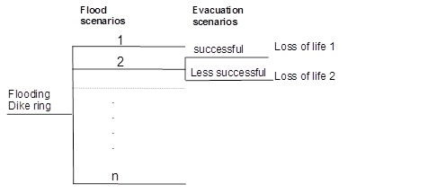
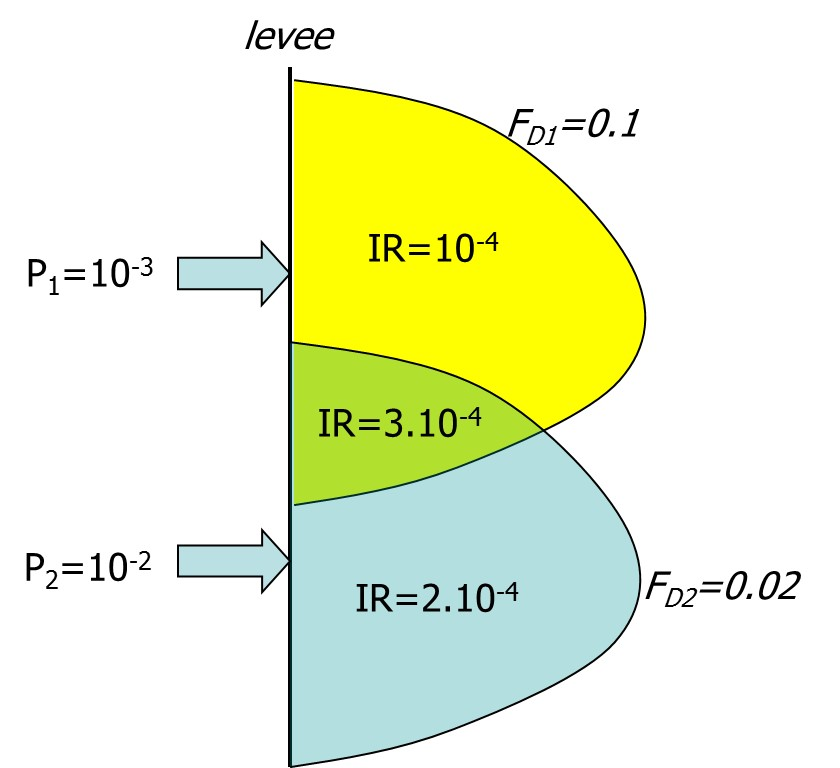
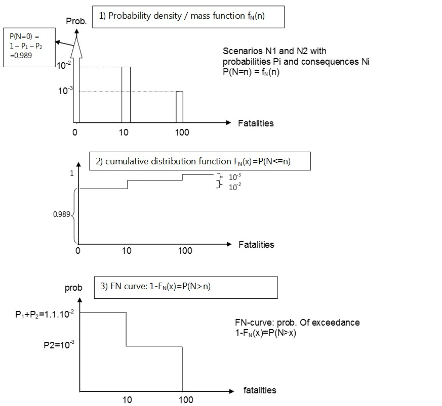
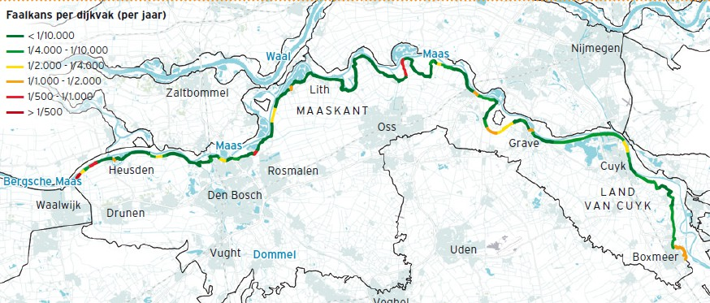
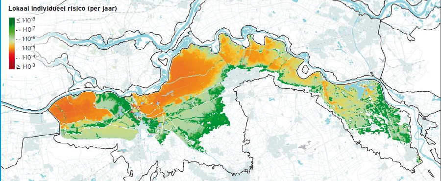
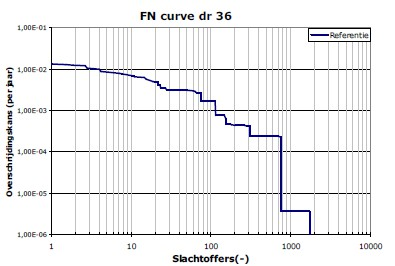
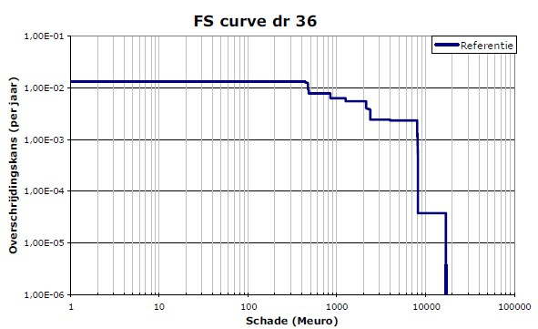

(sec-flood-risk-ana)=
# 3.7 Flood risk analysis

This section focuses on the approach for quantification of flood risk [Section 3.7.1](subsec-quant-floodrisk) and an example [Section 3.7.2](subsec-example-floodrisk). The evaluation of the acceptability of risk is discussed in [Section 3.8](sec-floodrisk-eval).

(subsec-quant-floodrisk)=
## 3.7.1 Quantification of flood risk

(Fig-flood-risk-scen-temp)=
In the flood risk quantification the results from the previous steps are combined. As a basis a set of scenarios or events should be available for which the probabilities and consequences (economic damage, life loss) have been estimated (see [Figure 3.24](#Fig-flood-risk-scen)). The life loss will be influenced by the success of evacuation resulting in a certain evacuation fraction $F_{E}$. In addition to flood scenarios, also evacuation scenarios can be distinguished that differ with respect to the success of evacuation and thus the value of $F_{E}$.

(Fig-flood-risk-scen)=
<figure>
    
    <figcaption style="text-align: center; font-size: small;">
        Figure 3.24: Scenarios of flood risk analysis (left) and evacuation scenarios (right)
    </figcaption>
</figure>

(Flood) risk is defined as a set of (flood) scenarios, each of which has a probability and a consequence. Following this general definition, multiple risk metrics can be used to quantify and visualize flood risk. The most commonly used metrics (economic, individual and societal risk) are discussed below. An example of the results of a quantitative flood risk analysis are given in the next paragraph.

### Economic risk
First of all, flood risk can be quantified by means of the expected economic damages. 

$$
E(d)=\sum\limits_{s_{i}=1}^n P_{i} d_{i}
$$ (Eq:Eco_risk)

In which:
- $E(d)$ - expected damage $[\text{\euro}/year]$;
- $P_{i}$ - probability of scenario i $[1/year]$;
- $d_{i}$ - damages of scenario i $[\text{\euro}]$.

In literature and applications, this is also referred to as expected annual damages (EAD). The information on probabilities and consequences of scenarios can also be shown in a curve, which shows the probability of exceedance of damages, a so-called FD curve. This curve is similar to an FN curve for fatalities and further details on how to construct such a curve are given further below. It can be shown that the area under the FD curve equals the expected value of damages [Vrijling J.K. (1997)](#ref-126). Several alternative ways of showing these curves are found in literature and more information on the integration of the area under the curve is given in the appendix D(Combining_probabilities_damages). Alternatively, the geographical distribution of the expected damage can be determined for a single unit of land, e.g. per hectare. The risk per hectare is of interest when one wants to compare relative risk values between areas. The risk for a whole area is relevant when one wants to know the absolute level of risk and consider risk reduction measures. 

### Risk to life
Loss of life is an important impact of floods. Consequently, protection of people is an important function of flood defences. Therefore, the risk to life can be explicitly considered in flood risk management by means of dedicated risk metrics. Two risk metrics are generally used: individual and societal risk (see lecture notes CIE4130 for further information).

### Individual risk
The individual risk concerns the probability of death of a person due to an accident. Various sub-definitions exist depending on the specific application (e.g. for users of planes and tunnels, people living near a chemical installation). In the context of flood management individual risk indicates the probability of death for a person at a certain location due to flooding. The effects of evacuation are generally taken into account, since especially for predictable floods warning and evacuation could reduce the life loss. The expression for individual risk ($IR$) becomes:

(Fig-example-IR-temp)=
In this expression the contribution of multiple scenarios to individual risk at a certain scenario can be added. A simplified example with two breach scenarios is given in [Figure 3.25](#Fig-example-IR) below. The figure shows the IR values associated with the two flood scenarios. In the area where the flood extents overlap the individual risk contributions of both scenarios are added. The approach shown here can also be used to “reason back” which failure probability would be required to meet a certain individual risk criterion. For example, if the acceptable individual risk is $IR_{acc}$=10-5 per year and mortality equals $F_{D}$=0.1, the acceptable failure probability of the defence is $P_{f}$=10-4 per year.

(Fig-example-IR)=
<figure>
    
    <figcaption style="text-align: center; font-size: small;">
        Figure 3.25: Simplified example of the calculation of the individual risk (plan view) for a dike ring with two scenarios
    </figcaption>
</figure>

### Societal risk
The societal risk expresses the probability of a disaster with many fatalities. It can be expressed by means of the expected value of the number of fatalities. Since this does not give insight in the contribution of scenarios, a so-called FN curve can be displayed. It shows the probability of exceedance of events with certain numbers of fatalities. An example of the calculation of such an FN curve is shown in the example below. It is the same concept as the FD curve which shows the probability of exceedance of damages.

::: {admonition} **Textbox 3.7: Example: calculation of an FN curve**
:class: tip

The following example shows the composition of an FN curve for a simple flood defense system with two event scenarios.

- Flood scenario 1 with \( N_{1} = 10 \) fatalities and a probability of \( P_{1} = 10^{-2} \) per year
- Flood scenario 2 with \( N_{2} = 100 \) fatalities and a probability of \( P_{2} = 10^{-3} \) per year

(Fig-FN-curve-exam-temp)=
Based on this information, the probability mass function can be formed (first graph, [Figure 26](Fig-FN-curve-exam)). Consequently, the cumulative distribution function can be made (second graph). Finally, the probability of exceedance or the FN curve is made (third graph).

Finally, we note that the expected value of the number of fatalities equals:

$$
E(N) = P_{1}N_{1} + P_{2}N_{2} = 0.2 \text{ fatalities per year}
$$ (Eq:expected_fatalities)

This value will also be found when the surface of the area under the FN curve is computed [Vrijling J.K. (1997)](#ref-126).
:::

(Fig-FN-curve-exam)=
<figure>
    
    <figcaption style="text-align: center; font-size: small;">
        Figure 3.26: Composition of an FN curve for a simplified example
    </figcaption>
</figure>

(subsec-example-floodrisk)=
## 3.7.2 Example of flood risk quantification for dike ring 36: Land van Heusden - De Maaskant

As an example of the quantification of flood risk with different risk metrics and example for a dike ring in the Netherlands from the VNK project has been presented below. The VNK (Veiligheid Nederland in Kaart) project made a nationwide analysis of flood risks for dike ring areas in the Netherlands. The approaches presented in previous paragraphs were implemented in the VNK project [VNK-eindrapportage (2014)](#ref-120). As an example the results are shown for dike ring “Land van Heusden / de Maaskant”. It is located in the south east of the country and borders the river Meuse. The population is about 420,000 people and it contains cities such as Oss and ‘s-Hertogenbosch. The total length of flood defences is about 100 km and the area 66,600 ha. 

(Tab-fail-prob-exam-temp)=
Analysis of the failure probability leads to an estimate of the probability of flooding of more than 1/100 per year. The failure probability estimates of dike sections are shown in  [Figure 3.26](#Fig-FN-curve-exam) and the contribution of various mechanisms in  [Table 3.3](#Tab-fail-prob-exam). The main threat is the piping failure mechanism and this contributes to 80\% of the failure probability. The second largest contribution (15\%) comes from hydraulic structures. Both contributions are fairly high and might be due to conservative assumptions in the reliability analysis and in the underlying deterministic models for the failure mechanisms. 

(Tab-fail-prob-exam)=
<table style="width:100%; border-collapse: collapse; text-align: left;">
    <thead>
        <tr>
            <th style="border-bottom: 1px solid black;">Dikes</th>
            <th style="border-bottom: 1px solid black;">Mechanism</th>
            <th style="border-bottom: 1px solid black;">Failure probability (per year)</th>
        </tr>
    </thead>
    <tbody>
        <tr>
            <td rowspan="4" style="border-right: 1px solid black;">Dikes</td>
            <td>Overflow and overtopping</td>
            <td>1/1750</td>
        </tr>
        <tr>
            <td>Piping</td>
            <td>~1/100</td>
        </tr>
        <tr>
            <td>Instability</td>
            <td>1/70000</td>
        </tr>
        <tr>
            <td>Erosion</td>
            <td>1/3500</td>
        </tr>
        <tr>
            <td style="border-top: 1px solid black;">Hydraulic structures</td>
            <td>Various mechanisms</td>
            <td>1/440</td>
        </tr>
    </tbody>
</table>

    Table 3.3: Calculated failure probabilities for dike ring 36 [VNK-eindrapportage (2014)](#ref-120)</a>

Consequently, the damages and life loss have been estimated for various flood scenarios. Since the area is sloping towards the west, the largest damages are found for breaches on the eastern side of the dike ring. Since high river discharges can often be predicted in advance, the (average) evacuation fraction is relatively high, i.e. in the order of $F_{E}$= 0.8 to 0.9. 

(Fig-IR-36-temp)=
(Fig-Dike36-curves)=
The risk is quantified and visualized with various risk metrics. The individual risk is displayed in [Figure 3.28](#Fig-IR-36). In substantial parts of the dike ring it is higher than 10 to 5 per year, especially due to the relatively weak defences. The FN curve and FD curve are shown in [Figure 3.29](#Fig-Dike36-curves). The potential number of fatalities in case of larger floods of the dike ring can reach more than 100 to 800 fatalities. The expected number of fatalities per year equals 0.3. The average damage in case of flooding equals \euro 1.5 billion, and the expected value \euro 16.6 million per year. The risks can be decreased substantially by reinforcing the weak dike sections, specifically for the geotechnical failure mechanisms.

(Fig-Dike36-curves-temp)=
<figure>
    
    <figcaption style="text-align: center; font-size: small;">
        Figure 3.27: Failure probability of the dike sections in dike 36 <a href="#Vergouwe2014">[VNK-eindrapportage (2014)](#ref-120)</a>
    </figcaption>
</figure>

(Fig-IR-36)=
<figure>
    
    <figcaption style="text-align: center; font-size: small;">
        Figure 3.28: Individual risk for dike 36 <a href="#Vergouwe2014">[VNK-eindrapportage (2014)](#ref-120)</a>
    </figcaption>
</figure>

<figure>
    

        

            
        

        

            
        

    

    <figcaption style="text-align: center; font-size: small;">
        Figure 3.29: FN- and FD-curve for dike ring 36 <a href="#Vergouwe2014">[VNK-eindrapportage (2014)](#ref-120)</a>, <a href="#Havinga2010">[Havinga (2010)](#ref-92)</a>
    </figcaption>
</figure>
