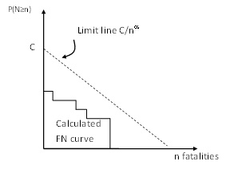
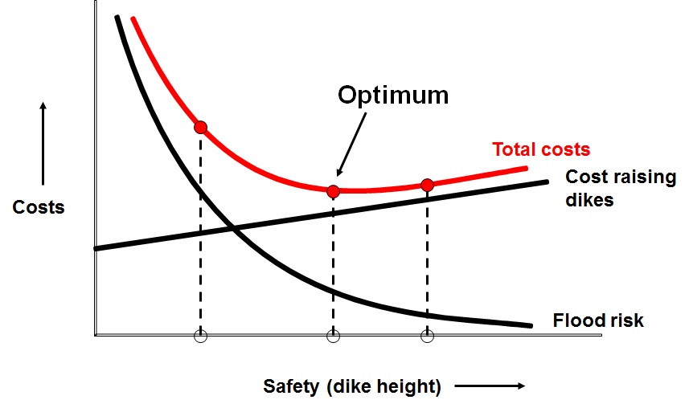
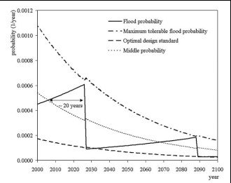

(sec-floodrisk-eval)=
# 3.8 Flood risk evaluation

(subsec-gen-con)=
## 3.8.1 General concepts

After the quantification of the flood risk, the next step is the evaluation of the risk. In this case the central question is “how safe is safe enough” [Starr (1967)](#ref-114). This is not a purely technical question, but part of the broader decision- making, based on costs and benefits and characteristics of risk bearing activities. Several subjective factors, such as risk perception and political processes will also play a role. A general framework has been developed ([TAW (1985)](#ref-77); [Vrijling et al. (1995)](#ref-123); [Vrijling et al.(1998)](#ref-124)) in which risks can be evaluated based on three criteria:
1. To limit the individual risk to prevent that certain people are exposed to disproportionally large risks;
2. To limit the societal risk to limit the risks of large scale accidents with many fatalities;
3. Economic optimization to balance investments in risk reduction from an economic point of view.

Both the individual and societal risk are also used in the Netherlands and other countries to display and limit the risks in different sectors, such as the transport and storage of hazardous materials (industrial safety) and the risks of airports. A broader overview and discussion of these approaches for evaluating acceptable risk is found in the lecture notes of CIE4130 and literature. Here, first an overview of the three above concepts is given ([3.8.2](Subsec-IR) – [3.8.4](subsec-eco_opt)). In the next [Section 3.9](sec-der-saf-NL) their application to the recent revision (2014 / 2015) of safety standards in the Netherlands is presented.

(Subsec-IR)=
## 3.8.2 Individual risk

The individual risk can be evaluated by comparing the calculated individual risk at a location with a certain acceptable value ($IR_{acc}$). The situation is acceptable if: 

$$
IR(x,y) \leq IR_{acc}
$$ (Eq:AccIR)

For example, in the field of industrial safety in the Netherlands, an individual risk level of $10^{-6}$ per year is accepted for most applications. A specific threshold value has been proposed for flooding in the Netherlands (see next paragraph).

(subsec-societal-risk)=
## 3.8.3 Societal risk

Societal risk limits define a threshold for the combination of the failure probability of events and the numbers of fatalities. The general formulation for such a limit line without horizontal or vertical cut-off equals: 

$$
1-F_{N} (n) \leq C/n^{\alpha}
$$ (Eq:SR_limit)

In which:
- $C$ = constant that determines the vertical position of the limit line $[per year]$;
- $\alpha$ = coefficient that determines the steepness of the limit line $[-]$.

If the calculated FN curve for a system exceeds the limit line, the risks are unacceptable. \\ \\

In general, the vertical position and value of $C$ is determined by the decision makers.The limit line is called risk neutral if $\alpha$ =1, since it places equal weight on exceedance. probabilities and numbers of fatalities. If $\alpha$ = 2, the limit is more steep and risk averse. This means that that the exceedance probability of 10 times as many fatalities should be 100 times lower. This has been motivated by public aversion to large numbers of fatalities. For example in the field of industrial risks in the Netherlands, a criterion per installation is used with $C=10^{-3}$ and $\alpha$ = 2.\\ \\

A general approach for the derivation of limit lines for various hazards at the national and local scale has been developed by [TAW (1985)](#ref-77) and [Vrijling et al. (1995)](#ref-123). It assumes a risk averse limit line ($\alpha$ = 2) and the following formula for the constant $C$:

$$
C=(\frac{\beta\cdot{100}}{k\cdot{\sqrt{N_{A}}}})^2
$$ (Eq:limit_line)

In which:
- $k$ = Risk aversion index (proposed value, $k$ = 3);
- $\beta$ = policy factor to account for voluntariness of exposure. For example for activities with benefits and some risks (e.g. driving a car) a value is proposed at $\beta$=1. For activities with limited direct benefit and involuntary exposure (e.g. living near a chemical plant) a value is proposed at $\beta$=0.01;
- $N_{A}$ = the number of independent locations where the activity takes place.

Further information on limit lines and their application at a national and local scale is given in the lecture notes of CIE4130, [TAW (1985)](#ref-77) and [Vrijling et al. (1995)](#ref-123).

<figure>
    
    <figcaption style="text-align: center; font-size: small;">
        Figure 3.30: A fictitious calculated FN curve (lower left) and a limit line (diagonal).
    </figcaption>
</figure>

(subsec-eco_opt)=
## 3.8.4 Economic optimization

An economic optimization can be applied to derive an optimal level of safety (or the optimal “failure probability”). It takes into account the costs of increasing the safety level and reducing the risks. In various practical applications it is also referred to as cost benefit analysis.Further information on this approach and the assumption is given in the lecture of notes of CIE4130 and the original references.

The economic optimization was developed and applied by [van Dantzig (1956)](#ref-117), to derive the optimal dike height for South Holland after the 1953 storm surge disaster. In the economic optimization the total costs $C_{tot} [\text{\euro}]$ are determined, consisting of the investments $I [\text{\euro}]$ in a safer system and the present value of the risk $R [\text{\euro}]$. 

$$
C_{tot}=I+R
$$ (Eq:costs)

The annual risk, or expected economic damage is found by:

$$
E(D)=P_{f} D
$$ (Eq:ann_costs)

In which:
- $E(D)$ = expected value of the risk $[\text{\euro}/yr]$;
- $P_{f}$ = failure probability of the system per year $[1/year]$;
- $D_{i}$ = damage in case of failure $[\text{\euro}]$

The present value of the risk for an infinite time horizon can be found as follows:

$$
R=\frac{P_{f} D }{r}
$$ (Eq:pres_value)

The risk can be reduced by constructing a safer system (a lower $P_{f}$) or limiting the damage (smaller $D$). In this case we assume prevention measures that focus on reducing the failure probability. The investments will become a function of the failure probability of the system, since increasing the safety will lead to an increase of costs.

$$
I=I(P_{f})
$$ (Eq:invest)

(Fig-eco_opt-temp)=
[Figure 3.31](Fig-eco_opt) shows the costs and risks as a function of the accepted failure probability of a system. The economic optimum is found when the total costs are minimal. For this situation the following is valid:

$$
\frac{dC_{tot}}{dP_{f}}=0
$$ (Fig:eco_opt)

This approach can be applied to various decisions problems, such as the optimal dike height. For example, in that application by van Dantzig the probability of failure of the dikes is approximated by the probability of exceedance of the dike height $h_{d}[m]$ with an exponential distribution, i.e.

$$
P_{f}=P(h>h_{d})=\exp{(-\frac{(h_{d}-A)}{B})}
$$ (Fig:prob_excee_dikeheight)

In which:
- $h_{d}$ = dike height $[m]$;
- $A$,$B$ = constants of the exponential distribution $[m]$.

The optimal flooding probability $P_{f,opt}$ becomes:

$$
P_{f,opt}=\frac{I\cdot{B}\cdot{r'}}{D}
$$ (Eq:Opt_flood)

In which:
- $P_{f,opt}$ = optimal failure probability $[per year]$;
- $I$ = variable costs per m heightening $[\text{\euro}/m]$;
- $B$ = constant in the exponential distribution of water levels $[m]$;
- $r'$ = reduced interested rate (growth minus inflation);
- $D_{i}$ = Damages in case of flooding.

The larger the damage $D$, the smaller the optimal failure probability and thus the higher the level of protection. If incremental protection is expensive - i.e. for high values of $I$ - a higher optimal failure probability and thus a lower level of optimal safety will be found. The optimal failure probability is also dependent on the discount rate $r'$.

Note that an extension of this model has been proposed by [Slijkhuis et al. (1997)](#ref-125) .It takes into account the so-called risk aversion against large damages by including the standard deviation of damages in the Risk term ($R = E(D) + k\cdot{\sigma}(D) $; where $k$ – risk aversion factor $0\leq k \leq 3$; $\sigma (D)$ – standard deviation of damages). Including this concept will lead to higher risk values and a higher risk curve, and thus to a higher safety value (or lower optimal failure probability). 

(Fig-eco_opt)=
<figure>
    
    <figcaption style="text-align: center; font-size: small;">
        Figure 3.31: Economic optimization, costs, risks, and total costs as a function of the failure probability of the system
    </figcaption>
</figure>

::: {admonition} **Textbox 3.8: Application to South Holland by the First Delta Committee**
:class: tip

The first Delta Committee used the following values for South Holland:  
\(D = 24.2 \times 10^9 \, \text{fl}\) [unit is Dutch guilders]; \(r_0 = 0.015\); \(I = 40.1 \times 10^6 \, \text{fl/m}\); \(A = 1.96 \, \text{m}\); \(B = 0.33 \, \text{m}\); \(h_{0} = 3.25 \, \text{m}\); \(I_{0} = 110 \times 10^6 \, \text{fl}\).

Using these values, the following optimal dike height and optimal failure probability were derived:  
\(h_{d,opt} = 5.83 \, \text{m}\); \(P_{f,opt}=8 \times 10^{-6}\) per year.  

Although the optimal safety level was determined at a failure probability of \(P_{f,opt} = 1/125,000\) per year, in later political derivation, a value of 1/10,000 per year was determined for the probability of exceedance of design water levels. This implied that the dikes of South Holland would need to be designed for hydraulic conditions (water levels and waves) with a probability of exceedance of, on average, 1/10,000 per year.  

In later decision-making, safety standards have been derived for other dike rings. For example, flood defences in the river system are designed for a safety standard of 1/1250 per year.  

It was expected that the actual failure probability for dikes designed for this design load would be smaller than 1/10,000 per year. However, the recent risk analysis in the project VNK has shown that this is not the case due to geotechnical failure mechanisms. For most dike rings, the estimated failure probabilities are larger than the probability of exceeding the design loads.  

For example, for riverine dike rings that have been designed for design levels with a probability of exceedance of 1/1250 per year, failure probabilities are often in the order of magnitude of 1/100 per year [VNK-eindrapportage (2014)](#ref-120), especially due to geotechnical failure mechanisms such as piping and instability.
:::

(fig-develop-opt-fp-temp)=
The model by van Dantzig was primarily focused on finding what the optimal safety at that time (when van Dantzig published his model) should have been, so for a static situation. While reviewing larger timescales and changing conditions, such as economic growth and sea level rise, the model needs to address the possibility of multiple interventions during the considered period. In that case a dynamic model is needed. This leads to questions regarding the timing of interventions (when? At which intervals?), as well as the optimal strengthening or raising of the dikes (how much?). [Eigenraam (2006)](#ref-88) developed an economic decision model that takes into account both questions. This model has been used for the proposal for safety standards of Dutch dike rings. [Figure 3.32](fig-develop-opt-fp) below shows an illustration of the outcomes of this model. The flooding probability is increasing over time, due to sea level rise. An intervention is implemented when the maximal acceptable (tolerable) failure probability is reached. The average accepted failure probability decreases over time, as the potential damages are growing so more protection is required.

(fig-develop-opt-fp)=
<figure>
    
    <figcaption style="text-align: center; font-size: small;">
        Figure 3.32: Development of the optimal failure probability of flood defences over time as a function of economic growth and sea level rise <a href="#Kind2014">[Kind (2014)](#ref-101)</a>.
    </figcaption>
</figure>

