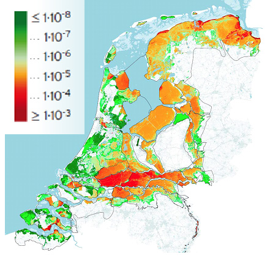

# 3.9 Derivation of new safety standards in the Netherlands

## 3.9.1 Background

For several decades the safety standards for flood defences in the Netherlands have been based on the probability of exceedance of hydraulic loads. Flood defences would need to be designed to safely withstand hydraulic loads with a certain probability of exceedance. The safety standard for various areas varied from 1/250 per year to 1/10,000 per year for South and North Holland (see [Figure 3.34](#Fig:IR_neth_2)). These standards strongly focused on overflow and overtopping of the flood defences and were derived in the 1960’s and 1970’s. 

In the year 2014 the Dutch government,as part of the delta program, has introduced new safety standards for flood defences. The main motivation for this was that due to economic and population growth the protected values by the defences have grown. Also, over the last decades more advanced methods for risk assessment have been developed. Thus, it was decided to derive new safety standards based on an advanced risk assessment of individual, societal and economic risk. In addition, it was explored whether there should be more attention for land use planning and emergency management in addition to prevention. The concept of “multi-layer safety” (meerlaagsveiligheid in Dutch) was introduced. It distinguishes prevention as a first layer, land use planning as a second, and emergency management as a third layer ([Figure 3.33](#Fig:multi_layer)). In the future some additional attention will be given to land use planning and emergency management in Dutch flood management. For example, in the year 2014 an app “overstroomik” and website have been launched to provide information for citizens on flood emergencies. However, eventually the emphasis in the Dutch policy (and the associated expenses) remains on prevention {cite}`Deltaprogramma2014` as preventive measures appear to be most cost-effective. 

<figure>
    
    <figcaption style="text-align: center; font-size: small;">
        Figure 3.33: Multi-layer safety (meerlaagsveiligheid) concept used by the Dutch government
    </figcaption>
</figure>

The new safety standards focus on prevention, but they have been chosen so that the overall risks become acceptable. These new safety standards are formulated as failure probabilities for flood defences and these will be used for design and safety assessment in the coming years. 

(subsec-deriv_risk_eval)=
## 3.9.2 Risk evaluation

This section summarizes the assessments and evaluations of individual, societal and economic risk (see {cite}`Deltaprogramma2014`; {cite}`Deltares2014`;\cite{MinisterieI&M2016}) for further information. These assessments mostly follow the principles introduced in the previous sections of this chapter.

**Individual risk**: [Figure 3.34](#Fig:IR_neth_2) shows an estimate of the individual risk level with the current state of the flood defences. It shows that large parts of the country, the areas in red, are characterized by IR levels higher than 10 to 5 per year. This is mainly due to the fact that the estimated failure probabilities of the defences are rather high (in the order of magnitude of 1/100 per year) mainly due to geotechnical mechanisms. Also in some “risk hotspots” there can be a high mortality values, e.g. for deep polders with dangerous flood conditions. 

For the individual risk for flooding in the Netherlands for areas protect by flood defences a limit value has been proposed of $IR = 10^{-5}$ per year. Thereby, every citizen living below flood defences should have at least this minimum level of safety (basisveiligheid in Dutch). The proposed value is one order higher than individual risks accepted in industrial safety (i.e. $10^{-6}$ per year), but flooding can be considered as a more “natural” hazard and the scale of exposure to flooding is much larger than for industrial safety.

Risk will have to be reduced in areas characterized by IR values higher than $10^{-5}$ per year, particularly along the main rivers. This is mainly done by providing better protection and raising the safety standards. 

<figure>
    
    <figcaption style="text-align: center; font-size: small;">
        Figure 3.34: Individual risk for flooding in the Netherlands <a href="#Vergouwe2014">{cite}`Vergouwe2014`</a>
    </figcaption>
</figure>

The **societal risk** has been considered at a national level. The proposed limit lines according to the method of \citeauthor{TAW1985} (\citeyear{TAW1985}; see also [section 3.8.3](subsec-societal-risk) for background) are shown in [Figure 3.35](Fig:Comparison_fncurves). These are considered for different values of a so-called policy factor $\beta$. This factor relates to voluntariness of exposure and the benefits of the risk-bearing activities. For flood risks typical values between $\beta$ = 0.1 and 1.0 have been proposed in earlier work. Similar to industrial safety a risk averse limit line is used ($\alpha$ = 2), which means that accidents with 10 times as many fatalities are accepted with a 100 times smaller probability.

The figure shows that the societal risk in the current baseline situation (“reference situation” - black line) is larger than typically acceptable levels according to the TAW model. When different sets of more stringent safety standards for the dike rings are applied (for example safety standards based on individual and economic risk - see the red and blue lines below) the actual risks decrease below the value of the limit line for $\beta$ = 1. The highest societal risks are found for dike rings in the Southwest of the country (e.g. Alblasserwaard) and along the Waal River (e.g. the Betuwe) - see \citet{Deltares2014} for further details. For six areas with relatively high societal risk levels, more stringent safety standards have been proposed based on this perspective.

<figure>
    
    <figcaption style="text-align: center; font-size: small;">
        Figure 3.35: Comparison of nationwide FN curves for flooding with potential limit lines with varying Beta values according to the TAW model <a href="#Deltaprogramma2014">{cite}`Deltaprogramma2014`</a>
    </figcaption>
</figure>

**Economic risk**: Using the economic optimization and the dynamic model of Eijgenraam (see also [section 3.8.4](subsec-eco-opt) the economic optimal level of protection has been determined. In the analyses economic damages in the future (reference year 2050) and costs of interventions have been considered. This has resulted in optimal protection levels for the various flood defences. Areas with high economic damages and relatively low costs of protection will result in the highest levels of protection according to the economic perspective.

(subsec-res-saf-stand)=
## 3.9.3 Resulting safety standards

Eventually, the three perspectives have been applied by the Delta Program to propose a new set of safety standards for primary flood defences in the Netherlands. Based on every perspective, a required failure probability could be determined. For example, the economic optimum that follows from the CBA, and the probability that would be required to reduce individual risks below $10^{-5}$ per year. In textbox 3.9 below it is illustrated how safety standards for flood defences can be derived based on an acceptable value of individual risk. The most stringent of the three perspectives (individual, societal, economic risk) determined the safety standard. Also, additional regional interests and values that were not quantitatively incorporated in the risk assessment were considered in the proposal of these standards. Examples of additional considerations include the presence of nationally important infrastructure, such as the gas fields in the north or the national airport Schiphol. The proposed safety standards are shown in [Figure 3.36](Fig:Proposed_new_SS). These refer to minimum protection levels (or maximal failure probability levels) that a defence is allowed to have.

Due to the implementation of these safety standards the individual risks behind flood defences will be smaller than 10 to 5 per year. Also societal risks will be significantly reduced: the probability of an event with more than 100 fatalities will decrease with a factor 15 to 20. Finally, economic risks will be reduced by a factor 25 {cite}`MinisterieI&M2016`.

<figure>
    
    <figcaption style="text-align: center; font-size: small;">
        Figure 3.36: Proposed safety standards, maximal acceptable failure probabilities for dike trajectories <a href="#MinisterieI&M2016">{cite}`MinisterieI&M2016`</a>.
    </figcaption>
</figure>

    <strong>Textbox 3.9: Deriving safety standards based on individual risk</strong> 
    Requirements for acceptable individual risk can also be related to the acceptable failure probability of the flood defences. In other words, safety standards for the flood defences can be derived from the individual risk limits. 
    This is illustrated using (simplified versions) of previously introduced formulas. 
    The actual individual risk in an area (\(IR\)) should be smaller than the acceptable individual risk determined by the government (\(IR_{acc}\)). This implies: \(IR \leq IR_{acc}\) 
    Consequently, homogeneous dike rings are assumed with constant values for the mortality and evacuation fraction. The actual individual risk is then found with: 
    \[
    IR = P_{f} \cdot F_{D} \cdot (1 - F_{E})
    \]
    In which:
    <ul>
        <li>\(P_{f}\) is the probability of flooding \([\text{per year}]\)</li>
        <li>\(F_{D}\) is the mortality in the area \([-]\)</li>
        <li>\(F_{E}\) is the evacuation fraction \([-]\)</li>
    </ul>
    By re-arranging both formulas, we find that \(P_{f,req} \leq \frac{IR_{acc}}{F_{D} \cdot (1 - F_{E})}\).  
    Where \(P_{f,req}\) is the required failure probability for an area (to comply with the individual risk limit).  
    This expression is applied to a number of typical cases for the Netherlands. We distinguish between areas with high or low evacuation fractions, and areas with relatively high or low mortality (deep vs. less deep polders). As an acceptable value for the individual risk, \(IR_{acc} = 10^{-5}\) per year is chosen. The results in the latest rows show the required failure probability values (or safety standards) that would result. Typical values range from \(10^{-2}\) per year for shallow polders that can be well evacuated, to \(10^{-4}\) per year for deep polders with limited possibilities for evacuation.  
    <table style="width: 70%; margin: auto; border-collapse: collapse; text-align: left;">
        <thead>
            <tr>
                <th style="border-bottom: 1px solid black;"></th>
                <th colspan="2" style="border-bottom: 1px solid black;">Shallow Polder</th>
                <th colspan="2" style="border-bottom: 1px solid black;">Deep Polder</th>
            </tr>
        </thead>
        <tbody>
            <tr>
                <td>Evacuation fraction \(F_{E}\)</td>
                <td>0</td>
                <td>0.9</td>
                <td>0</td>
                <td>0.9</td>
            </tr>
            <tr>
                <td>Mortality \(F_{D}\)</td>
                <td>0.01</td>
                <td>0.01</td>
                <td>0.1</td>
                <td>0.1</td>
            </tr>
            <tr>
                <td>Resulting failure probability or safety standard</td>
                <td>0.001</td>
                <td>0.0001</td>
                <td>0.01</td>
                <td>0.001</td>
            </tr>
        </tbody>
    </table>
    
<strong>Comparison between new and old safety standards</strong> 
    A brief comparison between the old and new safety standards is made in table below and further discussed.

    <table style="width: 100%; border-collapse: collapse; text-align: left;">
        <thead>
            <tr>
                <th style="border-bottom: 1px solid black;"> </th>
                <th style="border-bottom: 1px solid black;">New standards</th>
                <th style="border-bottom: 1px solid black;">Old standards</th>
            </tr>
        </thead>
        <tbody>
            <tr>
                <td>Basis and derivation</td>
                <td>Assessments of individual, societal risk, and cost-benefit analysis for the entire country</td>
                <td>Cost-benefit analysis/economic optimization for South Holland by van Dantzig</td>
            </tr>
        </tbody>
    </table>
    
When compared to the old system of safety standards, a first major change is that these standards refer to the failure probability of a dike system, whereas the old standards focused on the probability of exceedance of design water levels or loads. The use of the failure probability will enable a more complete assessment of the different failure mechanisms of a flood defence. The new safety standards will also take into account more directly the contribution of various dike sections and structures in a dike ring to the failure probability of the system and the so-called length effect.

    The second change concerns the spatial unit to which the safety standards apply. The new safety standards are valid for a so-called trajectory, which can be a part of a dike ring. The length of trajectories ranges from several kilometers to more than 30 km. A demarcation between trajectories is often made when there are differences in the consequences of breaching. Whereas the old standards were the same for the entire dike ring, the new system does include different standards for different parts of a dike ring if the consequences differ.  
    The third change concerns the protection levels and distribution over the country. In the new safety standards, the highest protection levels (1/10,000 to 1/100,000 per year) are found along both coastal areas and riverine areas. In the previous safety standards, the highest protection levels were found in the west of the country (1/10,000 per year for South Holland). Also, the categories for the numerical values of the new safety standards (1/1000; 1/3000; 1/10,000) are different than those in the old standards (1/1250; 1/2000; 1/4000; 1/10,000).  
    Another difference with the old standards is that the new safety standards also include values for the safety of dams and storm surge barriers, such as the Maeslant and Eastern Scheldt barriers and the Afsluitdijk (closure dam).

(Subsec:app_impl)=
## 3.9.4 Application and implementation of new safety standards

In the coming years, these new safety standards will be implemented and incorporated in dike reinforcements and safety assessment procedures. Future dike reinforcements will be based on the presented new standards. Then it will become fully clear how these new standards could be “reached” through dike reinforcements and system interventions. For the purposes of design of new structures and the assessment of the safety of existing structures an acceptable level of risk has to translated into values that can be used at the level of individual structures and failure mechanisms. To support designers. guidelines are available to derive design values for load and resistance that are linked to the safety standard. {numref}`CH:Saf_stand_ass_design` will provide further information with respect to the “reliability based design and safety assessment of flood defences”. 
