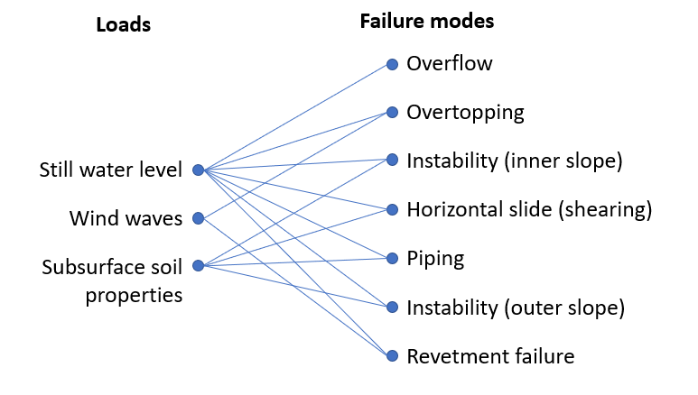

# 4.1 Hydraulic loads on dikes

Hydraulic loads are essential in the process of establishing the dimensions of flood defences. Some aspects are obvious, like water levels in order to establish a minimum crest level. Wave action and water current velocity on flood defences and their interaction with the structure is already more complicated. Groundwater flow and pore pressures determine the stability of flood defences. [Figure 4.1:](#fig-failuremodes) presents the relationships between loads and failure modes at a general level.

(fig-failuremodes)= 
<figure>
    
    <figcaption style="text-align: center;">
        Figure 4.1: Relationship between loads and failure modes of a typical dike.
    </figcaption>
</figure>

This section deals with the determination of hydraulic loads on flood defences, given an established flood protection level in terms of return period or probability per year. In order to show the importance of the hydraulic boundary conditions it is worthwhile to understand the failure mechanisms of dikes (all of which are introduced in section [2.2](sec-overview-of-failure-mechanisms)), especially overflow ({numref}`sec:overtopping_overflow`), wave overtopping ({numref}`Ch:Overtopping`), macrostability ({numref}`Ch:Stability`), piping (see {numref}`Ch:Piping`), revetment stability (see {numref}`Ch:Revetments`) and microstability (section [2.2](sec-overview-of-failure-mechanisms), mechanism F). 
