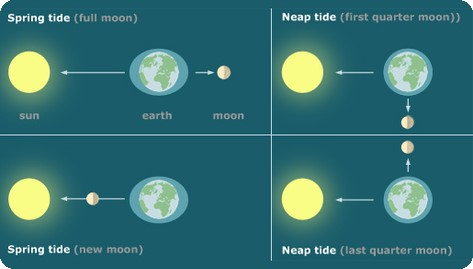
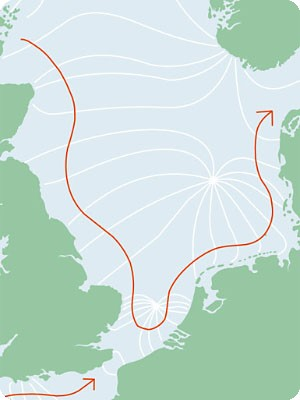
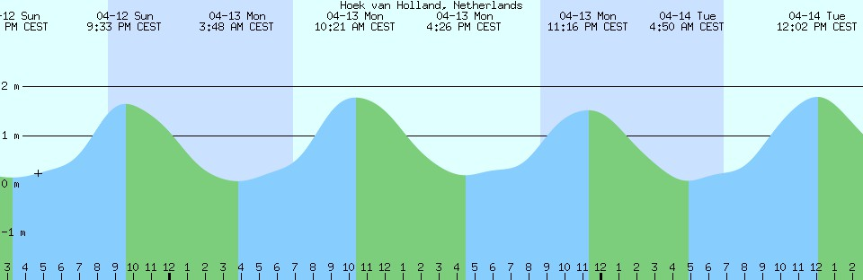
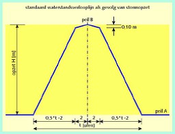
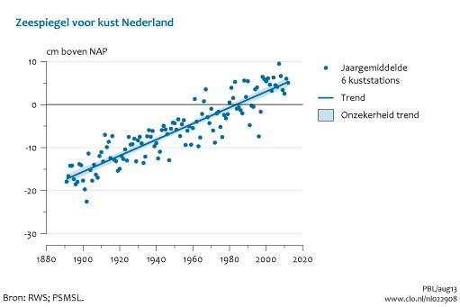
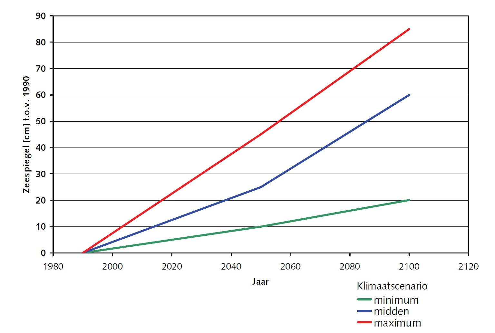
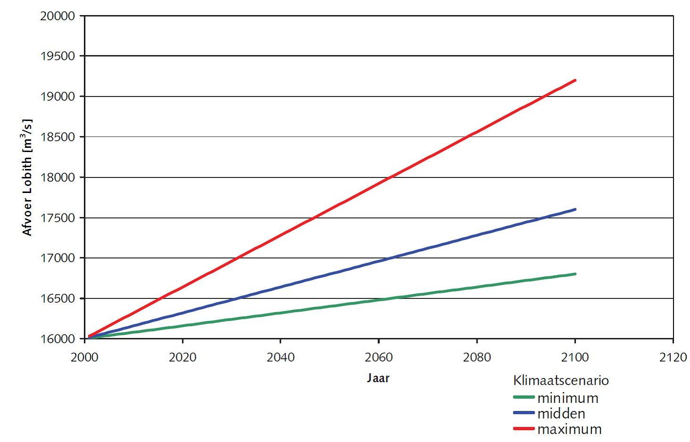
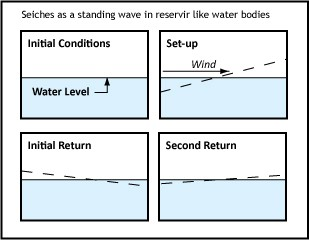
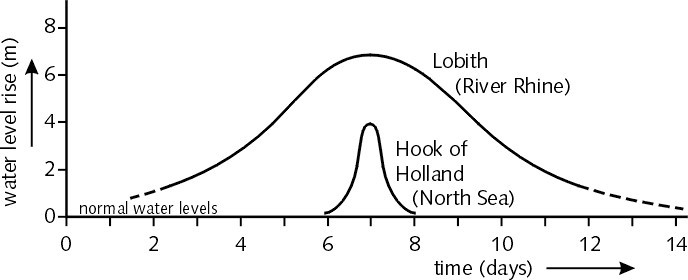
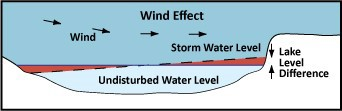

# 4.2 Still water levels

For crest height determination the still water level is the very first item to be addressed. Still water level stands for the water level at the toe of the dike or water defence structure, without waves. Obviously a flood defence needs to retain the water and should not be subject to overflow. It is the engineering design task to establish the right water level, based on the preceding assumption or, even stronger, boundary condition for the required flood protection level. This flood protection level is related to the hinterland protected by the dike (see {numref}`Ch:Floodriskanalysis` about flood risk and safety concepts). The approach varies for the location of the flood defence. High sea water levels have an origin that differs from river water levels; in the transition from river to sea, the estuaries, the water level will be a combination of the two and the behaviour of lake water levels depends very much on inflow, outflow and water retention in the lake. 

The still water level also determines the boundary condition for water flow through and underneath the dike body, it is therefore an important input parameter for geotechnical dike stability. The water level, with some duration (and without the waves) will also determine the penetration of water into the dike body and the flow through the subsoil, affecting the water pressure and effective soil pressure at the landside slope of the dike, creating a slope stability issue. The same holds for piping. For stability of the waterside slope the (speed of the) fall of the outside level is an important value to determine potential sliding. For further details we refer to the chapters on these failure mechanisms.

## 4.2.1 Sea water levels
### Tide

The sea water level is generally determined by the astronomic tide in its daily situation. The gravitational influence of the sun and the moon determine this rising and falling movement of the tidal waves on earth. The actual levels vary in the course of time depending on the actual position. For flood defence the extremes are important, when earth and moon are in one line: spring tide (see [Figure 4.2](#fig-relation-tide-moon)).

(fig-relation-tide-moon)=
<figure>
    
    <figcaption style="text-align: center;">
        Figure 4.2 : Relation between positions of Earth and Moon and the tidal movement on Earth
    </figcaption>
</figure>

The tidal wave in the North Sea originates in the Atlantic Ocean. It begins in Scotland. This wave reaches the Dutch coast the following day. When seen from the air, the tidal wave in the North Sea spins in a whirl around several central points in a counter-clock-wise direction. These whirls are caused by the rotation of the earth (Coriolis effect). The centre of such a whirl (called the amphidrome) barely moves, so that there is no tidal difference there. The North Sea is influenced by three such whirls: one in the northeast, one in the middle and one in the south. The whirl in the central North Sea affects the tides in the Wadden Sea the most. In the Netherlands, the tidal wave arrives first in Vlissingen, moves up north, and only arrives by Schiermonnikoog eight hours later. The height of the tide is related to the distance from the centre of the whirl.

<figure>
    
    <figcaption style="text-align: center;">
        Figure 4.3: Tidal wave in the North Sea.
    </figcaption>
</figure>

Whereas the tide at the North Sea is diurnal with a period between high and low tide of 12 hours and 24 minutes, some places on earth have only once a day high and low tide. Local tide charts refer to the local reference level (NAP for the Netherlands). International tide charts refer to Chart Datum (CD) which is an internationally established reference level for 'chartered depths'. This reference datum indicates a local approximation for the least available water depth under normal meteorological circumstances. Hence this chart datum will be below normal low tide sea level.

<figure>
    
    <figcaption style="text-align: center;">
        Figure 4.4: Astronomical tide for Hoek van Holland with reference to chart datum (CD).
    </figcaption>
</figure>

\begin{figure}[H]
\begin{minipage}[c]{0.69\textwidth}
### Storm surge
Where the water levels as a result from the astronomic tide can be calculated in advance, the actual water levels along the coast depend on the weather conditions. With winds from predominantly the western directions, Atlantic Ocean across Britain and the North Sea, the North Sea water will rise. The water level difference between the calculated astronomical tide and the actual storm water level is called the storm surge. A storm surge is a large scale increase in sea level due to a storm. Low atmospheric pressure allows sea level to rise, and gale force winds combined with the Earth’s rotation force water towards coastlines. \\

The same physics apply to storm surges caused by European weather systems (extra-tropical cyclones) and tropical cyclones (hurricanes). Storm surges can last from hours to days and span hundreds of square kilometers. Storm surges can raise sea levels by up to 8 m in tropical areas and by over 3 m in European seas. This still excludes the astronomical tide and the waves. With the installation of an automatic level writer in the gauging station of Hoek van Holland in 1887 the measurement series of water levels for the Dutch Coast has become very reliable and enable statistical interpretation for the frequency of occurrence (see {numref}`Fig:Prob_exceedance`: probability of exceedance of the water level near Hoek van Holland in {numref}`Ch:Floodriskanalysis`). Older data series give additional information. Hence it has also become possible to establish a reliable frequency curve for the exceedance of water levels and occurrence of storm surges, accounting for the astronomical tide. The storm water level is the astronomical tide plus the storm surge. Extremes originate with not only severe storms (Beaufort 9 and stronger), but often coincide more or less with spring tide.

<figure style="display: flex; flex-direction: row; justify-content: space-between; align-items: flex-start; margin: 1em auto;">
    

        

            Where the water levels as a result from the astronomic tide can be calculated in advance, the actual water levels along the coast depend on the weather conditions. With winds from predominantly the western directions, Atlantic Ocean across Britain and the North Sea, the North Sea water will rise. The water level difference between the calculated astronomical tide and the actual storm water level is called the storm surge. A storm surge is a large-scale increase in sea level due to a storm. Low atmospheric pressure allows sea level to rise, and gale force winds combined with the Earth's rotation force water towards coastlines...
        

    

    

        <table style="width: 100%; border-collapse: collapse; margin: 0 auto; border: 1px solid black;">
            <thead>
                <tr>
                    <th style="border: 1px solid black; padding: 5px;">Date</th>
                    <th style="border: 1px solid black; padding: 5px;">[ m + NAP ]</th>
                </tr>
            </thead>
            <tbody>
                <tr><td style="border: 1px solid black; padding: 5px;">01 FEB 1953</td><td style="border: 1px solid black; padding: 5px;">4.55</td></tr>
                <tr><td style="border: 1px solid black; padding: 5px;">03 JAN 1976</td><td style="border: 1px solid black; padding: 5px;">3.94</td></tr>
                <tr><td style="border: 1px solid black; padding: 5px;">12 MAR 1906</td><td style="border: 1px solid black; padding: 5px;">3.92</td></tr>
                <tr><td style="border: 1px solid black; padding: 5px;">27 FEB 1990</td><td style="border: 1px solid black; padding: 5px;">3.84</td></tr>
                <tr><td style="border: 1px solid black; padding: 5px;">01 MAR 1949</td><td style="border: 1px solid black; padding: 5px;">3.82</td></tr>
                <tr><td style="border: 1px solid black; padding: 5px;">15 NOV 1977</td><td style="border: 1px solid black; padding: 5px;">3.78</td></tr>
                <tr><td style="border: 1px solid black; padding: 5px;">16 NOV 1966</td><td style="border: 1px solid black; padding: 5px;">3.73</td></tr>
                <tr><td style="border: 1px solid black; padding: 5px;">26 NOV 1928</td><td style="border: 1px solid black; padding: 5px;">3.72</td></tr>
                <tr><td style="border: 1px solid black; padding: 5px;">28 FEB 1990</td><td style="border: 1px solid black; padding: 5px;">3.70</td></tr>
                <tr><td style="border: 1px solid black; padding: 5px;">02 FEB 1983</td><td style="border: 1px solid black; padding: 5px;">3.68</td></tr>
                <tr><td style="border: 1px solid black; padding: 5px;">23 DEC 1894</td><td style="border: 1px solid black; padding: 5px;">3.67</td></tr>
                <tr><td style="border: 1px solid black; padding: 5px;">21 MAR 1961</td><td style="border: 1px solid black; padding: 5px;">3.67</td></tr>
                <tr><td style="border: 1px solid black; padding: 5px;">10 DEC 1965</td><td style="border: 1px solid black; padding: 5px;">3.65</td></tr>
                <tr><td style="border: 1px solid black; padding: 5px;">01 MAR 1990</td><td style="border: 1px solid black; padding: 5px;">3.64</td></tr>
                <tr><td style="border: 1px solid black; padding: 5px;">Every two years</td><td style="border: 1px solid black; padding: 5px;">3.40</td></tr>
            </tbody>
        </table>
        <figcaption style="text-align: center; font-size: 0.9em;">Figure: Storm water levels in Flushing (Vlissingen) in 120 years from 1887.</figcaption>
    

</figure>

### Storm duration

(fig-approach-development-stormsurge)=
<figure style="float: right; margin-left: 1em; width: 50%;">
    
    <figcaption style="text-align: center;">
        Figure 4.6: Schematic approach for development of storm surge.
    </figcaption>
</figure>

The duration of the storm determines the duration of the extreme water level, that needs to be taken into account when establishing the dimensions of the dike. The longer the duration of the extreme water level, the higher the probability of overflow or wave overtopping. Also, the water will penetrate over a longer period into the dike's subsoil, thus increasing the pore pressures and decreasing the soil's effective stress and therefore the dike's stability.

Storm durations in the Netherlands are typically in the order of a day, 24 hours. For the design of dike extreme long storms need to be considered, which has resulted in an estimate of 35 hours for the Dutch coast. Going more in land shorter periods may be considered. The storm duration and the corresponding storm surge are assumed to follow the schematic pathway of [Figure 4.6](#fig-approach-development-stormsurge). The full hydraulic load on the water defence structure has a limited duration. However, care needs to be taken in situations where the storm surge cannot easily fade out. In narrow branches of the sea or closed basins without sufficient discharge capacity longer durations need to be accounted for, and in river mouth estuaries, combinations with longer lasting river discharge also need careful consideration of the water level duration.

### Sea level rise

<figure style="float: right; margin-left: 1em; width: 50%;">
    
    <figcaption style="text-align: center;">
        Figure 4.7: Actually measured sea level rise Dutch Coast, based on the average sea level of 6 tidal stations. The presented trend line is still straight (20 cm per century), which is not in line with the IPCC view.
    </figcaption>
</figure>

Since a dike needs to fulfil its function for a longer period, preferably decades, it is important to look ahead and assess the development of hydraulic loads over time. In the Netherlands dike construction and rehabilitation is commonly planned for 50 years ahead. Looking into the future is difficult, but we know e.g. that in the past 100 years the mean sea level has risen about 20 cm. It has therefore been common practice to add 10 cm for the design water level for sea dikes, until new views on climate change predicted an increased value for future sea level rise. Several scenarios for climate change, sea level rise, increased precipitation and river discharge have been developed. The Intergovernmental Panel on Climate Change (IPCC) states that is very likely that the mean rate of global averaged sea level rise was 1.7 (1.5 to 1.9) mm per year between 1901 and 2010, 2.0 (1.7 to 2.3) mm/yr between 1971 and 2010, and 3.2 (2.8 to 3.6) mm/yr between 1993 and 2010. The newest figures for global sea level rise projections are given by the {cite}`IPCC.2019`.\\

It is the responsibility of national or local dike building authorities to invest on beforehand in a certain reservation for future sea level rise. It is to their appreciation to choose a more or less optimistic climate change scenario. From the above IPCC formulations it is clear that numbers contain a high degree of uncertainty. 

(fig-sea-level-change-scenarios)=
(fig-river-discharge-change-scenarios)=
<figure style="display: flex; justify-content: space-between; align-items: center; margin: 1em 0;">
    

        
        <figcaption style="text-align: center; font-size: 0.9em;">
            Figure 4.8: Sea level change scenarios based on climate studies by IPCC and the Royal Netherlands Meteorological Institute (KNMI) as adopted for the situation in the Netherlands.
        </figcaption>
    

    

        
        <figcaption style="text-align: center; font-size: 0.9em;">
            Figure 4.9: Change of climate influences river discharges. There are however also other factors influencing river discharge end water levels: land use, flood protection upstream, river works etc.
        </figcaption>
    

</figure>

The Dutch Ministry of Infrastructure and Environment has a policy to allow for the "middle climate scenario", meaning that in plans for dike rehabilitation sea level rise and increasing river discharges will be included for 50 years ahead, following the blue line in [Figure 4.8](#fig-sea-level-change-scenarios) and [Figure 4.9](#fig-river-discharge-change-scenarios).

### Seiches and oscillations

Where a storm surge is the result of a large scale low pressure zone, there are water level rise phenomena at a more local scale. Seiches have been observed at sea but also on lakes and other reservoir-like water bodies. They originate from atmospheric pressure fluctuations, wind or seismic activity. Seiche is actually (Swiss) French for "sway back and forth". A seiche is a standing wave that needs an at least partially bounded water area to develop. In the semi-enclosed North Sea lengthwise seiches occur with a period of about 36 hours. A typical value for a seiche on the North Sea may be 20 cm. Given the period of a seiche it is not unlikely that it may coincide with an extreme storm. 

<figure>
    
    <figcaption style="text-align: center;">
        Figure 4.10: Seiches as a standing wave
    </figcaption>
</figure>

The period may be calculated assuming an ideal rectangular closed basin by $T = \tfrac{2L}{\sqrt{gh}}$, where $L$ is the length of the basin and h the average water depth. Dissipation of energy will make the standing wave fade.

Oscillations are of a different nature than seiches. They occur as a result of long waves at sea entering into the basin usually through a relatively narrow connection between sea and basin, such as harbour basins or lagoons. Depending on the dimensions of the basin these oscillations will either weaken or result in surging which may be, apart from a hydraulic load on the water defence structures, damaging for moored ships and other assets.

(Subsec:water_levels_rivers)=
## 4.2.2 River water levels

Water levels in rivers are of a much different nature than sea water levels. Where sea water levels depend mainly on tide and storm (duration), river water levels at a certain location depend on the river discharge and the permanently changing river characteristics like flood channel depth, flood plain elevation, presence of secondary channels, the elevation of the river banks or dikes, the roughness of the river bed material and obstacles like bridges, rocky points, ice accumulation dams and human river management concepts. A more detailed elaboration on the factors influencing the hydraulic loads at the river Rhine are given in {numref}`Sec:rhineexample`.

This makes the assessment of historic levels and the corresponding prediction for future levels more complicated than for sea water levels: the water level is, unlike at sea, never a statistic phenomenon in itself. In the course of years, decades and centuries, many developments in the river basin have influenced the water levels. 

(fig-surge-at-sea)=

    <figure>
        
        <figcaption style="text-align: center;">
            Figure: 4.11: Difference in flood duration of flood events at sea and in rivers
        </figcaption>
    </figure>

Another difference is visible also with regards to the load duration: A surge at sea depends on a storm, hurricane (or tsunami), have a relatively short duration of a maximum of two days or shorter. River water levels depend on discharge, ice melt, rain, rain duration and rainwater runoff, river length etc. Hence, especially in the low end of the rivers, deltas, flood levels are typically of longer duration as shown in [Figure 4.11](#fig-surge-at-sea).

From the above it is obvious that measurement of river water levels will not offer an engineer the possibility for extrapolation to a design water level. Extrapolation of the river water discharge at a fixed point in the river (Lobith for the Rhine) is a much better option, although not perfect. The changing behaviour of the Rhine basin more upstream is still quite difficult to account for. Trend analysis is imminent to be more secure. As stated, research is underway to derive precipitation patterns and rainfall-discharge relationships, offering even better ways and more calibration data for a more precise estimate of extreme discharges.

But having the discharge at Lobith, we still need to calculate the corresponding river water levels further downstream in all the river branches and at every 'corner' of the dike.

One-dimensional models like the former ZWENDL, the present SOBEK are well capable of estimating the river water levels in the axis of the river, especially when well-calibrated at higher discharges. Still, rivers are often wide, river bed changes and measures in the river enlargement programmes for Rhine branches and Meuse can hardly be studied without a 2D-model. In the Netherlands Rijkswaterstaat has adopted WAQUA as the most important hydraulic calculation model. Other models like Delft 2D, (Deltares), MIKE 21 (Danish Hydraulic Institute) and HEC (USACE) can do the job as well.

These models always contain a hydraulic calculation module and need to be filled with topographical and geographical data of the river: bottom elevation, flood plain elevations, obstacles, river bed material and its roughness, vegetation roughness.

### Wind effect on river water levels
Wind effects at river water levels generally do not play a major role, but still need attention as rivers can still be quite wide, especially in the estuaries closer to the sea, where wind plays a more important role. In shallower flood plains, wind setup like in lakes (see {numref}`Subsec:water_level_lakes`) may occur, in analogy to the storm surge at sea. The above mentioned hydraulic models are usually river flow models, they do not include wind statistics and wind setup calculations.

At sea the storm surge has a direct connection to wind speed, they are fully correlated: high wind speed, high storm surge (and waves). River floods do not have a direct correlation to wind or wind setup. Of course, also river floods occur in the winter season, in which also storms prevail. Because of the longer duration of the river flood and the season, it is recommended to take a certain storm into account when designing the dike crest level. A method for estimating wind waves for rivers is given in {numref}`Sec:bretschneider`.

### River water levels in estuaries
Closer to the sea, the river water level is subject to tidal influence and higher wind speeds. In the Netherlands, storm surge barriers protect the estuary form extreme water levels at sea, on the other hand, during closure of the barrier, the estuary will fill by the discharge of the river, an uneasy balance for dike crest calculations.

(Subsec:water_level_lakes)=
## Lake water levels

Water levels at lakes or larger reservoirs show a behaviour that deviates from water levels at seas. It is important to realise that the initial water level in the lake, preceding an extreme event, is important for the flood protection situation.
Water levels in lakes are the result of some natural phenomena, in many situations combined with human intervention possibilities.

### Inflow equal outflow + 'water level rise'
For a reservoir or lake, the inflow of rivers, rain, discharging pumping stations, tidal inflow, melting glaciers equals the discharge from the lake (rivers, tidal outflow, discharge sluices, pumping stations, spillways) plus the amount of water retained within the lake, which can be noticed in the form of water level rise (or fall).
For the calculation extreme lake water levels it is important to keep statistical record of the water level data and possible of all the statistical data constituting the lake water level.

### Wind setup

Apart from in- and outflow wind will also have its influence on the lake water level, in analogy to storm surge at sea. The wind will push up the water in the direction of the wind. Calculation of water level as a function of the wind fetch $F$, the length of the lake $L$, lake water depth $h$ and wind speed $u$. 
Since the blowing wind and the sloping water level will get into a certain equilibrium we need to know the relative density of air and water.

- $\rho_{air} = 1.21 kg/m^3$  
- $\rho_{water} = 1030 kg/m^3$  

There is friction between the air and the water, else the wind would not be able to push up the water. The friction factor is $c_{w}$ varies between $0.8*10^{-3}$ and $3*10^{-3}$ (see {cite}`CIRIA.2007`; choosing a value on the safe side (high friction is higher water level) $2.7x10^{-3}$ is often used. 

<figure>
    
    <figcaption style="text-align: center;">
        Figure 4.12: The wind effect
    </figcaption>
</figure>

$$
\kappa = c_{w} \frac{\rho_{air}}{\rho_{water}}
$$

Different authors recommend slightly different values, but the order of magnitude for $\kappa = 3.2 x 10^{-6}$. For canals, narrow elements of water a smaller effect of the wind is expected {cite}`Nortier1991`: $\kappa = 4 x 10^{-6}$. The water level difference over length in an open system is described by the basic formula:

$$
\frac{\delta h_{1}}{\delta x} = \frac{\kappa u^2 \cos{(\phi)}}{gh}
$$

For a closed lake this results a factor 0.5 needs to be included: 

$$
\delta h_{1} = 0.5 \kappa \frac{u^2}{gh} F \cos{(\phi)}
$$

In which: $\phi$ = approach angle to the coast (0 = perpendicular).
There are also equations for calculation of wind setup in more open systems, that are slightly different, based on empirical calibration data.

### Water level determination
The determination of extreme water levels in lakes require a combination of wind and water level statistics, especially in- and outflow statistics. Wind effects cannot easily be isolated from pure water level statistics, when only water levels have been measured.