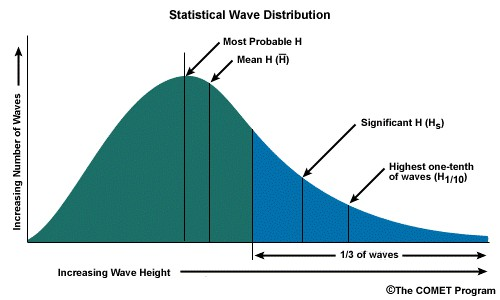
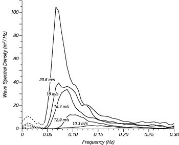

(sec-wind-waves)=
# 4.3 Wind waves
Short-crested waves are an important hydraulic boundary condition for evaluation of dike level and strength. Depending on their wave energy, which is related to the frequency and wave height and the breaking behaviour, waves may erode the land side slope (very common failure phenomenon in the 1953 Zeeland Flood) or the water side slope erosion of the revetment, be it grass, rip-rap or pitched stone, sometimes asphalt. Wave height alone is not relevant (enough). This can be easily illustrated by e.g. the tidal wave. The tidal wave height at Hoek van Holland is between 1.70 and 2.00 m, but the period is so long, 12 hours 24 minutes, that a flood defence will not 'feel' it as wave impact, but just as a water level rise.

In the context of these lecture notes we will not treat the whole theory of waves, but we will concentrate on what we need for the design of dikes, i.e. deal with wave overtopping and revetment stability. More detailed and up-to-date information on waves can be found in the EurOtop manual {cite}`EUROTOP2018`. For the theoretical background, readers are referred to the book 'Waves in Oceanic and Coastal Waters' {cite}`holthuijsen_2007`.

### Wave spectrum, representative wave height and period

(fig-wave-characteristics)=
<figure style="float: right; width: 40%; margin: 0 0 1em 1em;">
    
    <figcaption style="text-align: center;">
        Figure 4.13: The wave characteristic definitions
    </figcaption>
</figure>

In order to relate the characteristics of waves to the action, impact they have on a flood defence it is important to realise that the force and the duration of the impact on the dike construction is important. Wave height (twice the amplitude!) is of course a parameter that is often used, but that is not a very important parameter in itself. Other commonly used wave characteristics are visualised in [Figure 4.13](#fig-wave-characteristics).

For dike design, specifically wave runup and wave overtopping, we need a representative combination of wave height and wave period to use instead of running a full calculation with all different wave data. Hence, we need to pick representative values from the wave spectrum. In fact, it is a more or less an arbitrary choice which specific combination from the whole spectrum to choose and enter into the design formula for wave overtopping as long as we calibrate the formula to actual measurements. Thus different researchers have come up with different formula and a corresponding selection from the whole spectrum of waves.

Same as tidal waves, wind waves are only a small part of the wide spectrum of existing waves that occur. Particularly at sea dikes, approaching waves are composed of different sources, longer waves from the ocean like swell in combination with shorter wind induced waves, originating from older or more recent storms. Thus, at one point at the coast a whole spectrum of waves as shown in [Figure 4.14](#fig-wave-spectrum), built up of different periods $T$ or frequencies $f = 1/T$ will approach, the coastal dike. From this whole spectrum of waves we need to select a representative value (combination of wave height $H$ and wave period $T$) in order calculate wave runup or wave overtopping, unless we would prefer to make numerous calculations for the whole spectrum.

(fig-wave-spectrum)=
<figure style="text-align: center; margin: 1em auto;">
    
    <figcaption style="text-align: center;">
        Figure 4.14: Counting the number of waves with different heights yields a graph that looks like a wave energy spectrum with wave periods (or frequencies).
    </figcaption>
</figure>

The significant wave height $H_s$ (or $H_{m0}$ when working with spectra) corresponds to the mean of the third of the highest observed waves and is broadly used as the characteristic value for the wave height. This value can be obtained from wave spectra like [Figure 4.14](#fig-wave-spectrum), but also from simple observations. The corresponding significant wave period $T_s$ is less frequently used. More common is the usage of $T_{m,-1,0}$ or $T_p$ which again can be obtained from wave spectra analysis. As a rule of thumb, the following relationships can be used:

$$
\label{eq:equivalentT}
    T_p = 1.08 * T_s = 1.1 * T_{m,-1,0}
$$

Wave steepness is a useful way of evaluating wave characteristics and is defined as the ratio of a characteristic wave height to a characteristic wave length, $s_{0p}=H_{m0}/L_{0p}$. Swell seas will have a steepness of around 0.01, whereas a typical wind sea 0.04 to 0.06 {cite}`EUROTOP2018`.

It has to be noted, that the calculation of wind generated wave characteristics is still mostly empirical, as the interaction between wind and water surface is highly complex and very difficult to accurately represent. Hence, the choice of representative parameters of H and T depend mostly on the chosen set of empirical equations representing the hydraulic loads.

(fig-wave-spectrum)=
<figure style="text-align: center; margin: 1em auto;">
    
    <figcaption style="text-align: center;">
        Figure 4.15: A wave spectrum is a representation of the combination of waves from different origin occurring at one measuring point. It distinguishes all the different waves in the combination by the frequency <em>f</em> (=1/T).
    </figcaption>
</figure>

(Sec:bretschneider)=
### Birth of wind waves 

<figure style="float: right; width: 40%; margin: 0 0 1em 1em; text-align: center;">
    32.7 m/s at a return period of T = 10,000 years (Source KNMI)." 
         style="display: block; margin: 0 auto; width: 100%; height: auto;">
    <figcaption style="text-align: center; font-size: 0.9em;">
        Figure 4.16: Wind speeds in the North Sea. In the logarithmic Gumbel distribution, maximum wind speeds seem to arrive at a maximum of Beaufort 12 >32.7 m/s at a return period of T = 10,000 years (Source KNMI).
    </figcaption>
</figure>

As indicated by their name, wind waves are caused by wind blowing over the surface, inducing stresses on the water body that results in instabilities and the growth of waves. Depending on the amount of shear stress (which is correlated with the wind speed), the duration how long the shear stress is induced and limitations of the fetch length and water depth, a certain maximum wave height and period can be created. Meanwhile fetch is a limiting factor as it limits the distance over which shear forces can be induced (compare small lake with large ocean), the depth allows only for a maximum wave height before the waves start breaking. Other parameters like viscosity of the water, turbulence in the airflow or atmospheric parameters are usually ignored. This can introduce significant errors when estimating the characteristic wave height {cite}`holthuijsen_2007`. 

Significant wave height and significant wave period can be estimated from wind speed using predictive equations calibrated with large data sets as done by Sverdrup, Munk and Bretschneider {cite}`Barua2005`. Although the parameters have been periodically updated with new data, all versions retain hyperbolic tangent terms which are used to reduce wave height and period due to a limited fetch and water depth {cite}`holthuijsen_2007`. In the Netherlands, these equations are referred to as the 'Bretschneider equations' and have been used in the design of flood defences for decades, although the parameters for these empirical equations have been repeatedly updated as new data becomes available. One version of these equations are given below as a function of wind speed, water depth and fetch:

$$
\tilde{H} = 0.283 \;\textrm{tanh}\left(0.530\;\tilde{d}^{0.75}\right) \; \textrm{tanh} \left(\dfrac{0.0125\;\tilde{F}^{0.42}}{\textrm{tanh}\left(0.530\;\tilde{d}^{0.75}\right)}\right)
$$ (ch2_loading_bretHs)

$$
\label{ch2_loading_bretTp}
    \tilde{T} = 2.4\pi \;\textrm{tanh}\left(0.833\;\tilde{d}^{0.375}\right) \; \textrm{tanh} \left(\dfrac{0.077\;\tilde{F}^{0.25}}{\textrm{tanh}\left(0.833\;\tilde{d}^{0.375}\right)}\right)
$$

Where $\tilde{H}$, $\tilde{d}$, $\tilde{F}$ and $\tilde{T}$ are dimensionless coefficients:

$$
\tilde{H}=\frac{H_{s}g}{u_{10}^2} \;,\;\;\; \tilde{d}=\frac{dg}{u_{10}^2} \;,\;\;\; \tilde{F}=\frac{Fg}{u_{10}^2} \;,\;\;\; \tilde{T}=\frac{T_{s}g}{u_{10}}
$$

It is assumed here that the significant and spectral wave heights are identical (i.e., $H_{s}\approx H_{m0}$, and that various measures of wave period can be determined using Equation {eq}`eq:equivalentT`. Although newer versions of these equations available based on better data {cite}`Young96,holthuijsen_2007` and could give a more accurate prediction of wave conditions, the versions presented above are consistent with those implemented in the current module for generating hydraulic boundary conditions for Dutch flood defences, Hydra-NL {cite}`HKV19`, which in turn are based on Dutch design guide from 1989 {cite}`Andringa1989`. These equations may under-predict wave height for underdeveloped conditions (i.e., low fetch id deep water); see {cite}`Breugem07` for a detailed comparison and discussion. {cite}`Barua2005` gives a historical perspective.

In the Netherlands we will generally not deal with fully developed waves, which influences the wave spectrum used for determining hydraulic boundary conditions. In oceans and well-developed storms waves will fully develop in period and height, however, a measurement campaign in the early 70's of the last century (the Joint North Sea Wave Project, JONSWAP) showed that in the North Sea wave spectra would never fully develop.In smaller seas or lakes the full spectrum will also not fully develop, yet different wave characteristics and consequently other representative wave heights and periods will occur compared to similar conditions at sea. The Bretschneider equations calculate the representative wave heights and periods for a fully developed wave field which assumes an infinitely long and constant duration, conditions that are generally not realized. In particular, these empirically derived conditions are generalized to predict ocean wind wave characteristics, but are applied to inland or sheltered waters, resulting in steeper design waves than would probably develop during a real storm. In general, dependence between wave height and period is ignored. Despite these limitations, the Bretschneider equations are commonly used because they are based on high quality data sets and there is essentially no better alternative.

### Nearshore wave attenuation
When waves approach shallow waters, their characteristics change. At some point, the wave will start to feel the bottom, which will slow down the wave, reduce its propagation speed, meanwhile the wave period remains constant. This causes a wave height increase, until the wave is too steep or a significant wave height is reached that is about 50\% of the water depth, $h$, both of which will cause wave breaking. A maximum observed height for individual waves is around 75\% of the depth, but for design purposes we consider waves that break when $H_{brk} \approx 0.5 h$. Breaking characteristics on a beach or levee slope are dependent on wave steepness and the shore slope and influence the way waves run up, and possibly over, a flood defence. This is described with the Iribarren number, described in {numref}`Subsec:iribarren`.

<figure style="display: flex; justify-content: space-between; align-items: center; margin: 1em 0;">
    

        
        <figcaption style="text-align: center; font-size: 0.9em;">Seas and swell</figcaption>
    

    

        
        <figcaption style="text-align: center; font-size: 0.9em;">Changes to wave characteristics</figcaption>
    

</figure>
<figcaption style="text-align: center; font-size: 1em; margin-top: 0.5em;">
    Figure 4.17: Wave characteristics
</figcaption>