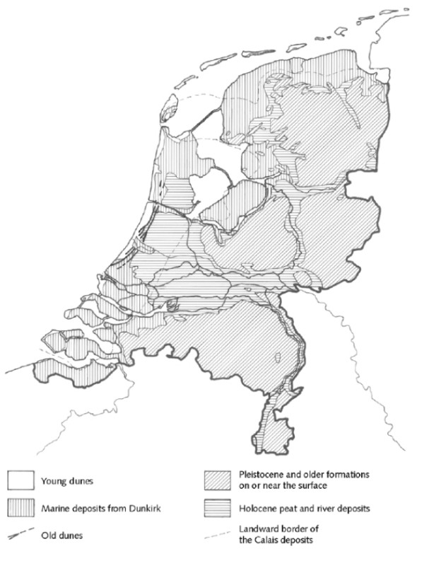
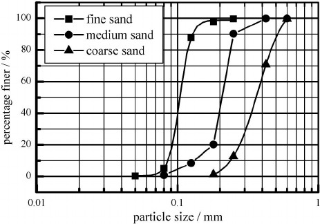
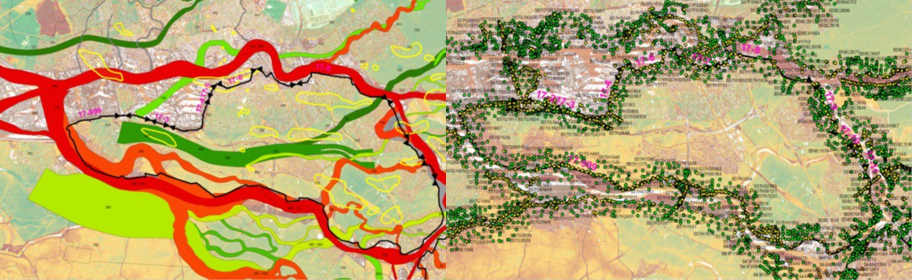
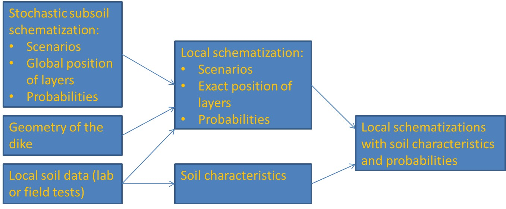
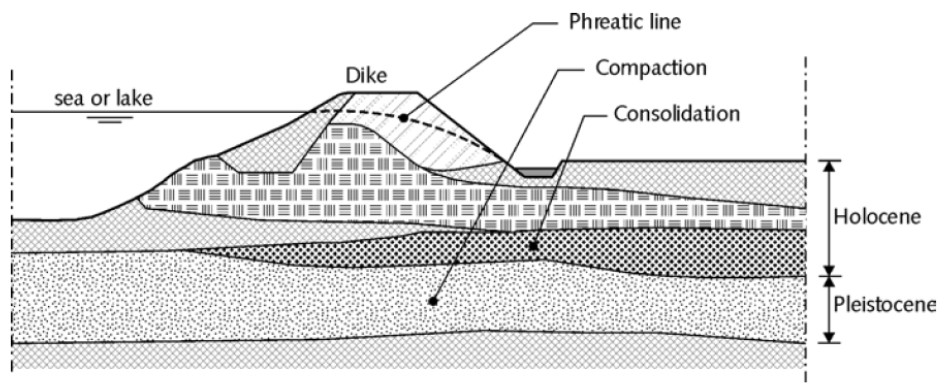
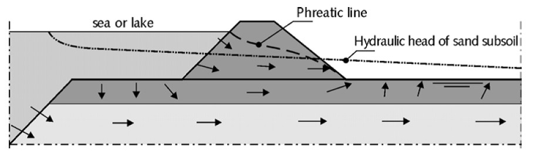

(sec:geotech_boundary_conditions)=
# 4.4 Geotechnical boundary conditions

## 4.4.1 Geological situation
The geological situation of an area require a global investigation of the soils and substratum. Initially, the geological description is based on existing data such as geological maps, groundwater maps and archives. A geological description of the area is necessary to estimate the geo-hydrological and geo-technical conditions relevant for the design. In this section a very global description of the geological situation of the Netherlands is described.

In the upper river area, the substratum is composed of Pleistocene and Holocene sediments. The composition however may vary considerably. The upper layers of the Pleistocene consist of fluvial sediments or –outside the river valleys – of windblown cover sands deposited during the last ice age. These layers are generally overlain by Holocene settlements, expect in the easterly and south-easterly provinces. During the Holocene, the major rivers deposited a wide variety of sediments. These sediments were deposited in areas where there rivers actively flowed (sand) or where the river ceased to flow (silt). Due to the changing course of the rivers, the Holocene deposits are frequently intersected or interrupted by Holocene river channels, choked by sand or silt. As a consequence, the geological structure may vary considerably from place to place. 

<figure>
    
    <figcaption style="text-align: center;">
        Figure 4.18: Geological map of the Netherlands
    </figcaption>
</figure>

In the lower river area, there are two geological formations, Kreftenheye from the Pleistocene and Westland from the Holocene. Again, large variations in soil structure may occur over short distances. The Kreftenheye formation is formed in the late Pleistocene and consists of:
- Fluvial deposits (mainly sand) are deposited by the rivers between MSL-10 and MSL-23 meters. These deposits are usually sealed by several decimeters of silty and fine-grained sand (or loam). 
- Aeolian deposits (sand) or Pleistocene dunes consist of medium-grained sand. These dune are irregularly spread and very greatly in thickness.

The Westland formation originates from 10,000 years ago when the temperatures and sea level rose. The rising sea level caused four types deposits:

- Dune (old and young) and beach deposits that were blown onshore. These deposits occur only in the west, near the coast.
- Marine deposits that were formed directly by the sea. The older deposits (Calais series) consist primarily of sand (lower parts) and clay (upper parts). The younger deposits (Dunkirk deposits) consist of sand (in the channels) and clay (outside the channels).
- Perimarine deposits that are fluvial deposits laid down under the influence of sea level rise. The older deposits are the Gorkum deposits, the younger ones are Tiel deposits. The perimarine deposits consist of clay, peaty clay and sand (particularly in the bigger channels).
- Organic deposits shows two different layers of peat, basal peat (up to the base of the Westland formation) and Dutch peat.

The coastal area of the Netherland can be divided into three geographical areas: south-western sea clay area, dune area and the Friesland-Groningen sea clay area. In these areas there are two important geological units: 

- The Pleistocene Twente formation was deposited during the last cold period of the Pleistocene preceding the Holocene. The Netherlands was covered by sparse tundra vegetation and except for the river area the entire country was covered with a thin layer of aeolian sand (dekzand in Dutch). The thickness of this cover sand vary greatly form one meter up to 10 meters.
- The Holocene Westland formation in the south-western sea clay area is similar to the formation in the lower river area.
- The Holocene Westland formation in the dune area are similar too, except for the perimarine deposits which are absent.
- In the Friesland-Groningen sea clay area the Pleistocene deposits are relatively shallow. During the Holocene marine and organic deposits were formed.

## 4.4.2 Soil behaviour and soil parameters
The most common types of soil in the Netherlands are sand, clay and peat, often with a great variety of variations and mixtures. Soil consists of three components: solid particles (grains), water and air. Water and air fill the voids between the grains. The characteristics of the grains and the ratio between the three components determine the soil behaviour with respect to dike design. The soil characteristics do vary within a wide range due to differences in the nature, size and shape of the grains, the manner of deposit and the history, especially in relation to previous loading. 

Sand is characterized by a loose, non-cohesive grain structure, good permeability and a relatively large mass per unit volume. Clay is a cohesive type of soil, usually not very permeable and resistant to erosion. However, clay may be very permeable if structural formation (ripening) has occurred. The mass per unit volume depends strongly on the organic component content and the degree of consolidation. Peat is very cohesive and weakly to moderately permeable. The mass per unit is considerably lower than for sand or clay. Young peat deposits may possess very poor friction properties and be strongly compressible. If peat has a well-developed fibre structure, the friction properties may be higher, although there will be a significant anisotropy. For dikes the most important elements of soil behaviour are weight or mass (by unit of volume), shearing behaviour (cohesion and internal friction), deformation and settlement (compressibility) and permeability. If the substratum consists of sandy soil the grain distribution is important for piping and liquefaction. For liquefaction the (critical, minimum and maximum) density is relevant too. For clay the grain distribution and the Atterberg limits for plasticity are important. {numref}`Tab:Global_soil_parameters` shows an indicative range of soil characteristics. 

```{table} Global soil parameters
:name: Tab:Global_soil_parameters
| soil type | weight | internal friction | cohesion | compressibility | permeability |
| :--: | :--: | :--: | :--: | :--: | :--: |
| | [$kg/m^3$] | [$^o$] | [$kg/m^2$] | [$-$] | [$m/s$] |
| sand | 19-21 | 30-38 | 0 | 50-500 | $>10^{-5}$ |
| clay | 16-19 | 20-30 | 1-10 | 10-50 | $10^{-8}-10^{-6}$ |
| peat | 10-11 | 15-25 | 1-15 | 5-25 | $10^{-8}-10^{-5}$ |
```

In addition to the soil parameters relevant for macro-stability an additional soil parameter is relevant for piping. A granular analysis is used to determine the grain size distribution of the sandy aquifer below the Holocene cover layer. From a grains size distribution the $D_{70}$ can be determined. This parameter is used in the piping formula of Sellmeijer. The value of $D_{70}$ (and the permeability) depends very much on the type of sand: for fine sands $D_{70}$ can be around $100 \mu m$, whereas for coarse sand $D_{70}$ can be as high as $400-500 \mu m$. (see [Figure 4.19](fig-grain-size-esìxample))

(fig-grain-size-esìxample)=
<figure>
    
    <figcaption style="text-align: center;">
        Figure 4.19: Grain size distribution (example)
    </figcaption>
</figure>

The structure of the substratum and soil characteristics can be determined by using laboratory and field tests (in situ). As dike stability depends mainly on the behaviour of soil and groundwater under extreme circumstances, serious investigations are required to determine the proper characteristics. Such investigations include:

- Geotechnical longitudinal sections: possibly one under the dike crest, one at the land side (often the place where the reinforcement is going to be realised) and if necessary also one on the water side.
- Geotechnical cross sections, preferably every 50 to 100 m: dikes are usually situated in an area with a highly dynamic morphological behaviour; hence there will be a lot of variation in the subsoil layers.
- Sufficient soil samples in each geotechnical unique layer to establish the relevant geotechnical parameters.

This soil investigation is usually time consuming in terms of historical investigation of data, definition of required investigation in relation to the intended dike reinforcement, tendering, mobilisation of equipment, reassessment of the sampling plan after the first results, the sampling itself and the laboratory test. The results need to be statistically analysed to determine the right parameter values for the geotechnical calculations. Often this soil investigation takes weeks or months and is critical in the design itself and the planning of the design. 

Within the framework of the new safety standards in the Netherlands a stochastic subsoil schematization (Deltares, 2016) has been developed. This model, D-Soil, is based on much available data from the field combined with geotechnical and geological experience. 

<figure>
    
    <figcaption style="text-align: center;">
        Figure 4.20: Data used for D-Soil (left: geological map of river patterns; left: drilling and penetration tests)
    </figcaption>
</figure>


For any given location in the Netherlands the global position of the various layers in the subsoil are given, including scenarios (and their likelihood). Combining this information with the geometry of the dike and the results from laboratory or field tests, this information can be updated for designing purposes. This tool is very powerful and provides the engineer with sufficient data to make an initial design. 

<figure>
    
    <figcaption style="text-align: center;">
        Figure 4.21: Determining the local schematization(s)
    </figcaption>
</figure>


## 4.4.3 Hydrological situation
The stability of the dike body depends primarily on the pore pressure and hydraulic head in and under the dike during design conditions. The design load is generally a water level, but heavy precipitation or wave overtopping may also occur. In addition to the still water level and the time-dependent fluctuation ({numref}`Subsec:water_levels_rivers`) The pore pressure is dependent on the groundwater flow, which in turn is depend on the geological conditions, the permeability, retention capacity and consolidation process. The geology of the Netherlands is largely comprised of relatively impermeable, weak, Holocene, upper layers, overlying relatively permeable and incompressible Pleistocene sand layers. This is called the Holland profile ([Figure 4.22](fig-holland-profile)).

(fig-holland-profile)=
<figure>
    
    <figcaption style="text-align: center;">
        Figure 4.22: The Holland profile
    </figcaption>
</figure>


The entry point of groundwater flow during design conditions as shown in [Figure 4.23](#fig-groundwater-flow), entering the ground via the unprotected foreland of the dike and exiting through the cover layer of the hinterland. Groundwater flow can be generally characterized as follows:

- A 2-dimensional flow pattern in the vertical plane through the dike body and subsoil;
- Horizontal flow in the sandy subsoil;
- Vertical flow through the covering layer near the exit point.

Groundwater flow in the dike and subsoil can be described using:
- The hydraulic head in the Pleistocene layer;
- The location of the phreatic line;
- The penetration length in the weak layer package.

(fig-groundwater-flow)=
<figure>
    
    <figcaption style="text-align: center;">
        Figure 4.23: Groundwater flow during design conditions
    </figcaption>
</figure>


For more details related to groundwater flow, reference is made to the Technical Report on soil structures {cite}`TAW1998` and {numref}`Ch:Piping` of these Lecture Notes.
