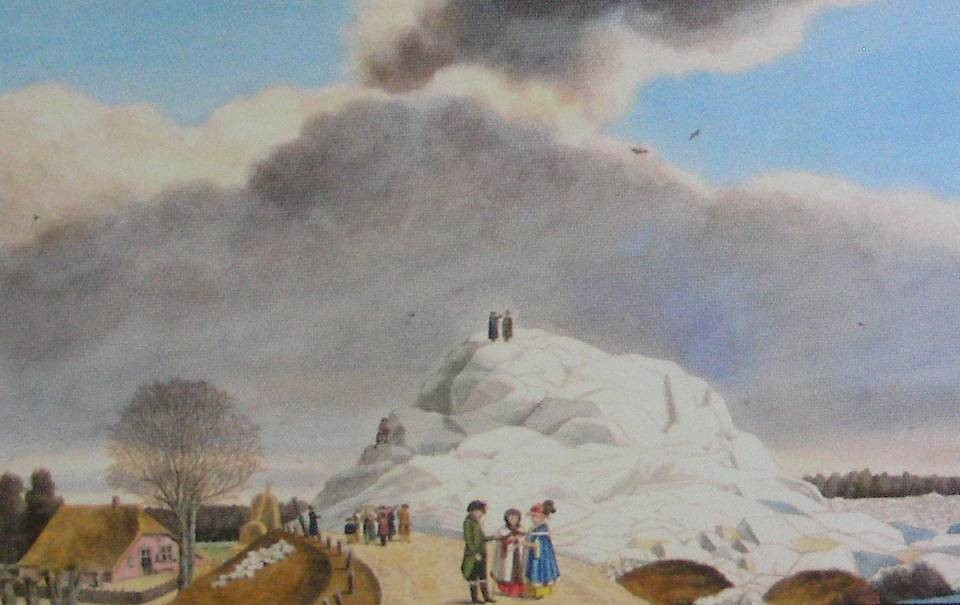
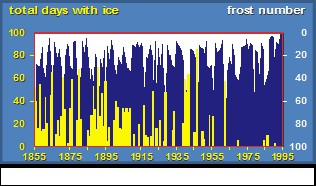

(sec-rhineexample)=
# 4.5 Rhine river example: factors influencing the loads

In the sections below the Rhine River has been taken as an example for the possible development of river water levels in history.
### Ice melt and ice induced floods
The Rhine River, sourcing at the St. Gotthard Glacier in Switzerland has shown a changing behaviour over the centuries. Discharge resulting from ice melt and precipitation in the river basin area will, under varying circumstances over the historic past, result in different water levels.

The Rhine has been considered a meltwater river, i.e. the extreme flood are dominated by ice and snow melt, usually in spring time. The 1926 Rhine and Meuse flood were not in spring, but occurred after a long period of snow in the upper regions of the river late November and early December, followed by an intense thaw period with high temperatures and rain. 

In the small Ice Age of the 17th and 18th century the Rhine and the Meuse would still get covered with ice. Thaw would cause the ice cover to break, resulting in drifting ice floe, (ice) damming of the river and consequential floods and inundations.

<figure style="display: flex; justify-content: space-between; align-items: center; margin: 1em 0;">
    

        
        <figcaption style="text-align: center; font-size: 0.9em;">
            Figure 4.24: 17th Century representation of ice dam at the Waal River
        </figcaption>
    

    

        
        <figcaption style="text-align: center; font-size: 0.9em;">
            Figure 4.25: Climate change has resulted in a decreasing number of ice days per year, hence a lower probability of occurring ice dams and ice induced floods (Boertien, 1993).
        </figcaption>
    

</figure>

Climate change has between the 18th and 20th century has resulted in retreat of the glaciers in the Alps, the base flow of the Rhine has thus been reduced. Milder winters have lower snow fall. As a result the Rhine River is changing slowly from an ice melt based river to a river of which the discharge and especially the peak discharge is dominated by precipitation. 

Another cause of less ice cover is pollution. Cooling water discharge of power plants, wastewater discharge, but also the long-term discharge of salt by the French potash mines have resulted in a virtual impossibility of ice on the Rhine River in the 1970s. The pollution problem has since been put under control to a large extent.

### Contributaries and other upstream developments
In the Netherlands it is usually the Rhine discharge at the German border (Lobith gauge station) that is taken as an input to calculate water levels downstream in the Netherlands. The discharge at Lobith depends on the accumulation water in the river in Germany.
First and most important of all are the base flow in the Rhine, entering from Switzerland and the more or less coinciding contribution of the contributaries in Germany, of which the Neckar, Main and Mosel are the most important.

During a flood in Germany, inundation will occur, which is an – unwanted – form of retention. Within Germany flood protection are being created, either retention areas (especially in Baden-Würtemberg), dike construction or improvement of the discharge capacity. Retention and flooding have a positive result in the Netherlands in an effort to reduce maximum discharge water levels. Dike constructions and discharge enhancement, like flood channel improvement, may have an upward downstream on water levels.

#### Local measure for flood protection and water level regulation

<figure style="display: flex; justify-content: space-between; align-items: center; margin: 1em 0;">
    

        
        <figcaption style="text-align: center; font-size: 0.9em;">
            Figure 4.26: Contributaries in the Meuse-Rhine-Eems river basins
        </figcaption>
    

    

        
        <figcaption style="text-align: center; font-size: 0.9em;">
            Figure 4.27: Accumulation of river discharge into the Rhine
        </figcaption>
    

</figure>

(fig-rivers-around-1600)=
<figure style="display: flex; justify-content: space-between; align-items: center; margin: 1em 0;">
    

        
        <figcaption style="text-align: center; font-size: 0.9em;">
            Figure 4.28: Un-diked Rhine, Waal, Meuse before 1200, only minor settlements at the natural levees.
        </figcaption>
    

    

        
        <figcaption style="text-align: center; font-size: 0.9em;">
            Figure 4.29: Partially diked Meuse and Waal Rivers in 16th century. Obviously major parts of the flood plains have been taken from the river system.
        </figcaption>
    

</figure>

The development of the dike system in the Netherlands has deprived the Rhine branches and the Meuse from the major part of it floodplains and backlands. Over 90\% of the potential flooding area has been protected by dikes over the centuries since the start of dike constructions around 1200. The Room for the River program (2006-2015) only returns a very small percentage to the river in terms of flood plain area.
The change of the river system by dikes has also caused the river to silt up, in technical terms, to reduce its gradient. Sedimentation of sand in the river bed, siltation closer to the sea and sedimentation of mostly clay in the flood plains between the flow channel and the dikes has decreased the discharge capacity of the river, resulting in higher water levels at the same discharge. One of the most important goals of the Room for the River programme is to re-instate this discharge capacity by creation of flood channels in the flood plains and by lowering of the flood plains.

<figure>
    
    <figcaption style="text-align: center;">
        Figure 4.30: Local Measures
    </figcaption>
</figure>

A second example of a river work that has influenced the water levels in the Rhine is the construction of the Pannerden Canal in 1706. The Pannerden Canal is in fact a "dug river" that has cut of the former "Old Rhine" near the Dutch-German border. For centuries there had been a problem of sufficient water downstream in times of average discharge and below. At the disjunction of Waal and Rhine the townships of Zutphen river harbour at the northern branch, IJssel) and Dordrecht (river harbour at the southern branch, Waal)) had been struggling to get an even distribution of the water discharge. In 1672 it happened that the French army could invade through a virtually empty river bed. The Pannerden Canal has been built as a combined effort of the Dutch provinces to ensure sufficient water as military defence line and at the same time ensure sufficient water depth to economically run the harbours further downstream.

<figure>
    
    <figcaption style="text-align: center;">
        Figure 4.31: Comparison between the situation in 1690 and in 1790
    </figcaption>
</figure>

After construction of the canal major river regulation works needed to be carried out to adjust and fine-tune the water distribution between Waal and Lower Rhine (and IJssel), but the effort was successful. Obviously, these river regulation works influenced water levels in normal conditions further downstream, but these same regulation works determine also the river behaviour and water levels in extreme discharge conditions.

Along with the closure of the dike systems in the river region (see [Figure 4.29](#fig-rivers-around-1600)) the construction of the Pannerden Canal caused many dikes to breach in the century after. The closure of the dike rings around 1600 and the Pannerden Canal are among the most significant changes on Dutch territory to influence water levels in the Rhine branches. Two other significant changes were the separation of Waal and Meuse (1883) and the construction of three weirs in the Lower Rhine (1960/1970s) for navigation improvement.

### Morphological river behaviour

A river discharges not only water, but also sediment: gravel, sand, silt, clay. This sediment will settle at different locations and influence the water levels. Vice versa, we may intervene by influencing the sediment (fixing the river bed, groynes or dredging) to manipulate river water levels.

Natural sedimentation in the deltaic area of the Netherlands will reduce the gradient of river Rhine, slow down the flow (causing more sedimentation) with rising river water levels as a result. To give an image, with still 150 km to flow to the sea the Rhine still has a drop of about 10 m for the average discharge 2200 $m^3/s$. In extreme conditions of 12,000 $m^3/s$ this drop is over 16 m. To compare, the Mekong river has much more sediment, its delta has much more silted up: a drop of only 4.5 m over 150 km for 45,000 $m^3/s$ and indeed, the water will not flow, causing inundations for months, every year again.

<figure style="display: flex; justify-content: space-between; align-items: center; margin: 1em 0;">
    

        
        <figcaption style="text-align: center; font-size: 0.9em;">
            Figure 4.32: Closed dike rings and Pannerden Canal cause higher water levels in the river region and many dikes to breach in the 18th century.
        </figcaption>
    

    

        
        <figcaption style="text-align: center; font-size: 0.9em;">
            Figure 4.33: Measured elevation of river dunes during flood.
        </figcaption>
    

</figure>

Also at a much smaller time scale, the river bottom changes, rapidly. Where at an average discharge one will notice small sand waves in the river bottom, due to river flow, these smaller waves will grow with higher discharge. Actually they grow considerably to 'river dunes' of more than one meter. So, where we expect a certain discharge capacity with a smooth bottom, the river dunes will considerably reduce discharge area and capacity, causing much higher water levels. Rijkswaterstaat discovered this natural phenomenon only in 1986. They had to adjust their design water levels for dikes by 1 meter up. This a politically unpleasant moment as the government had just reduces the design water level for dikes by half a meter in order to avoid too many dimension and social problems.

### Statistics of river water levels (extremes)

Like for sea water levels, we need to predict flood levels in order to establish the dimensions of the flood defence, particularly the dye crest levels. 

As explained above, water level recordings before the major changes in the river systems give us very little information. The Lobith gauging station has been in service since 1900. The year extremes have been analysed and homogenised in order to create comparable figures, accounting for smaller changes in the river geometry.
Thus Rijkswaterstaat has acquired a reliable set of data for more than 100 years, in order to make prediction for 50 to 100 years ahead. In order to make a prediction Rijkswaterstaat has determined the statistical probability of discharge occurrence at Lobith. From 1977 (Becht Commission) the design safety standard for flood protection in the river area has been fixed at 1/1250 per year (around 8\% per century).

<figure style="float: left; width: 50%; margin: 1em 1em 1em 0; text-align: center;">
    
    <figcaption style="text-align: center; font-size: 0.9em;">
        Figure 4.34: Rhine river discharge plotted against its return period.
    </figcaption>
</figure>

At such a high standard of on average once in 1250 years, the uncertainty in the true statistical distribution of the discharge is still considerable. Still this uncertainty is not being taken into account when calculating the design discharge and related water levels for the dikes.

A second point of attention is that the acquired number for 1/1250 per year is only a statistical extrapolation. It needs to be considered that a discharge as high as 16,500 $m^3/s$ may not even exist, at least not in the Rhine River at Lobith! Experts have however estimated that the absolute maximum at Lobith could be around 20,000 $m^3/s$ if Germany would be flood-protected to a maximum, which is not the case yet. Rijkswaterstaat and Deltares have started the so-called study 'Generator of Rainfall and Discharge Extremes' (GRADE) in 2007 in order to establish a model to relate statistical precipitation data and rainfall runoff to maximum discharges for the Rhine (still ongoing).

The Boertien Commission (1993) decided to use a different statistical distribution to arrive at the purely political wish for a lower design discharge of 15,000 $m^3/s$ at the same flood protection standard of 1/1250 per year. At the time dike reinforcement projects caused much social opposition; the Boertien Commission tried to reduce the impact by lowering the required dike crest level by 50 cm and by enforcement of an environmental impact assessment. It was only a natural coincidence that in 1993 and in 1995 two consecutive extreme flood events of 1/65 and 1/125 per year occurred and were added to the measured time series, causing the adopted statistical distribution to yield a design discharge of 16,000 $m^3/s$ at T=1/1250 per year, a rise of 1,000 $m^3/s$! The Dutch government decided to stick to 15,000 $m^3/s$ for a speedy dike reinforcement programme after the 1993/1995 floods (Delta Programme Major Rivers) and solve the remaining 1,000 $m^3/s$ by river enlargement (Room for the River Programme).

<figure style="display: flex; justify-content: space-between; align-items: center; margin: 1em 0;">
    

        
        <figcaption style="text-align: center; font-size: 0.9em;">
            Figure 4.35: In the 1960s Gelderland province set the flood protection standard at 18,000 m³/s (1/3000 per yr). This needed to be reduced because of the impact it had on the dike dimensions in 1977: 1/1250 per yr, Becht Commission). Boertien reduced the design water levels again in 1993 (see text).
        </figcaption>
    

    

        
        <figcaption style="text-align: center; font-size: 0.9em;">
            Figure 4.36: Influence of the occurrence of the 1993 and the 1995 floods on the perception of the design flood, using the adopted statistical distribution (rounded average of Pearson III, log-normal and Gumbel distribution). The value of 15,000 m³/s dropped from 1/1250 to 1/600 per year!
        </figcaption>
    

</figure>
