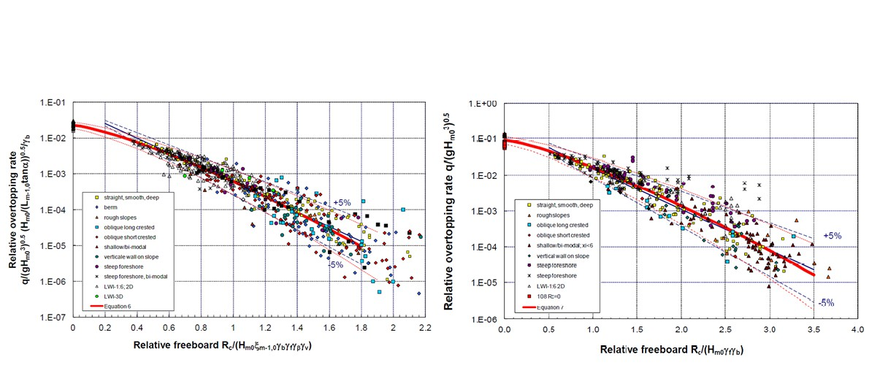

(Sec:Overtopping_straight_smooth)=
# 5.4 Overtopping on straight smooth slopes

(Subsec:Theoretical_considerations_overt)=
## 5.4.1 Theoretical considerations

In the same way as was done for run-up, the theoretical shape of the overtopping formula can be derived from an analysis of regular, breaking waves, and can then be extended to the use in irregular waves. {cite}`BATTJES1974_PhD` found the resulting theoretical expression for the mean overtopping rate and expressed his results as a rather complicated analytical function.

We can define a parameter $q$ which is the mean overtopping rate per unit length of dike and per unit time, so $q$ has units $\frac{m^3}{s\cdot{m}}$ or $\frac{l}{s\cdot{m}}$. This is the total amount of wave that crosses the dike crest during the storm, divided by the duration of that storm. It turns out that this parameter $q$ is mainly a function of the Iribarren parameter and the relative crest level of the dike $\frac{R_{c}}{H_{m0}}$, where $R_{c}$ is the freeboard defined as the difference between the crest level and the still water level, and $H_{m0}$ is the wave height.

Battjes’ results are only valid in the breaking wave regime, so for low Iribarren numbers. Like in the case of run-up, practical observations have shown that the overtopping reaches a maximum limit for non-breaking waves (high Iribarren numbers). Two sets of overtopping equations are provided below, which give similar results for most conditions. While the relationship from {cite}`VANDERMEERBRUCE2014` is the most recent and is incorporated in {cite}`EUROTOP2018`, the TAW formulas are still widely used in the Netherlands, including the legal software for calculating flooding probabilities (e.g., RisKeer). The main difference between the two is that the {cite}`VANDERMEERBRUCE2014` equations have an additional exponent within the argument of the exponential function and are valid for all positive values of freeboard. Note that there are two sets of coefficients for each of the four overtopping equations presented below. Characteristic values are approximately one standard deviation above the mean discharge and are recommended for use in deterministic (or semi-probabilistic) design. Mean values of the coefficients can be used to compute average overtopping discharge, or used in combination with the standard deviations (assuming a normal distribution) for use in probabilistic calculations. 

(Subsec:Prediction_overtopping_rates)=
## 5.4.2 Prediction of mean overtopping rates

### Van der Meer and Bruce 2014
For use in practice, {cite}`VANDERMEERBRUCE2014` provide a simple approximation of Battjes’ formula, and re-fitted the coefficients for use with $H_{m0}$ and $T_{m-1,0}$. Their formula is as follows:

$$
\frac{q}{\sqrt{g\cdot{H_{m0}}^3}} =
\frac{0.023}{\sqrt{\tan{\alpha}}} \cdot \xi_{m-1,0} \cdot \exp
\left\lbrace
-\left(
2.7 \cdot \frac{R_{c}}{\xi_{m-1,0} \cdot H_{m0}}
\right)
^{1.3}
\right\rbrace
$$ (Eq:MeerandBruce2014)

It was found that, although Battjes’ formula was almost entirely derived on theoretical grounds, it provides a very good description of the mean trend through the available data from model tests, and required no further calibration.

In the non-breaking wave regime there is no longer a theoretical basis for the shape of the formula. We have to rely on observations only, which have shown that for nonbreaking waves the mean overtopping rate reaches a maximum given by: 

$$
\frac{q}{\sqrt{g\cdot{H_{m0}}^3}}=0.09\exp \left\lbrace -\left( 1.5\cdot{\frac{R_{c}}{H_{m0}}} \right)^{1.3} \right\rbrace
$$ (Eq:MeerandBruce2014,2)

According to {cite}`VANDERMEERBRUCE2014` the reliability of the coefficient values is as follows: 

(tab-runup-coefficients-5-2)=
**Table 5.2: Coefficient values in {eq}`Eq:5.6`, {eq}`Eq:5.7`, {eq}`Eq:5.12`, and {eq}`Eq:5.13`.**

| **General Shape** $\frac{q}{\sqrt{g \cdot H^3}} = A(...) \exp(-B(...))^{1.3}$ | **Equation {eq}`Eq:5.6`** | **{eq}`Eq:5.12`** | **Equation {eq}`Eq:5.7`** | **{eq}`Eq:5.13`** |
|:--------------------------------------------------------|:----:|:----:|:----:|:----:|
|  | **A** | **B** | **A** | **B** |
| **Mean Value** | 0.023 | 2.7 | 0.09 | 1.5 |
| **Standard Deviation** | 0.003 | 0.20 | 0.013 | 0.15 |
| **Characteristic Value**[^4] | 0.026 | 2.5 | 0.1035 | 1.35 |

#### TAW Formula
The above formulas express recent scientific insights, and appear to be supported very well by the theoretical work of Battjes from the 1970s. It may be important to realize that most of the practical design guidelines for wave overtopping (such as {cite}`TRGG2007,EUROTOP2007`, \citetalias{Rockmanual2007}) contain a slightly older version of the prediction formulas: 

$$
\frac{q}{\sqrt{g\cdot{H_{m0}}^3}} = 
\frac{0.067}{\sqrt{\tan{\alpha}}}
\cdot \xi_{m-1,0} 
\cdot \exp 
\left( 
-4.75 \cdot \frac{R_{c}}{\xi_{m-1,0}\cdot H_{m0}}
\right)
$$ (Eq:MeerandBruce2014old)

With a maximum of:

$$
\frac{q}{\sqrt{g\cdot{H_{m0}}^3}}=0.2\exp \left( -2.6\cdot{\frac{R_{c}}{H_{m0}}} \right)
$$ (Eq:MeerandBruce2014old,2)

These formulas have been derived from empirical observations and do not have an explicit theoretical basis. The coefficients in the formulas have been fitted to match the observed data. These formulas are still widely used in practice. In The Netherlands, the standard calculation method in the design and assessment of levees for overtopping implies the use of the software package PC-Overslag, which makes use of these equations. The program PC-Overtopping is an English version of this software that was used to develop a web-based application available on the EurOtop website [overtopping-manual.com/](http://overtopping-manual.com/eurotop/pc-overtopping/), although the equations will use the older version from {cite}`EUROTOP2007` indefinitely.

The difference between formulas {eq}`Eq:MeerandBruce2014` / {eq}`Eq:MeerandBruce2014,2` and {eq}`Eq:MeerandBruce2014old` / {eq}`Eq:MeerandBruce2014old,2` is almost indiscernible, especially in the middle and upper ranges of the dimensionless freeboard. Only for (very) small dimensionless freeboards is formula {eq}`Eq:MeerandBruce2014` / {eq}`Eq:MeerandBruce2014,2` explicitly recommended.

The values to use for the coefficients depend on the type of calculation (semi-probabilistic or full-probabilistic). According to {cite}`EUROTOP2007` the reliability of the coefficient values is as follows:

(tab-coef-values-3)=
**Table 5.3: Coefficient values in Equations {eq}`Eq:MeerandBruce2014old` and {eq}`Eq:MeerandBruce2014old,2`**

| **General Shape** $\frac{q}{\sqrt{g\cdot H^3}} = A(...) \cdot \exp\left\lbrace -B(...) \right\rbrace$ | **Equation {eq}`Eq:MeerandBruce2014old`** |  | **Equation {eq}`Eq:MeerandBruce2014old,2`** |  |
|:--------------------------------------------------------------------------------------------------|:----:|:----:|:----:|:----:|
|  | **A** | **B** | **A** | **B** |
| **Mean Value** | 0.067 | 4.75 | 0.2 | 2.6 |
| **Standard Deviation** | - | 0.5 | - | 0.35 |
| **Characteristic Value** | 0.067 | 4.3 | 0.2 | 2.3 |

<figure>
    
    <figcaption style="text-align: center;">
        Figure 5.3: Dimensionless overtopping for low Iribarren numbers (breaking waves) - left, Equation Eq:MeerandBruce2014 and high Iribarren numbers (non-breaking waves) - right, Equation Eq:MeerandBruce2014,2, taken from VANDERMEERBRUCE2014.
    </figcaption>
</figure>
