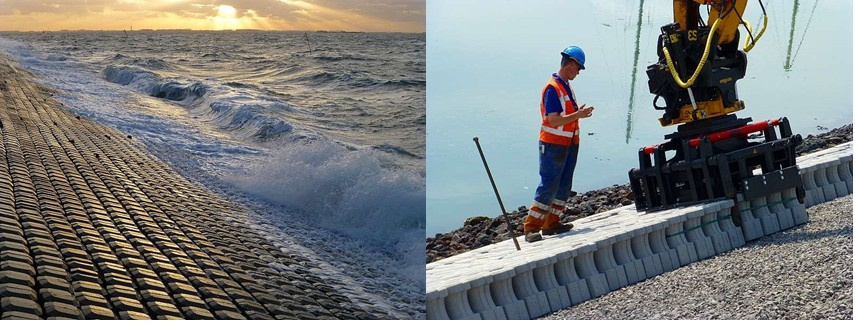
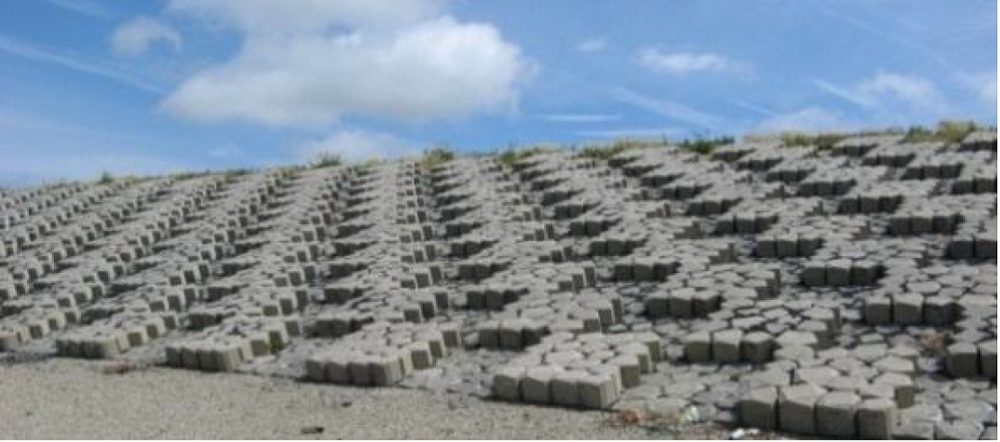
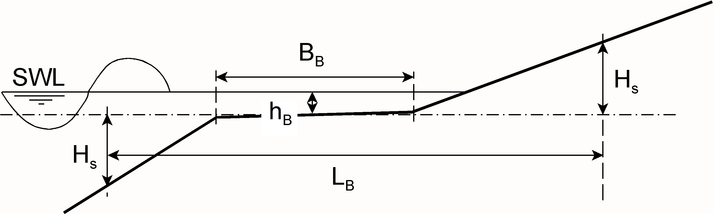
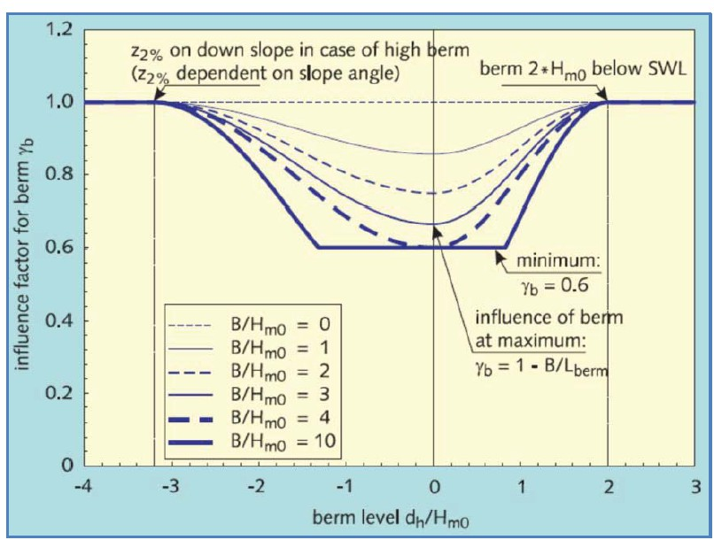
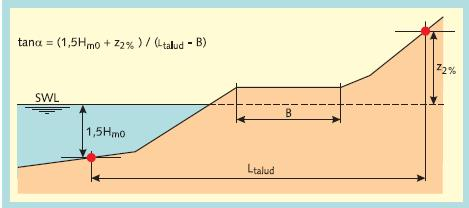
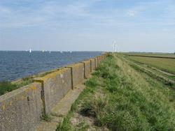

(Sec:Red_factors)=
# 5.5 Reduction factors for roughness, berms and oblique wave attack

In the above we have only studied run-up and overtopping on smooth, straight slopes. In reality, several factors may reduce run-up and overtopping, which can be taken into account with a reduction coefficient, $\gamma$, which has a value $0 < \gamma < 1$ (and $\gamma = 1$ means no reduction). Up to four different factors can be combined into a single reduction coefficient, $\gamma=\gamma_{b}\cdot{\gamma_{f}}\cdot{\gamma_{\beta}}\cdot{\gamma_{v}}$, where:

- $\gamma_{b}$ = reduction due to a berm
- $\gamma_{f}$ = reduction due to friction caused by roughness of the slope
- $\gamma_{\beta}$ = reduction due to oblique waves
- $\gamma_{v}$ = reduction due to a wall on top of the slope

It should be noted that the reduction factors are all based on model tests, but each effect has been tested separately and there is no direct evidence of their combined effect. It is common practice to limit the combined effect to $\gamma=\gamma_{b}\cdot{\gamma_{f}}\cdot{\gamma_{\beta}}\cdot{\gamma_{v}} > 0.4$ for a first design. For run-up the formula becomes:

$$
\frac{R_{u2\%}}{H_{m0}}=  1.65 \gamma_b \gamma_f \gamma_\beta \xi_{m-1,0}
$$ (Eq:Ru)

With a maximum of: 

$$
\frac{R_{u2\%}}{H_{m0}}= \gamma_f \gamma_\beta \left(4.0 -\frac{1.5}{\sqrt{\xi_{m-1,0}}} \right)
$$ (Eq:Max_Ru)

An updated version of the maximum run-up formula (Equation {eq}`Eq:Max_Ru`) has been included in the current edition of {cite}`EUROTOP2018`, but has not been included in this document, as the calculated results are relatively small. The coefficients are slightly different and the coefficient $\gamma_b$ is also applied to $\xi_{m-1,0}$.

For overtopping the same reduction factors apply, but they appear separately in the formulas and cannot always be combined into a single reduction factor $\gamma$. For instance, for calculation of the maximum value the reduction due to a berm ($\gamma_{b}$) and due to a vertical wall ($\gamma_{v}$) should not be taken into consideration. The formulas for overtopping, including reduction factors, are shown below. The same coefficients as for the older overtopping equations can be used (Table [5.2](tab-5.2)).

$$
\frac{q}{\sqrt{g\cdot{H_{m0}}^3}}=
\frac{0.023}{\sqrt{\tan{\alpha}}} \cdot \gamma_b \cdot \xi_{m-1,0} \cdot \exp
\left\lbrace
- \left(
2.7 \cdot \frac{R_{c}}{\gamma_b \cdot \gamma_f \cdot \gamma_{\beta} \cdot \gamma_v \cdot \xi_{m-1,0} \cdot H_{m0}}
\right)
^{1.3}
\right\rbrace
$$ (Eq:MeerandBruce2014,red)

With a maximum of:

$$
\frac{q}{\sqrt{g\cdot{H_{m0}}^3}} = 
0.09 \exp
\left\lbrace
- \left(
1.5 \cdot \frac{R_{c}}{H_{m0} \cdot \gamma_f  \cdot \gamma_{\beta}}
\right)
^{1.3}
\right\rbrace
$$ (Eq:MeerandBruce2014,red2)

If formulas {eq}`Eq:MeerandBruce2014old`/\ref{Eq:MeerandBruce2014old,2} are used instead of formulas 
{eq}`Eq:MeerandBruce2014`/\ref{Eq:MeerandBruce2014,2}, the same reduction factors appear at the same places.

(Subsec:roughness)=
## 5.5.1 Roughness

One of the parameters to decrease run-up and overtopping is the roughness of the slope. There is no theoretical derivation of roughness parameters. Practical tests (on large scale) have given results for a reduction factor for various types of material: (see e.g. {cite}`TRGG2007, EUROTOP2007`)

(tab-5.4)=
```{table} Roughness coefficients. Note: reduction factors for other types of material can be found in the appendix of {cite}`TRGG2007` and {cite}`EUROTOP2007`
:name: Tab:Rougness_coef
| **Reference type** | *$\gamma_{f}$* | **Reference type** | *$\gamma_{f}$* \\ \hline|
| :--- | :--- | :--- | :--- |
| Smooth asphalt or concrete | 1.00  | Hillblock | 0.71-0.78 |
| Smooth concrete blocks | 1.00  | Open stone asphalt (Fixtone) | 0.90 |
| Grass | 1.00  | Polymer Bonded Aggregate (Elastocoast) | 0.55-0.77 |
| Natural Basalt | 0.95  | Single layer of riprap | 0.70 |
```

The reduction factor for roughness is not really a constant but depends on the breaking pattern of the waves, and thus on the value of the Iribarren parameter. This is caused by the fact that the breaking pattern determines how much water is left on the slope when the next wave arrives. When there is more water already on the slope, the next wave will ‘feel’ a smoother slope. The nett effect is that the reduction effect decreases (so the reduction factor becomes larger i.e. closer to $\gamma_{r}= 1.0$) for increasing values of the Iribarren parameter. For practical use, {cite}`TRGG2007` recommends to use the values from table x for $\xi_{m-1,0} < 1.8 $, use $\gamma_{r}= 1.0$ for $\xi_{m-1,0} > 10 $ and interpolate linearly for values in between.

### Porous layers
In fact the values in the right-hand column are not really “friction” values. The reduction is only partly caused by skin friction of the layer, but for a larger part by the permeability of the material. The wave tongue will partly penetrate into the top layer and this will result in less wave run-up and overtopping. Especially for Hillblocks this is the case, the top surface of the blocks is rather smooth, so the real friction is very small. Most run-up reduction is caused by the fact that the water of the run-up tongue disappears into the voids in the revetment.

<figure>
    
    <figcaption style="text-align: center;">
        Figure 5.4: Hillblock (photos courtesy Hillblock b.v.).
    </figcaption>
</figure>


### Special cases: artificial roughness elements and grass
It is (implicitly) assumed in the derivation of $\gamma_{r}$ values that the height of the roughness elements is small compared to the thickness of the water tongue on the slope, so the roughness coefficient is independent of the wave conditions. There are a few cases where this assumption does not hold.

The first case is for grass. The roughness is determined by the size of the grass leaves. For reasonably large waves this roughness is small, and the value given in Table [5.4](tab-5.4) ($\gamma_{r} = 1.0$) can be used, meaning that there is no reduction. For smaller waves the relative size of the grass leaves increases, and grass can give a considerable reduction. An empirical formula has been derived to take this effect into account (see, {cite}`TRGG2007`):

$$
\gamma_{f}=1.15\cdot H_{s}^{0.5} \text{ for } H_s < 0.75 \text{ m}
$$ (Rough_Red)

Another case is when artificial roughness elements are used, for example by placing Basalton blocks in a checkerboard system (Figure [5.5](fig-checkboard-roughness)) . The idea of this type of solution is to increase the roughness and reduce the required crest level of the dike. This can be seen as the inverse case as for grass: now it is not the waves that become smaller, but the roughness elements that become larger. The nett effect is again that the roughness coefficient becomes a function of the wave conditions. For artificial elements there is no general guidance of how to calculate this effect. Model tests have been performed for a multitude of artificial elements and patterns, and specific guidance for each type can be found in literature, see e.g . {cite}`CAPEL2014`. The relationship between roughness and wave conditions is often not straightforward and may involve iterative calculations.

(fig-checkboard-roughness)=
<figure>
    
    <figcaption style="text-align: center;">
        Figure 5.5: Checkerboard roughness at the Hondsbossche Zeewering.
    </figcaption>
</figure>


(Subsec:Oblique_wave_approach)=
### 5.5.2 Oblique wave approach

When the wave attack is not perpendicular to the slope, i.e. $\beta\neq0$, a reduction factor is applied. This is due to the fact that the wave energy will be distributed over a longer section of the slope. For long crested waves, like swell or ship waves (\cite{TAUTENHAINETAL1982})

$$
\gamma_{\beta}=\sqrt{\cos{\beta}}
$$ (Eq:Tautenhal)

(from the energy flux, which is approximately $H^2\cdot \cos{\beta}$) with a minimum of 0.7. {cite}`TAUTENHAINETAL1982` found experimentally that for small angles of $\beta$ (5 – 10 degrees) the value of $\gamma_{\beta}$ is even in the order of 1.05.

For short crested waves (wind waves, which are not unidirectional like swell), the reduction factor has been established on the basis of model tests. These tests have shown that the reduction is roughly linear with the angle of wave attack. The following formulas have been established: 
For run-up:

$$
\gamma_{\beta}=1-0.0022|\beta| \text{ , } \beta \text{ in degrees}
$$ (Eq:wave_red1)

For overtopping:	

$$
\gamma_{\beta}=1-0.0033|\beta| \text{ , } \beta \text{ in degrees}
$$ (Eq:wave_red2)

These formulas apply for angles $\beta \leq 80^o$. For larger angles, the spreading out of the wave energy is no longer the dominant effect, but diffraction of the incoming waves starts to play a role. In that case, it makes more sense to keep $\gamma_{\beta}$ constant (at the value for $\beta=80^o$) and reduce the incoming wave height and period as a function of the wave angle. {cite}`TRGG2007` gives the following formulas:

$$
\text{Multiply } H_{m0} \text{ by: } \frac{110-|\beta|}{30} \text{ ,for } \beta > 80
$$ (Eq:wave_red3)

$$
\text{Multiply } T_{m-1,0} \text { by:	} \sqrt{\frac{110-|\beta|}{30}} \text{, for } \beta > 80
$$ (Eq:wave_red4)

These formulas have the effect that the wave conditions, and thus the run-up and overtopping are reduced to zero for angles $|\beta|>110$ degrees. This is logical because in that case the waves will be directed away from the structure. Note that this reduction to zero only occurs for 110 degrees, not 90 degrees as may be expected, because of diffraction effects .

(Subsec:Berm_effect)=
## 5.5.3 Berm Effect

### Berm reduction factor
Many dikes do not have a straight slope from the toe to the crest but consist of a composite profile with different slopes, a berm of even multiple berms. A berm reduces the wave run-up for two reasons. First, the length of the berm effectively changes the slope angle, making it less steep. Second, the height of the berm relative to the still water level (SWL) influences the breaking pattern of the waves.

Modern prediction formulas for the berm effect are based on these two principles, fitted to data from laboratory experiments. This can be done in many ways, and in fact several alternative formulas have been proposed in the past. Out of these, we will only discuss the method that is presently used in the design and safety assessment in The Netherlands. 

Figure [5.6](fig-def-berm-red) illustrates the main parameters. Here, $B_{B}$ is the width of the berm itself and $L_{B}$ can be interpreted as the length over which the berm has an effect on the wave attack. This length is defined as the distance between the intersection points on the slope at a vertical distance $H_{s}$ from the horizontal centre plane of the berm. The distance between SWL and the berm level $h_{B}$ is defined as positive if the berm is below SWL and negative if the berm is above SWL. It is known from experience and observations that a berm has the largest effect when it is located at SWL (so $h_{B}=0$), and it has no effect when it is either above the $z_{2\%}$ run-up level, or more than 2.$H_{s}$ below SWL (so $h_{B}<-z_{2\%}$ and $h_{B}>2\cdot{H_{s}}$).

(fig-def-berm-red)=
<figure>
    
    <figcaption style="text-align: center;">
        Figure 5.6: Definition Berm Reductions.
    </figcaption>
</figure>


The berm reduction factor is given as:

$$
\gamma_{b}=1-\frac{B_{B}}{L_{B}} \cdot 
\left[
0.5+0.5 \cdot \cos \left( \pi\cdot \frac{h_{B}}{x} \right)
\right]
$$ (Eq:Berm_red_fac)

where:
-{ $x=z_{2\%}$		for		$z_{2\%}>h_B > 0$ (berm above SWL)}
-{ $x=2H_s$		for		$2\cdot H_s > h_B >0$	(berm above SWL)}

with limits: $0.6<\gamma_{B}<1$ and $-1<\frac{h_{B}}{H_{s}}<1$


This equation can be seen as a combination of two factors: one for the influence of the width of the berm $R_B$, and one for the influence of the position (of the middle) of the berm in relation to the water level $R_{dh}$:

$$\gamma_B = 1 - R_B (1-R_{dh})$$

with:

$$R_B = 1 - \frac{2 H_{m0}/L_B}{2 H_{m0} / (L_B-B_B)} = \frac{B_B}{L_B}$$
$$R_{dh} = 0.5 - 0.5 \cos \left( \pi \frac{h_B}{x} \right)$$

The vertical position of the berm has an influence on wave run-up and overtopping. The berm is most effective when close to the water level ($R_{dh} = 0$). The influence of the berm disappears when the berm lies higher then the run-up on the lower slope. Then, the run-up does not reach the berm. It is also suggested that the influence of the berm disappears when it lies more than $2 H_{m0}$ below the water level. The formula for $R_{dh}$ describes this behavior.

The influence of the berm width can be found by examining the change in the slope due to the berm. This is why the formulae are actually valid for identical upper and lower slopes. If the upper and the lower slopes have different angles then the berm position with the maximum influence can deviate somewhat from the Still Water Line. The berm width is optimal when the influence factor $R_B$ reaches 0.4. Then the reduction factor $\gamma_B$ reaches its minimum of 0.6. In this case the width of the berm $B_B$ equals $0.4 L_B$.

Figure [5.7](fig-berm-effect) shows the reduction factor $\gamma_B$ for various berm levels and berm widths. The berm width in this figure is expressed as $B_B/H_{m0}$. For a given wave period, this can also be expressed relative to the wave length, so the parameter $B_B/L_0$ can also be used.

(fig-berm-effect)=
<figure>
    
    <figcaption style="text-align: center;">
        Figure 5.7: Berm effect.
    </figcaption>
</figure>


In fact, very wide berms do not behave like berms but more like a special kind of foreshore. In those cases the formulas given above do not apply. Different methods must then be applied to calculate the run-up and overtopping. For more information, see the European Overtopping Manual (\cite{EUROTOP2007} or {cite}`TRGG2007`).

### Composite slopes
Another effect of the berm, or otherwise composite profiles, is that there is no longer a clearly defined single value of the dike slope, and so there is also no clearly defined value of the Iribarren parameter $\xi_{m-1,0}$ . A practical schematization uses the average slope in the zone that is affected by the Figure [5.8](fig-schema-av-sl). But because the $z_{2\%}$ level is not known beforehand, the run-up and overtopping can only be found by an iterative procedure. The width of the berm should not be included in the calculation of the average slope, because its effect is already accounted for separately in the berm reduction factor.

(fig-schema-av-sl)=
<figure>
    
    <figcaption style="text-align: center;">
        Figure 5.8: Definitions schematization average slope.
    </figcaption>
</figure>


A slope can also be composed of several different types of roughness elements. A typical example, at least for Dutch levees, is rip-rap in the toe, Basalton on the lower slope, asphalt on the berm and grass above the berm. In that case some kind of weighed average of the roughness factor must be used in the run-up and overtopping calculations. For more details on the correct schematization of non-standard, composite profiles one is referred to {cite}`TRGG2007`. In those cases, calculations by hand or with a simple spreadsheet become less practical and the use of special-purpose software programmes like PC-OVERSLAG is recommended.

(Subsec:Vertical_walls)=
## 5.5.4 Vertical walls

The reduction for walls $\gamma_{v}$ is not treated in these lecture notes because this is not a very common situation. In cases that a wall is present on top of a levee, the reader is referred to specialist literature e.g {cite}`EUROTOP2007` or {cite}`TRGG2007`].

### *Intermezzo: Muralt Walls
*
*Around 1935 it was concluded that a number of dikes in Zeeland was too low, resulting in too much overtopping during design conditions. As a simple method to solve this problem many concrete walls were constructed on the dikes, named after their inventor, Jhr. de Muralt. However, during the storm surge of 1953 the waterlevel in many places was higher than the design water level and also higher than the crest of the original dike. At that moment these wall did not act only as overtopping reductors, but also as water retaining structure. They were not designed for that purpose, and many failed. Because of that experience Waterboards in the Netherlands became very reluctant regarding the application of walls on dikes in the period after 1953. In general one can conclude at this moment that a wall on a dike as overtopping redactor may work well, provided one is certain that the design (still) water level is below the foot of such a wall. At this moment overtopping reduction walls are quite popular in Vietnam. *

<figure>
    
    <figcaption style="text-align: center;">
        Figure 5.9: Muralt wall in Zeeland (Wikipedia Commons, A. van der Linde).
    </figcaption>
</figure>
