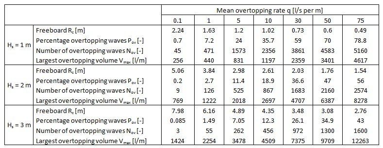
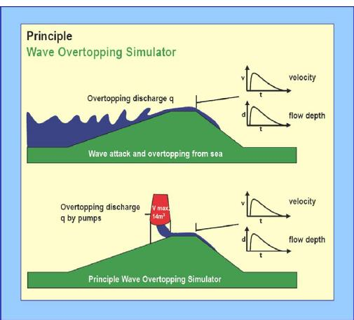
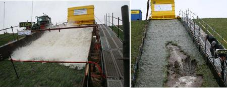

(Sec:Overtopping_quant_single)=
# 5.6 Overtopping quantity of a single wave

So far we have concentrated on the calculation of the mean overtopping rate $q$. This is an important parameter that is often used in practice, but it does necessarily not say much about the load on the inner slope of the dike. For instance, the mean overtopping rate can be caused by an almost constant sequence of a lot of small waves, or by one single wave during a storm that discharges a lot of water over the dike. In both cases the total volume of overtopped water during the storm is the same, so $q$ is the same. However, for a person standing on the dike the effect of experiencing a series of small splashes, or one single big splash, is completely different.

In order to make a proper safety assessment of a levee we need to make a more elaborate analysis. We can do that by looking at more advanced overtopping-related parameters such as:

- The probability that a single wave will overtop, and the expected number of overtopping events during a storm
- The probability distribution of individual overtopping volumes and the largest volume that is expected during a storm
- The associated velocities and layer thicknesses of the overtopping water, and their effect on the strength of the inner slope

(Subsec:Prob_overtop)=
## 5.6.1 Probability of overtopping

The probability that a given wave will overtop is given by the probability that its run-up level is higher than the crest level of the dike. In the previous paragraphs we have established that the run-up levels follow a Rayleigh distribution, that is:

$$
F_{R_{u}}(R_{u}) = Pr(*R*_{u} < R_{u}) =  1-\exp
\left\lbrace
-\left(
\frac{R_{u}}{A}
\right)
^2
\right\rbrace
$$ (Eq:Ray_runup)

in which A is a scale parameter. Since we are commonly using $z_{2\%}$ as a characteristic run-up level, it is practical to express the scale parameter in those terms as well. The value of $A$ follows from the definition that $Pr(R_{u} > z_{2\%}) = 0.02$, so we find $A=z_{2\%} / \sqrt{-\ln{0.02}}$ and finally, for the probability of overtopping:

$$
P_{ov}=1-Pr(*R*_{u} < z_{c})=\exp
\left\lbrace
-\left(
\sqrt{-\ln{0.02}} \cdot \frac{z_c}{z_{2\%}}
\right)
^2
\right\rbrace
$$ (Eq:prob_overt)

The number of overtopping waves during a storm can now be found as:

$$
N_{ov}=P_{ov}\cdot{N_{w}}=P_{ov}\cdot{\frac{T_{storm}}{T_{m}}}
$$ (Eq:num_overt)

in which $N_{w}$ is the number of waves in the storm, $T_{storm}$ is the storm duration in seconds and $T_{m}$ is the mean wave period.

(Subsec:Distr_overtop_vol)=
## 5.6.2 Distribution of overtopping volumes

While the run-up levels follow a Rayleigh distribution, the individual overtopping volumes are no longer Rayleigh distributed due to the various complex and nonlinear processes involved in overtopping. {cite}`BATTJES1974_PhD` made an attempt to derive a distribution for these volumes on theoretical grounds, see section [5.4.2](Subsec:Prediction_overtopping_rates), but his results are not universally applied in practice. 

In general, it is expected that the wave overtopping volumes follow a Weibull distribution, in other words the exponent 2 in the Rayleigh distribution changes to some other value because of the nonlinear processes:

$$
F_{V}=Pr(*V*<V)=1-\exp
\left\lbrace
\left( \frac{V}{a} \right) ^b
\right\rbrace
$$ (Eq:Overtopvol_1)

The values of $a$ and $b$ have been calibrated on physical model tests. {cite}`EUROTOP2007` gives a constant value for the exponent, $b = 0.75$, and a scale parameter that is dependent on the mean overtopping rate: 

$$
a=0.84\cdot{T_{m}}\cdot{\frac{q}{P_{ov}}}=0.84\cdot{q}\cdot{\frac{T_{storm}}{N_{ov}}}
$$ (Eq:Overtopvol_scaleparam_a)

Recent studies have shown that the assumption of a constant exponent b may not be correct, and that this value may in fact be a function of the wave conditions again. {cite}`ZANUTTIGHETAL2013` give:

$$
b=0.73+55\cdot 
\left( 
\frac{q}{g \cdot H_{m0} \cdot T_{m-1,0}}
\right)
^{0.8}
$$ (Eq:Overtopvol_scaleparam_b)

The coefficient $0.84$ in the scale parameter a must then change to $1/\Gamma\cdot{(1+b-1)}$ in order to normalize the distribution mathematically, in which $\Gamma(x)$ is the Gamma function.

### Maximum overtopping volume
The distribution for overtopping volumes can be used to estimate $V_{max}$, the largest overtopping volume in a single wave during the storm. This follows immediately from the observation that the largest wave has a probability of exceedance of “once out of the total number of overtopping waves”, or $F_{V}(Vmax) = 1 - 1/N_{ov}$. Entering this into {eq}`Eq:Overtopvol_1` gives:

$$
V_{max}=a\cdot{(\ln{(N_{ov})})}^{\frac{1}{b}}
$$ (Eq:Max_overtopvol)

Note that this maximum volume can be several orders of magnitude larger than the mean overtopping rate.

### Calculation examples
One of the support documents for the Dutch safety standards for flood defences gives a table in which some of these overtopping parameters have been calculated for various conditions, see {numref}`Fig:Example_Overtopping_TAW`. These values have been derived for a wave steepness $s_{0p}$ = 0.04, an outer slope 1:4 and a storm duration of 6 hours (see {cite}`HTGD2012`). This table provides a good illustration of the points that were made above, for instance it shows clearly that for the same mean overtopping rate, but higher wave conditions, the percentage of overtopping waves Pov goes down and the maximum overtopping volume $V_{max}$ goes up. This table can also be used to get an impression of the order of magnitude of the parameters in various conditions.

<figure>
    
    <figcaption style="text-align: center;">
        Figure: Calculation example overtopping parameters.
    </figcaption>
</figure>

(Subsec:Velocities_inner_slope)=
## 5.6.3 Velocities on inner slope

There has been a considerable degree of research into the velocities and layer thicknesses associated with overtopping waves, because of its relevance to the design of inner slopes of levees. See for instance {cite}`SCHUTTRUMPF2003`, {cite}`VANGENT2003`, {cite}`EUROTOP2007`, {cite}`Rockmanual2007`, {cite}`BOSMANETAL2008`. So far, it has not been possible to derive a theoretical expression for these parameters, and we have to rely on empirical relationships only. The cited investigations have not always been consistent in the shape of the prediction formulas, or the value of the calibrated coefficients. The most recent state of affairs has been summarized by {cite}`VANDERMEERETAL2012`, who give the following formulas for the $2\%$ exceedance values of velocity ($u_{2\%}$) and layer thickness ($h_{2\%}$) at the outer crest line:

$$
u_{2\%}=c_{u2\%} \cdot \left( g \cdot (z_{2\%}-z_c) \right) ^{0.5}
$$ (Eq:Exeed_vel)

$$
h_{2\%}=c_{h_{2\%}}\cdot{(z_{2\%}-z_{c})}
$$ (Eq:Exeed_layerthick)

With $c_{u_{2\%}} = 1.4-1.5$, $c_{h_{2\%}}=0.20$ for slopes 1:3 and 1:4 and $c_{h_{2\%}}=0.30$ for slopes 1:6.

These values apply on the outer crest line. They can serve as the basis to calculate the velocities on the crest and on the inner slope. Literature provides some formulas for these calculations, see for example \citet{SCHUTTRUMPFANDVANGENT2004}. There is still some inconsistency between the values found in various investigations. This is due in part to the practical difficulties to measure velocities in thin layers in a laboratory experiment.

\cite{VANDERMEERETAL2009} note that the velocities calculated in this way correlate strongly to the individual overtopping volumes. They propose a simplified relationship for practical applications:

$$
u=5.0\cdot{V^{0.34}}
$$ (Eq:Vel_cor_overtopvol)

This simplified relationship is only valid in the context for which it was developed, which is the study of overflow velocities in typical Dutch situations with the Overtopping Simulator (see section [5.6.4](Subsec:Develop_netherlands)). Note that the coefficient 5.0 is not dimensionless, so $V$ must be entered using the correct dimensions $[m^3/m]$ and not $[l/m]$.

(Subsec:Develop_netherlands)=
## 5.6.4 Developments in The Netherlands: the wave overtopping simulator

In order to obtain actual information on the erosion resistance of the inner slope, field or laboratory tests are required. Testing this in a laboratory on small scale is difficult because of scale effects, not in the least because the properties of a natural material like grass cannot be scaled down. The alternative is to perform tests in large-scale facilities on full scale, and in fact some of these tests have been performed in the past (see e.g. {cite}`PIONTKOWITZ2009, SMITH1994`) 

However, large-scale laboratory testing of grass slopes can be difficult as well. The grass will need to grow inside the wave flume, which takes time. It can be problematic to obtain a correct representation of the natural grass cover and strength, especially if seasonal influences are included (grass is weaker in the winter when it stops growing). In addition, typical objects on the inner slope of a dike such as concrete staircases, fence poles, trees etcetera cannot be represented in the laboratory at all, nor can effects of burrowing animals. 

A better approach would be to conduct full scale field tests, on an actual dike under real conditions. Of course, generating large waves in a field test is not possible, but this is also not necessary. After all, the topic of interest is the effect of the flow on the crest and the inner slope, not the wave run-up itself. This idea has led to the development of the Wave Overtopping simulator, which is a large tank from which a volume of water can be discharged in a controlled fashion (i.e. in a certain time, with a certain velocity and with a certain layer thickness). Such a set-up can be used to simulate the overtopping during a given storm event, if it is placed on top of the dike and set-up in such a way that it discharges its water in accordance with the expected distribution individual overtopping volumes, velocities and layer thicknesses that we derived in the previous paragraphs. In fact, some of this knowledge was developed specifically for this purpose.

<figure>
    
    <figcaption style="text-align: center;">
        Figure: Principle of the wave overtopping simulator.
    </figcaption>
</figure>

A series of these field tests were carried out at several locations in The Netherlands and Belgium during the period 2007-2009, see {cite}`VANDERMEERETAL2009` for a summary. The locations were chosen such that a variety of inner slope configurations and soil conditions were tested. All tests were done with (simulations of) typical wave conditions for the Dutch levees ($H_{s} = 2.0$ m, steepness $s_{op} = 0.04$). The tests were carried out in the winter, when the grass strength is lowest.

These tests have provided a lot of valuable information about erosion of the inner slope due to overtopping. In general they have shown that the erosion resistance of a grass covered inner slope was higher than expected. The tests have led to the development of some tentative criteria for allowable overtopping, which will be discussed in Section [5.7](Sec:allowable_runupovertop). 

<figure>
    
    <figcaption style="text-align: center;">
        Figure: The wave overtopping simulator in action.
    </figcaption>
</figure>

Recently, overtopping simulators have been developed for similar tests in Vietnam (\cite{LEETAL2014}) and the United States (\cite{VANDERMEERETAL2011}). Also, similar simulators for wave impact and run-up on the outer slope are under development ( {cite}`VANDERMEERETAL2012`).