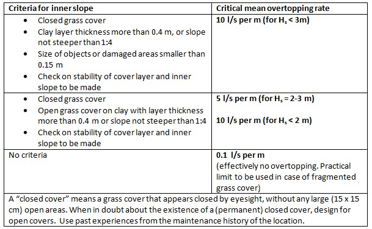

(Sec:allowable_runupovertop)=
# 5.7 Allowable run-up and overtopping

In the previous paragraphs we have derived methods to calculate the run-up and overtopping parameters for a levee. The next step is to establish design criteria for these parameters, i.e. determine critical levels for run-up and overtopping that should not be exceeded. There are various approaches that can be distinguished for this purpose, and these are treated below.

(Subsec:Crit_runup)=
## 5.7.1 Critical run-up levels

A traditional approach is to set a critical run-up level, typically high enough so that practically no overtopping is to be expected. Then there is no reason to worry about overtopping and associated damage to the inner slope anymore. This is therefore a safe and conservative approach.

This approach has been followed in The Netherlands for a long time. The critical run-up was set at the $z_{2\%}$ level. Then still $2\%$ of the waves would overtop, but the associated volume was expected to be low. In fact it can be shown that, if the crest height is equal to the $z_{2\%}$ level, that the mean overtopping rate $q=0.1$ [l/sm] approximately, which is indeed rather low (see Section [5.7.2](Subsec:Crit_overtoprates)).

This approach has been abandoned in the Netherlands, because it is not compatible with the modern philosophy of designing against *failure (inundation) probabilities*. When a dike is made higher than the $z_{2\%}$ run-up level, there is still a large safety margin (resilient strength) before the dike will fail due to overtopping. This margin is unknown, so the actual failure probability cannot be calculated. 

Another reason to abandon this approach is its conservatism, which may lead to over-designed levee levels. It may be better to design a lower dike, allow for some overtopping and make sure that the inner slope is resilient enough to cope with the flow of water. 

(Subsec:Crit_overtoprates)=
## 5.7.2 Critical mean overtopping rates

When the focus shifts from critical run-up to critical overtopping, the most obvious would be to set criteria for an allowable mean overtopping rate. In fact, for many coastal structures such as promenades and breakwaters such criteria have been developed. These are usually linked to the land use of the area immediately behind the structure. 

An example of such a list of criteria is the guidance provided in {cite}`EUROTOP2007`. Other sources may give different lists, but most sources generally agree in the order of magnitude of their recommendations:

-{Safe passage of cars at moderate speeds, untrained drivers (general audience):	$q < 0.01$ l/s} 
-{Safe passage of cars at low speeds, 
trained drivers under special conditions: $q < 10 - 50$ l/s} 
-{Safe passage of unaware pedestrians: $q < 0.05$ l/s}
-{Safe passage of aware pedestrians: $q < 0.1$ l/s}
-{Safe passage of trained staff: $q < 1$ l/s}
-{No damage to buildings: $q < 0.01$ l/s}
-{Acceptable damage to buildings (at 5-10m): $q < 0.5$ l/s}
-{Sinking of small boats, 5-10 m from wall: $q < 10$ l/s}
-{Sinking of larger yachts: $q < 50$ l/s}
-{Damage to the rear side of breakwaters,even if well armoured / protected: $q < 200$ l/s}

These values provide a good baseline for the general safety level of a structure, and will also help to get a feeling for the order of magnitude of mean overtopping values. Note that the safety levels roughly go up by a factor of 5 - 10, so in practice it makes little sense to try to make calculations on a scale more accurate than that.

### Values for design of flood defences
As we have discussed before, such an approach may not be applicable to the design of levees, as the mean overtopping rate does not give direct information about the load on the inner slope. However, if no further information is available, a first approximation can be made using the following:
- The Dutch safety assessment guidelines (\cite{VTV2007}, {cite}`HTGD2012`) give a rough categorization:
\begin {itemize}
- A value lower than $q = 0.1$ l/sm is considered to be very low or negligible. 
- A value in around$ q = 1$ l/sm is considered to be moderate, and could be acceptable in most cases depending on the erosion resistance of the inner slope. 
- Values higher than $q = 10$ l/sm are considered to be high, and would require the designer to be especially careful about the erosion protection of the inner slope. Also, for these rates it is typically necessary to check whether the overtopping volumes do not lead to drainage problems in the low-lying area during the storm. For instance, if the overtopping water has to be retained in an area 1 km wide, there will be a layer of approximately 1 m height in the area after 5 hours storm duration at $q = 50$ l/sm.

\item The tests with the Overtopping Simulator (see Section [5.6.4](Subsec:Develop_netherlands)) have indicated that for an inner slope consisting of a grass cover on a good clay layer, the critical overtopping rate can exceed $q = 30$ l/sm without failure, sometimes even up to $q = 75$ l/sm (\cite{VANDERMEERETAL2009}). It is not the grass cover by itself but rather the combination of grass and clay that determines the erosion resistance of the inner slope:
- If the grass is of good quality but the clay is of poor quality, the grass will fail at approximately this rate and the clay layer will progressively fail not much later.
- If the grass is of poor quality, but the clay layer is good, then the grass will fail earlier but there is a- However, if the clay and the grass are both of poor quality and/or the grass cover is not sufficient, the critical volume is less. In some cases, with poor grass cover on a thin, sandy clay layer, damage development starts already at $q = 1$ l/sm (\cite{HTGD2012})
- Objects in the rear slope such as fences and poles do not have a negative influence on the strength as long as they are smaller than approximately 0.15 m. Larger objects such as concrete staircases and in particular the transition from the inner slope to the inner berm, can be weak spots
- There is some consensus that a value of$ q = 5 - 10$ l/sm is a good lower bound for the stability of crass covered inner slopes. Also, because the mean overtopping rate goes up logarithmically, there is not much economical gain in terms of reduction of crest level if this criterion would be extended to e.g. $q = 30$ l/sm, while the associated uncertainties and the safety risks go up (\cite{VANDERMEERETAL2009}).

It is important to realize that these values have been derived for “typical Dutch” situations, i.e. inner slopes with grass on clay layers (in winter conditions), a typical wave height of$ H_{s} = 2$ m and relatively gentle inner slopes. They cannot be extrapolated to other conditions without due care and further research.
\end{itemize}

These criteria have only been derived for the stability of the inner slope against erosion. In some circumstances another failure mechanism can occur, when the overtopping water penetrates into the soil, increases the pore pressures and causes a macro instability. This failure mechanism is not explicitly treated in these lecture notes. It is commonly assumed (\cite{HTGD2012}) that this mechanism will not occur if either the overtopping is very low ($q < 0.1$ l/sm), the slope is gentle enough (not steeper than 1:4) or if the slope consists of good quality clay. In The Netherlands these circumstances usually apply. In cases where this is not obvious, the occurrence of this failure mechanism should be checked. The Dutch guidelines provide more details of such an assessment, see {cite}`HTGD2012`.

(Subsec:Crit_maxovertopvol)=
## 5.7.3 Critical maximum overtopping volumes

Even though the design criteria for coastal structures are now given in terms of allowable mean overtopping rates (see above), they may be better expressed in terms of an allowable maximum overtopping volume. These maximum volumes might provide a better correlation with the way in which the hazards caused by overtopping flows are experienced, especially by pedestrians and/or the general public at a seaside promenade. Some tentative criteria have been developed, see e.g. {cite}`EUROTOP2007`.

- $V_{max}$ = 1000 to 2000 l/m for trained and safety-equipped staff in pulsating flows on a wide-crested dike;
- $V_{max}$ = 750 l/m for untrained people in pulsating flows on a promenade;
- $V_{max}$ = 100 l/m for overtopping at a vertical wall (where people cannot see the wave coming);
- $V_{max}$ = 750 l/m where overtopping could unbalance an individual by striking their upper body without warning

These limits are not yet used widely in practice, although there is a trend that future design standards may be expressed in terms of $V_{max}$ rather than mean overtopping rates. This is an area of ongoing research.

(Subsec:Crit_velo_innerslope)=
## 5.7.4 Critical velocities on the inner slope, cumulative overload approach

For theoretical reasons, the best way to describe allowable overtopping is by imposing a critical velocity on the inner slope. However, so far it has proved complicated to find a stability relation using the $u_{2\%}$. In addition, there is some evidence that it is not a single wave that will destroy the inner slope, but rather the cumulative effect of a series of waves. For this reason, a cumulative approached has been proposed. This is an approach comparable to the method used to compute the effects of fatigue. Only those cases where the velocity exceeds a certain critical velocity are considered relevant, and the magnitudes of these events are summed over the entire duration of the storm.

Various theories are summarized by {cite}`DEANETAL2010`. One may have the following cases: 

1. Erosion by exceedance of velocity \tab $E=K\cdot{\Sigma}\cdot{(u-u_{c})}\cdot{t}$
1. Erosion by exceedance of the shear stress \tab $E=K\cdot{\Sigma}\cdot{(u^2-u_{c}^2)}\cdot{t}$
1. Erosion by exceedance of the work done \tab $E=K\cdot{\Sigma}\cdot{(u^3-u_{c}^3)}\cdot{t}$

In these formulas $K$ is a coefficient to be determined later. In {cite}`DEANETAL2010` preference is given to option 3. However, based on tests in the Netherlands preference is given to option 2. Option 3 was derived from theoretical considerations assuming a continuous steady overflow, while option 2 appears to correspond better to practical tests and observations where overtopping flow is non-steady and intermittent (\cite{VANDERMEERETAL2010}).

Research into the application of the cumulative overload approach is ongoing, and the method is not yet universally accepted for design. However, the first preliminary results can be used for initial estimates of slope erosion. It seems that the critical velocity is in the order $u_{c} = 4$ to $ 6.3 m/s$, depending on the quality of the grass cover and the clay layer (\cite{VANDERMEERETAL2009, VANDERMEERETAL2010,HTGD2012}). These investigations have resulted in the following tentative criteria, for grass covered inner slopes:

- Start of damage \tab $\Sigma\cdot{(u^2-u_{c}^2)}=500 \ m^2/s^2$ (large spreading)
- Several eroded patches \tab $\Sigma\cdot{(u^2-u_{c}^2)}=1000 \ m^2/s^2$
- Failure of cover layer \tab $\Sigma\cdot{(u^2-u_{c}^2)}=3500 \ m^2/s^2$

For practical purposes, {cite}`HTGD2012` gives tables and design graphs in which the value of $\Sigma\cdot{(u^2-u_{c}^2)}$ is calculated for various combinations of wave conditions and mean overtopping rates, per hour of storm duration. An example of two such tables is given below. Suppose we have a storm of 4 hours, and a wave height of 1 meter. Suppose also that we have a weak clay cover and we assume $u_{c} = 4$ m/s. The first table shows that we expect start of damage ($500 \ m^2/s^2$ after 4 hours, so $125 \ m^2/s^2$2 after 1 hour) at a mean overtopping rate of $q = 19$ l/sm (by interpolation). However, if the same storm has a wave height of 3 meters, we can see from the second table that the same damage occurs at just over $q = 5$ l/sm. If the grass and clay cover would be good, and we use $u_{c} = 6.3$ m/s, the cover would probably never fail for $H_{s} = 1$ m, while it will start being eroded at$ q = 25$ l/sm for $H_{s} = 3$ m.

This examples shows once more that the mean overtopping rate q is not a good stability predictor by itself, and that other parameters such as the wave conditions, the storm duration and the quality of the grass cover on the inner slope also play a role. 

## 5.7.5 Review: recommendations for the stability of inner slopes

It will be clear from the above that the present state of knowledge is not advanced far enough yet to assess the overtopping resistance of a levee in what is theoretically the best way, i.e. by looking at the velocities on the inner slope. In the meantime, an acceptable practical method must be established. 

The table in Figure [5.13](fig-critical-overtopping) gives the requirements that are likely to be included in the new safety standards in 2017. As can be seen, these standards make the pragmatic choice to express their criteria as allowable mean overtopping rates, despite the theoretical shortcomings of such a type of criterion. Apparently the Dutch legislating body considered the alternative methods such as the cumulative overload approach as still too uncertain to be used with confidence in a safety standard. However, the knowledge gained during the development of this method, and the experiences from the Wave Overtopping Simulator tests were implicitly included in the derivation of these numbers.

(fig-critical-overtopping)=
<figure>
    
    <figcaption style="text-align: center;">
        Figure 5.13: Critical mean overtopping rates.
    </figcaption>
</figure>

[^1]: The choice of value of $2\%$ is rather arbitrary. It was selected by Delft Hydraulics around 1940, because it gave a good optimum between accuracy and test duration of the waves.

[^2]: Battjes did not use the modern definition of $\xi_{m-1,0}$. The values given in {cite}`BATTJES1974_PhD` have been re-calculated for this purpose.

[^3]: Note that these characteristic values are one standard deviation above the mean, so they are not $5\%$ exceedance values as is customary in other semi-probabilistic calculations.

[^4]: Note that these characteristic values are one standard deviation above the mean, so they are not $5\%$ exceedance values as is customary in other semi-probabilistic calculations.
