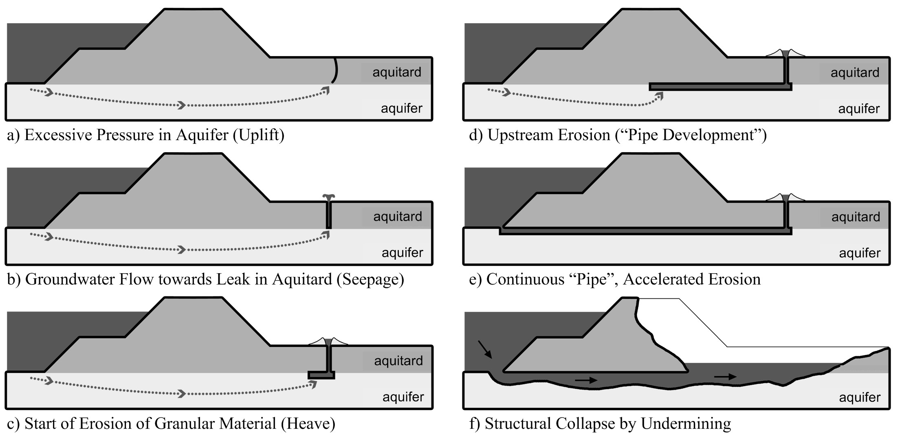

(Sec:ConceptualModel)=
# 7.1. Description of the (sub-)mechanism(s)

According to our current state of knowledge, uplift, heave and piping evolve in the phases as illustrated in Figure [7.2](fig-piping-process):

**a) Uplift** The pore pressures in the aquifer increase due to the large hydraulic head on the river side. If the upward pressure on the landside of the dike exceeds the weight of the blanket layer (aquitard), the latter is lifted up and ruptures.

**b) Seepage** Groundwater starts flowing upward through the ruptured blanket layer. The phenomenon observed at the surface is sometimes called *water boils*.

**c) Start of Erosion (Heave)** If the gradient at the exit point (also called *exit gradient*) exceeds a critical (heave) gradient, sand particles can start eroding.

**d) Backward Erosion** The erosion progresses upstream forming so-called "pipes", networks of erosion channels[^1]. The eroded material around the exit point starts forming sand boils (Figure [7.1](fig-sand-boils)). The erosion may stop even under a constant head difference depending on the ground conditions and flow pattern (see [7.2.5](Sec:Piping)).

**e) Continuous Pipe** If the erosion does not stop and the pipes reach the river, the flow velocity increases drastically due to the loss of hydraulic resistance.

**f) Collapse** The structure is undermined and collapses.

(fig-piping-process)=
<figure>
    
    <figcaption style="text-align: center;">
        Figure 7.2: Phases of the piping process (backward internal erosion).
    </figcaption>
</figure>

As indicated in the description, the process might stop at several points in time. For example, the blanket layer may be thin (if present at all) and ruptured, but the exit gradient insufficient to erode any particles. The limit states and assessment models are based on this conceptual model of the piping process.