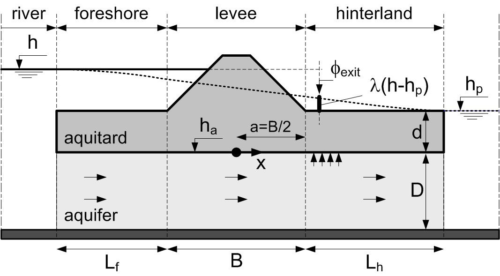
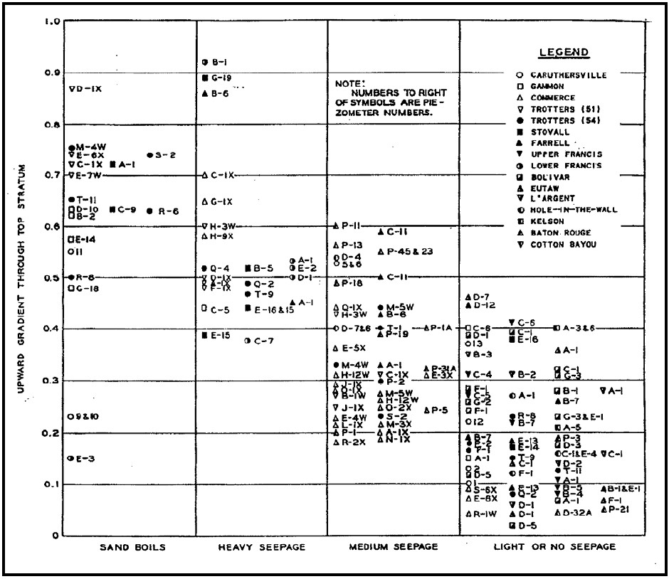
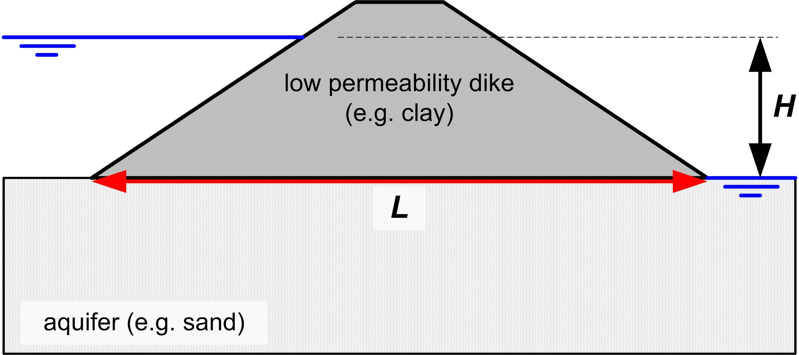
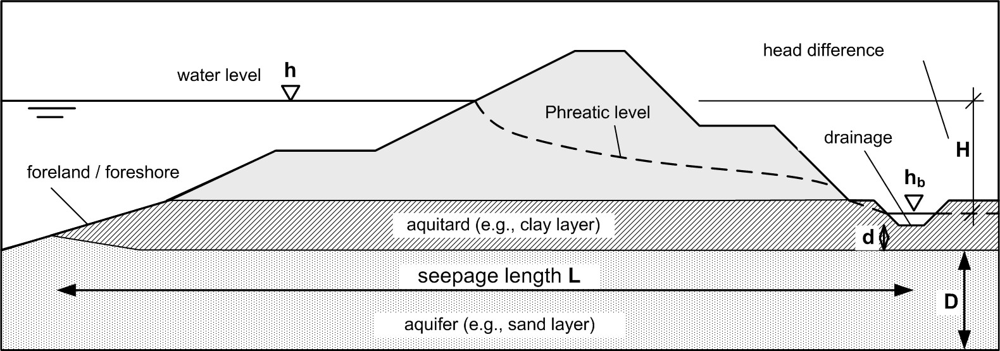
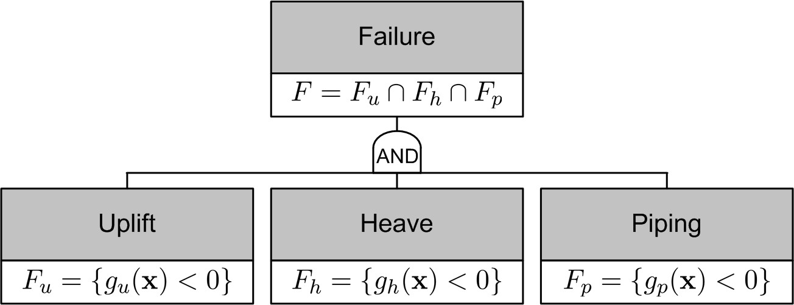

(Sec:internalerosion2)=
# 7.2. Limit states and models

This section gives a brief overview of the limit states and computations for uplift, heave and (backward erosion) piping. Notice that world-wide there are different approaches to assessing piping safety. For example, in the United States a heave criterion is applied to check whether erosion could start at a potential exit point \citet{USACE2005}. On the other hand, in the Netherlands, piping is assessed by an average gradient-based criterion based on \citet{Sellmeijer1988} and piping, heave and uplift are considered as a parallel system.

(Sec:GWFlow)=
## 7.2.1. Piezometric head

Before providing the actual performance functions or limits, we introduce the definitions of the relevant piezometric heads and phreatic levels for evaluating uplift and heave in a cross section. For both mechanisms, we need to estimate the potential $\phi_{exit}$ [m] at the landside exit point. Notice that in the following all surface and phreatic levels are denoted as $h$ (with a subscript), whereas the $\phi$ stand for piezometric heads in the aquifer.

<figure>
    
    <figcaption style="text-align: center;">
        Figure 7.3: Groundwater flow model for an aquifer under an impermeable dike with leakage through the blankets (adopted from {cite}TRWD 2004).
    </figcaption>
</figure>


The most common situation in the Netherlands is an aquifer underlying a (semi-pervious) blanket layer (i.e., aquitard). A blanket may be present in the hinterland as well as in the foreshore. {numref}`Fig:GoundWaterFlow` contains a schematic representation of that situation and the associated groundwater flow model. The potential at the exit point is described by the damping factor $\lambda$ defined as :

$$
\phi_{exit} = h_p + \lambda (h - h_p)
$$ (Eq:DampingFactorLambda)

where $h$ [m] is the (river) water level and $h_p$ [m] is the hinterland phreatic level (both with respect to mean sea level), the latter being assumed equal to the piezometric head in the far hinterland for the sake of simplicity. In general, $\lambda$ can be estimated using groundwater flow models, calibration based on monitoring data or expert judgment. Notice that the so-called exit gradient $i$ (i.e., the gradient in the blanket at the exit point) in this case is defined as

$$
i = (\phi_{exit} - h_p) / d = \lambda (h - h_p) / d
$$ (Eq:ExitGradient)

where $d$ [m] is the thickness of the hinterland blanket.

One possibility to estimate the piezometric heads in such a typical cross section is an analytical groundwater flow model based on Dupuit flow (i.e., predominantly horizontal flow with vertical leakage, see for example {cite}`TRWD2004`. Making a few assumptions about the extent and permeability of the levee and the blankets, the damping factor can be approximated by:

$$
\lambda = \frac{\lambda_h}{L_f + B + \lambda_h} \exp^{(B/2-x_{exit})/\lambda_h} , \quad x_{exit}>B/2
$$ (Eq:phi)

where $x_{exit}$ [m] is the distance of the exit point from the center of the levee footprint, $B$ [m] is the width of the levee, $L_f$ [m] is the length of the (effective) foreshore, $k$ [m/s] is the hydraulic conductivity of the aquifer, $D$ [m] is the aquifer thickness, and $\lambda_h$ [m] is the so-called "leakage factor" for the hinterland section given by

$$
\lambda_h = \sqrt{kDd/k_h}
$$ (Eq:lambda_h)

Where $k_h$ [m/s] is the hydraulic conductivity of the aquitard.

Notice that this is just an example for typical conditions. More details on analytical solutions for different configurations can be found in {cite}`TRWD2004` or in the so-called *blanket equations* {cite}`USACE1956` used in North America. Naturally, also other groundwater flow models can be used to estimate the relevant piezometric heads such as numerical analysis.

(Sec:Uplift)=
## 7.2.2. Uplift

The uplift model used in safety assessments and design in the Netherlands {cite}`TAW1999` and elsewhere is based on a comparison of pore pressures at the upper boundary of the aquifer with the weight of the blanket layer. This leads to the following limit state function:
```{math}
:label: Eq:Zu
\begin{align*}
Z_u = g_u(**x**) 	&= m_u \Delta \phi_{c,u} - \Delta \phi \\
    \Delta \phi_{c,u} 	&= d \frac{\gamma_{sat} - \gamma_w}{\gamma_w} \\
    \Delta \phi 		&= \phi_{exit} - h_p
\end{align*}
```

where $m_u$ is the model factor addressing the uncertainty in the critical head difference (i.e., the resistance model), $\Delta \phi_{c,u}$ [m] is the critical head difference, $d$ the blanket thickness at the exit point, $\gamma_{sat}$ [kN/m$^3$] the saturated volumetric weight of the blanket and  $\gamma_w$ [kN/m$^3$] the saturated volumetric weight of water. 

The corresponding factor of safety is defined as

$$
FoS_u = \frac{\Delta \phi_{c,u}}{\Delta \phi}
$$ (Eq:FoS_u)

using characteristic values (if necessary).

(Sec:Heave)=
## 7.2.3. Heave

While uplift is concerned with the rupturing of the low-permeability, cohesive blanket, heave considers the start of erosion of sand (i.e. aquifer material). The exceedance of a critical heave gradient $i_{c,h}$ is considered a necessary (not sufficient) condition:

$$
Z_h = g_h(**X**) = i_{c,h} - i
$$ (Eq:Zh)

where $i$ is the exit gradient defined in Eq. {eq}`Eq:ExitGradient`. 

The corresponding factor is safety is defined as

$$
FoS_h = \frac{i_{c,h}}{i}
$$ (Eq:FoS_h)

There are numerous approaches for the critical heave (exit) gradient in the literature such as the one by {cite}`Terzaghi1929`:

$$
i_{c,h} = \frac{(1-n)(\gamma_s - \gamma_w)}{\gamma_w} \approx 1.65 (1-n)
$$ (Eq:ic)

where $n$ is the porosity and $\gamma_s$ [kN/m$^3$] is the volumetric weight of sand grains (=26.5 kN/m$^3$). Notice that various scholars after Terzaghi have developed variations of his approach (e.g., \citealp{Harza1935,Bazant1953,Davidenkoff1956}), which tend to result in lower critical gradients. 

Experimental and field observations such as shown in {numref}`Fig:USACE_crit_exit_grad_obs` suggest that the value is something between 0.5 and 0.9. The critical heave gradient can a-priori be assumed lognormal distributed with the following mean and standard deviation: $i_{c,h} \sim LN(0.7,0.1)$, the characteristic value is usually assumed to be 0.5. 

<figure>
    
    <figcaption style="text-align: center;">
        Figure 7.4: Severity of seepage as related to upward gradient through top stratum (from {cite}USACE 1956, Vol. 1, Figure 47).
    </figcaption>
</figure>


With respect to {numref}`Fig:USACE_crit_exit_grad_obs` it should be noted that from experience in the U.S. sand boils were also observed for rather low gradients. However, later reviews (e.g. \citealp{Wolff1994}) exhibit doubts about the measured gradients with those observations for the pressure release effect in the vicinity of the exit point. That means that the actual gradients at the observations were probably higher.

(sec:Bligh)=
## 7.2.4. Bligh and Lane

\citet{Bligh1910} was the first to treat the issue of piping for dams and levees scientifically. After having stated that the stability of a weir on a porous foundation depended on the weight of the structure in the first edition of "Practical Design of Irrigation Works" {cite}`Bligh1907`, he revised his opinion and stated that the stability depends on the length of the percolation path or seepage length. He also realized that piping-resistance decreased with decreasing grain size. After analyzing a large number of dams, mostly for irrigation, in India, both failed and intact, he established empirical coefficients relating the required seepage length $L_d$ [m] (design value of the resistance) to the head difference $H_d$ [m] (design value of the load) by: $L_d = c H_d$. These percolation factor $c$ depended on the grain size of the erodible material in the aquifer. Intuitively, that makes sense, since $H/L$ is the average hydraulic gradient, the driving force for flow velocity and thereby erosion. 

In safety assessments the seepage length $L$ [m] is given and the performance function can be written as:

$$
Z_p = g_p(**X**) = L/c - H \quad \Leftrightarrow \quad Z_p = L - c \cdot H
$$ (Eq:BlighLSF)

Bligh chose the coefficient $c$ as a relatively safe value for design purposes. Designing a foundation with a seepage length of $c$ times the head difference should give "perfect confidence in its stability" {cite}`Bligh1915`. This conservatism needs to be kept in mind when using Bligh's percolation coefficients $c$ in a probabilistic analysis, as addressed by \citet{Kanning2012_PhD} who assessed the bias included in the percolation factor.

{
\begin{table}[htb] 
\caption{Design percolation factors $c$ based on {cite}`Bligh1915` as applied by \citet{TAW1999}}
  \centering
  \label{Tab:BlighFactors}

\begin{tabular}{lll}
  \hline
  Soil Type & median grain diameter $d_{50}$ [$\mu$m] & Percolation Factor $c$ \\
  \hline
  very fine sand        & $<$ 150       & 18 \\
  medium-fine sand      & 150 - 300     & 15 \\
  coarse sand           & 300 - 2000    & 12 \\
  gravel                & $>$ 2000      & $<$ 12 \\
  \hline
\end{tabular}
\end{table}}

<figure>
    
    <figcaption style="text-align: center;">
        Figure 7.5: Horizontal seepage length (L) and head difference (H) in Bligh's rule.
    </figcaption>
</figure>


The next major insight was reported by \citet{Lane1935} along with a corresponding proposed design rule. In his analysis of a large number of dams he distinguished between horizontal and vertical percolation paths. He found that vertical paths offered a 3 times higher resistance than horizontal ones. Since the focus in this chapter is on river dikes, vertical seepage paths are of minor relevance and will not be considered.

(Sec:Piping)=
## 7.2.5. Sellmeijer

Piping resistance is usually expressed in terms of a critical head difference $H_c$ [m] or sometimes a critical piping gradient $i_{c,p} = H_c / L$ (where $L$ is the seepage length [m]). Models formulated this way refer to average gradients addressing the piping process (phases b to e in Fig.\ref{Fig:PipingProcess}) as opposed to another class of models addressing local gradients dominating the start of erosion (phase c in {numref}`Fig:PipingProcess`) like uplift and heave.
\begin{figure}[htb]

<figure>
    
    <figcaption style="text-align: center;">
        Figure 7.6: Definitions for piping assessment models.
    </figcaption>
</figure>


Sellmeijer developed a theory on piping stability based on the flow pattern generated by the head difference between the waterside and the landside water level - the driving force of internal erosion - and the erosion resistance of the sand grains in a partially developed piping channel ({numref}`Fig:SellmeijerGrainStability`). Using local stability criteria for sand grains, stability criteria were derived for levee safety assessment and design purposes in the Netherlands \citet{TAW1999}.

<figure>
    
    <figcaption style="text-align: center;">
        Figure 7.7: Erosion of sand grains in a piping slit {cite}`Sellmeijer1988`. For a river levee, the high water level would be on the right-hand side.
    </figcaption>
</figure>


Recently, a major effort in the Netherlands involving physical modes tests up to prototype scale {cite}`VanBeek2012` has led to a revision of the Sellmeijer formula (see also \citealp{Sellmeijer2012}). The performance function (related to {numref}`Fig:PipingDefinitions`) reads:

$$
Z_p = g_p(**X**) = m_p H_c - H = m_p H_c - (h - h_p - 0.3d)
$$ (Eq:SellmeijerLSF)

where
    \begin{tabular}{ll}
        $m_p$     & model (uncertainty) factor  \\
        $H_{c,p}$ & critical head difference [m] \\
        $H$       & head difference [m] \\
        $h$       & water level at the entry point (water side) [m] \\
        $h_p$     & phreatic level at the exit point (land side) [m] \\
        $d$       & thickness of the blanket layer [m] \\
    \end{tabular}
The critical head difference in the revised version is given by:
\begin{eqnarray}\label{Eq:SellmeijerRev}
  H_{c,p} &=& F_1 F_2 F_3 L \\
  \nonumber F_1 &=& \eta \left( \frac{\gamma_s}{\gamma_w}-1 \right) \tan \theta \\
  \nonumber F_2 &=& \frac{d_{70m}}{\sqrt[3]{\frac{\nu k L}{g}}} \left( \frac{d_{70}}{d_{70m}} \right)^{0.4}  \\
  \nonumber F_3 &=& 0.91 \left( D/L \right)^{\frac{0.28}{(D/L)^{2.8} - 1}+0.04}
\end{eqnarray}
where
    \begin{tabular}{ll}
        $L$         & seepage length [m] \\
        $\gamma_s$  & volumetric weight of sand grains (=26.5 kN/m$^3$) \\
        $\gamma_w$  & volumetric weight of water (=10 kN/m$^3$) \\
        $\theta$    & bedding angle [deg] \\
        $D$         & thickness of the aquifer [m] \\
        $\eta$      & drag factor coefficient \\
        $\nu$		& kinematic viscosity of water (=1.33 $10^{-6}$ m$^2$/s) \\
        $d_{70}$    & 70\%-fractile of the grain size distribution [m] \\
        $d_{70m}$ 	& reference value for $d_{70}$ [m] \\
        $g$         & gravitational constant (=9.81 m$^2$/s) \\
        $k$         & specific conductivity [m/s]
    \end{tabular}
Note that the $d_{70}$ refers to the the piping-sensitive layer, often fine sand underlying a blanket layer. This formula is supposed to be used for safety assessments in the Netherlands in the near future. The corresponding factor of safety is defined as:

$$
FoS_p = \frac{H_c}{h-h_p-0.3d}
$$ (Eq:FoS_p)

(Sec:PipingParallelSystem)=
## 7.2.6. Parallel system

Backward internal erosion failure as considered in the conceptual model presented in {numref}`Sec:ConceptualModel` can only occur if the uplift, heave and piping limit states are all exceeded. In system reliability terms, this can be described by a parallel system, for which the failure set of the failure mode is the intersection of the separate failure mechanisms:

$$
F = F_u \cap F_h \cap F_p 
      = \{\{g_u(**x**) < 0\} \cap \{g_h(**x**) < 0\} \cap \{g_p(**x**) < 0\}\}
$$ (Eq:SystemFailure)

In a fault tree representation ({numref}`Fig:PipingFaultTree`) the events are connect by and *AND*-gate.
\begin{figure}[htbp]

<figure>
    
    <figcaption style="text-align: center;">
        Figure 7.8: Fault tree uplift, heave and piping
    </figcaption>
</figure>


This notion is important not only to evaluate safety but also for measures to improve safety. Taking measures on either mechanism can improve the overall safety. This holds for uncertainty reduction as well as for physical retrofitting.
