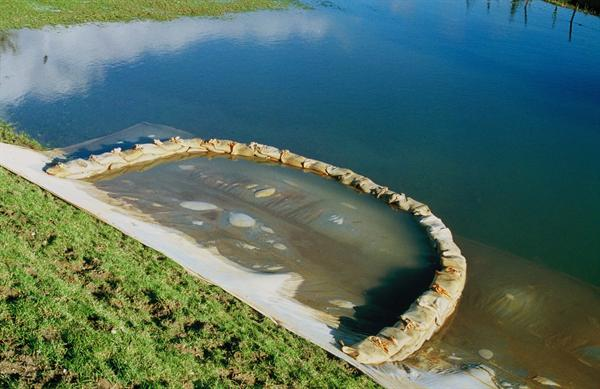
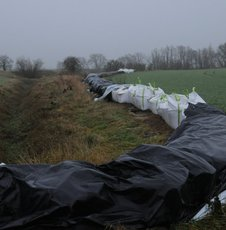
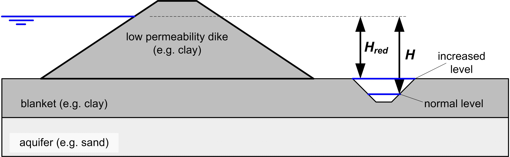

(Sec:internalerosion4)=
# 7.4. Emergency counter-measures

In severe flood situations, dike patrols can be deployed to monitor dikes and other flood defences for any visual signs of bad dike performance or imminent failure. The most common processes to be observed in visual inspections for backward erosion piping are heavy seepage and sand boils. The most common measures that can be taken, when such phenomena are observed  are described below. If there are known weak spots by experience during previous floods, such measures can also be taken pre-emptively. In general, they are however less reliable than structural measures mainly due to the logistics and potential human error involved, and should not be considered as alternative to dike reinforcement without thorough (reliability) analysis of their effectiveness.  

## 7.4.1. Sand bag rings (in Dutch: *opkisten*)

When actual sand boils are detected, the exit points can usually be clearly identified. The conventional counter-measure in this situation is to build a ring of sand bags around the boil. Figure [7.13](fig-opkisten) shows a ring of sand bags connected to the inner berm at the dike toe. In other situations sand boils can be farther from the toe line and the containment is entirely built from sand bags, thus not necessarily connecting to the dike. The basic principle is that the water level inside the sand bang ring or cylinder rises, acting as a counter pressure. Ideally, the water level rises to such a degree that the head difference between the bottom and the top of the blanket (or over the overall structure, i.e. outside water level minus inside water level) decreases sufficiently, and the groundwater flow with it, to stop the internal erosion process. 

(fig-opkisten)=
<figure>
    
    <figcaption style="text-align: center;">
        Figure 7.13: Ring of sand bags connected to the inner berm at the dike toe. The bottom of the containment is covered by a geotextile to prevent the transport of soil particles. Source: beeldbank.rws.nl.
    </figcaption>
</figure>

Sometimes geotextiles are used to cover the the boil before building the actual ring of sand bags to prevent further soil erosion and only allow outflow of seepage water. The effectiveness of the geotextiles is ambiguous in this application and has not been proven by systematic research so far.

## 7.4.2. Parallel dams (in Dutch: *kwelkades*)
Instead of building rings of sand bags around individual wells, small dikes or dams can be built parallel to the actual dike. This is particularly effective for situations with a large concentration of well in areas that can be reasonably surrounded by these small dams. 

<figure>
    
    <figcaption style="text-align: center;">
        Figure 7.14: Temporary dam of big bags parallel to the main dike for enclosing areas with (large concentrations of) sand boils. The water level inside the enclosed area is raised to reduce the head difference with the outside water level in order to stop internal erosion.
    </figcaption>
</figure>

Typically, the logistics for such dams need preparation long before the actual emergency. In some cases, these auxiliary dams are made permanent and integrated into the landscape. The basic concept is the same as for individual rings of sand bags; the rising water level in the surrounded area rise and the head difference is reduced. In planning the location of such dams, the right balance must be struck between two aspects in finding the appropriate distance to the toe: (a) if the dam is too close to the dike, sand boils may appear on the landside of the dam, while (b) if the dam is too far, the water level will rise insufficiently to stop the erosion.

## 7.4.3. Increase of water levels in ditches or canals (in Dutch: *slootpeil opzetten*)

If sand boils are located in ditches or canals, it can be sufficient to increase the water level in the ditches or canals themselves to reduce the head difference and stop the erosion. Sometimes it will be necessary to close the ditches around the critical locations to the avoid the water disappearing the in the canal system and achieve an effective and fast increase of the water level.

(fig-slootpeil-opzetten)=
<figure>
    
    <figcaption style="text-align: center;">
        Figure 7.15: Reducing the head difference by increasing the water level in a ditch or canal prone to sand boil formation.
    </figcaption>
</figure>

Figure [7.15](fig-slootpeil-opzetten) shows the effect of increasing the water level in a ditch or canal on the head difference. Notice that if the erosion cannot be stopped by bringing the water level to the top of the channel, the measure can be complemented by a small dam just on its landside in order to be able to increase the water level even further.

