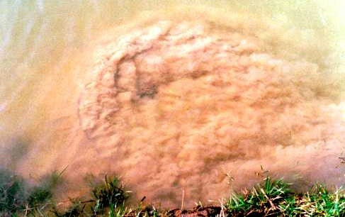
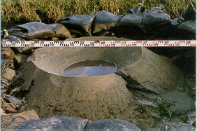

(Ch:Piping)=
# 7. Internal erosion (piping)

    <em>T. Schweckendiek</em>

There are many types of internal erosion which are relevant for dikes and earthen embankments in general. This chapter is restricted to the phenomenon *backward erosion piping* (also called *under-seepage* or just *piping*), as this is the relevant type for dikes with low-permeability dike bodies. For an overview of other types, typically relevant for sand dikes, refer to the International Levee handbook {cite}`LeveeHandbook`. 

Note for students: sections with required knowledge for the course CIE5314 Flood Defences are [7.1](Sec:ConceptualModel), [7.2](Sec:internalerosion2), [7.3](Sec:internalerosion3) and [7.4](Sec:internalerosion4). The other sections provide additional information, and are still highly recommended to read. Note that sometimes the terms *internal erosion* and *piping* are used interchangably, which can cause confusion with the sub-mechanism also named *piping* ([7.2.4](sec:Bligh)--[7.2.6](Sec:PipingParallelSystem)).

<figure>
    
    
    <figcaption style="text-align: center;">
        Figure 7.1: Sand boils: in action (left) and after flood event (right), courtesy of Rijkswaterstaat.
    </figcaption>
</figure>

#### Learning objectives
After studying the stability chapter students are able to:
- explain the basic the sub-mechanisms leading to piping failure and their interaction. 
- explain the different types of modelling and assessment, including their advantages and drawbacks (i.e. know which type is appropriate in which situation).
- perform a basic piping analysis using analytical approaches for typical Dutch river dikes. 
- explain and choose between the most common design options to increase a dike's resistance to backward erosion piping as well as common emergency measures in case of an imminent threat.

This chapter could also serve as a background and reference document for students and professionals that want to perform safety assessments and designs of dikes for internal erosion aspects. Additional guidance related to reliability-based design is also included in {numref}`Ch:Safety_asses`.