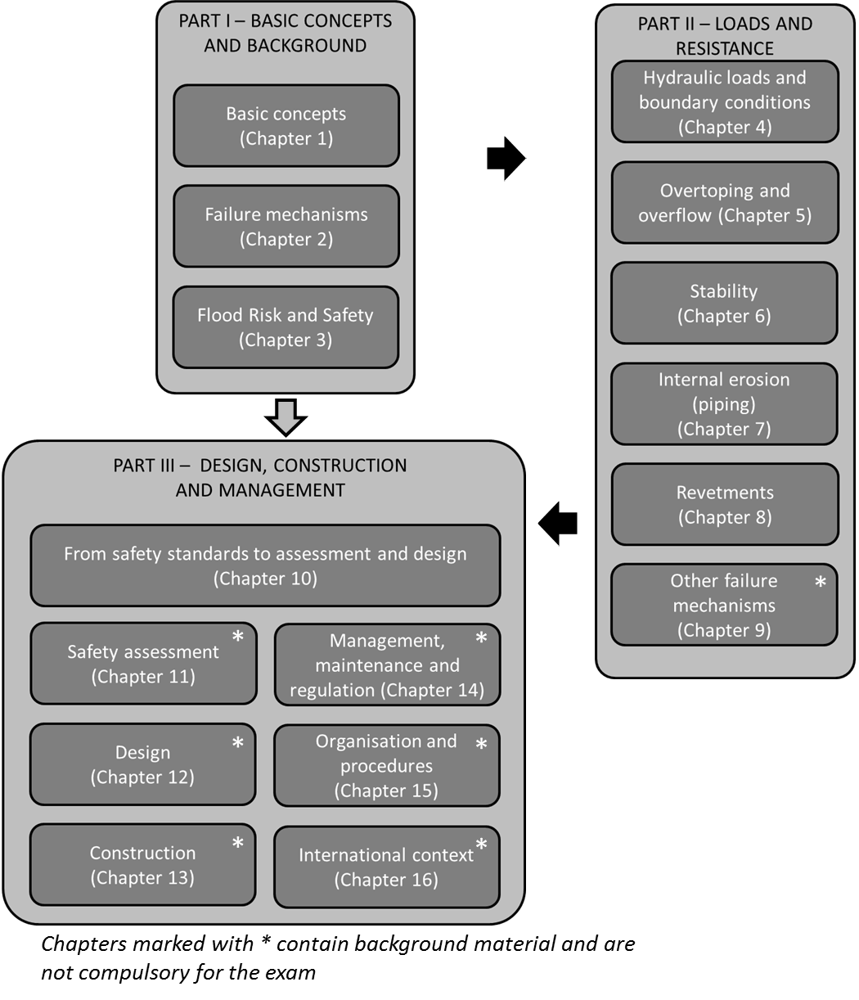

# Introduction to the Lecture Notes

## General
The majority of the global population is located in deltas, coastal areas and along rivers. These areas are prone to flooding. Therefore often flood defences, such as dikes, barriers and dunes, are applied to provide protection. Failure of these flood defences (also named levees, dikes or embankments) during extreme events can lead to enormous damage and loss of life. Examples of catastrophic floods include the 1953 storm surge disaster in the Netherlands and the flooding of New Orleans after hurricane Katrina in the year 2005. Therefore, an understanding of the functioning, safety and vulnerability of flood defences is essential to come to reliable and cost-effective designs and management schemes.

In the Netherlands, the majority of the population is located in flood prone areas. The primary flood defence system along the rivers, coasts and lakes is thus of critical importance for the nation, and it has a total length of almost 3800 km. The most recent safety assessment of the Dutch flood defences showed that one third of the defences is not safe enough according to the current standards. Therefore, a large national dike reinforcement program is now implemented. In addition, new safety standards will be implemented in the (near) future that will require asset managers to assess and design their defences based on the concept of flooding probabilities. For these programs, a lot of expertise is required in the field of flood protection and several related topics such as the physics of failure mechanisms and risk analysis. 

The course CIE5314[^1] Flood Defences and these lecture notes intend to provide information on the basic principles of flood defences, but they also aim to provide some insight in state-of-the art knowledge in fields such as flood risk analysis and understanding of failure mechanisms. Some of the topics are only briefly treated in this course but are important research themes in the department of hydraulic engineering at TU Delft and the faculty. Examples of these topics are: reliability analysis, geotechnical failure mechanisms, breach growth, flood risk analysis and the design of storm surge barriers and multifunctional flood defences. For some of these topics more in-depth information can be provided upon request in the form of research papers and reports.

The first lecture notes for the course on Flood Defences were prepared by J.B.A. Weijers and M. Tonneijck. A major update was prepared in the summer of 2015, with subsequent revisions made for the course year 2016-2017 and 2020-2021. Changes in the most recent edition include a number of simple corrections to the text and minor updates of technical content in Chapters 4, 5 and 10. Writing and editing of these lecture notes is an ongoing progress which is expected to continue in the years to come. Feedback and suggestions by students and readers is therefore most welcome and can be sent to [R.C.Lanzafame@tudelft.nl](mailto:R.C.Lanzafame@tudelft.nl).

## Course objectives and materials
These lecture notes are part of the course CIE5314 Flood Defences. After completion of the course students are expected to be able: 
- To explain the principles, objectives and types of flood defences and their functioning, including relevant aspects such as failure modes and risk assessment and the societal context;
- To apply (basics of) relevant methods and models for flood risk analysis, design and safety assessment of flood defences.	
- To perform a (simplified) safety assessment and to make design of a flood defence; 

As part of the overall course, an exercise will be included in which some of the approaches and methods taught in this course will be applied to an actual case dike. The slides of the lectures will also be a part of the course materials and may provide additional information.

### Scope of the course
The scope of the course is characterized as follows: The course focuses on dikes (water-retaining soil structures), but other types of flood defences such as flood walls and gates are treated as well. It is noted that other types of flood defences, such as dunes and hydraulic structures are treated in other M.Sc. courses at TU Delft in more detail. A lot of attention is paid to the Dutch situation (loads and geotechnical properties), but international examples and design practices are included as well. The course mostly addresses large-scale flooding from the rivers, coast or lakes. Smaller-scale flooding (e.g. from rainfall) or tsunami flooding are not treated in the course.

## Structure of the lecture notes
The lecture notes have been organized in three parts (see figure). The sequence of the lectures in the course mostly follows the sequence of chapters and parts in these lecture notes.
Part I introduces some general concepts of flood defences and flood risk ([chapter 1](ch-flood-defences)) and provided a general introduction to the main failure modes ([chapter 2](ch-failure-mechanisms)). The final chapter of Part I ([chapter 3](ch-flood-risk-analysis)) focuses on flood risk analysis, which forms an important basis for the evaluation of failure mechanisms (part II) and design (part III).

Part II deals with the loads and strength of flood defences. Firstly, hydraulic loads ([chapter 4]Ch:HydraulicLoads) are introduced at a general level. Then, typical failure mechanisms for dikes are treated in more detail, such as overtopping and overflow ([chapter 5]Ch:Overtopping), instability ([6]Ch:Stability), internal erosion or piping ([7]Ch:Piping) and failure of revetments [8](Ch:Revetments).

Part III takes a more process-based approach. The first chapter ([chapter 10]CH:Saf_stand_ass_design) combines the previous elements of flood risk and failure mechanisms into a framework for design and assessment of flood defences and the related safety standards. These elements are then worked out in some more detail, taking the situation in The Netherlands as an example. [Chapter 11]Ch:Safety_asses will treat the dutch Safety Assessment cycle and chapters [12]Ch:Design and [13]Ch:construction will treat the specifics of the design process and construction stage issues, respectively. [Chapter 15]CH:organisation_procedures provides more details about the (dutch) governmental organization and legal procedures related to flood defences. The lecture notes are concluded by a chapter on international context and examples ([Chapter 16]Ch:Int_compar).

**Important notice to students:** Chapters 9 and 11-16 contain background material and are not compulsory for the exam, although the material is obviously relevant and will help place much of the remaining chapters in context (with the exception of issues that may be discussed during the lectures, if any). In particular, parts of Chapter 12 may help complete the course design exercise. For the other chapters, some sections or paragraphs may contain non-compulsory material as well, which will be indicated by means of a "note to students" in the beginning of the chapter. If nothing is mentioned, the entire chapter is compulsory.

### Relation to the Dutch context
This course is intended to be suited to an international context and audience. It does not intend to be a training course in application of the Dutch (or any other) safety standards or design guidelines. The general concepts of Part I and the physical processes described in Part II are applicable in all situations. The more process-based Part III is centered around examples from the specific Dutch context. 
The Dutch standards for design and assessment of Flood Defences are in constant development. The year 2017 saw a major paradigm shift in the philosophy and approach towards flood safety in The Netherlands, and a subsequent significant revision of the Dutch safety standards. These lecture notes were written early in 2017, while the details of this revision were still taking shape. Despite the best intentions of the authors, some details provided in these lecture notes will deviate from the final version of the safety standards and corresponding guidelines. The most recent editions of key guidance documents and frequently asked questions about the Dutch standards can be found online through the resources listed below.

<figure>
    
    <figcaption style="text-align: center;">
        Outline of the lecture notes CIE5314 Flood Defences
    </figcaption>
</figure>

## Further reading
Besides the material discussed in the present lecture notes, there is very useful material in the literature where aspects beyond the scope of this document are explained in more detail. The table below contains a selection or references students or practitioners may consult.
More suggestions are included throughout these lecture notes.

## Further reading
Besides the material discussed in the present lecture notes, there is very useful material in the literature where aspects beyond the scope of this document are explained in more detail. The table below contains a selection or references students or practitioners may consult. More suggestions are included throughout these lecture notes.

| **Reference** | **Description / links** |
|---------------|-------------------------|
| International Levee Handbook | The International Levee Handbook is extensive (>1300 pages) co-production of experts from several countries covering the international common ground in levee assessment, design, construction etc. It can be downloaded from [www.leveehandbook.net](http://www.leveehandbook.net/). |
| Fundamentals of flood protection, or Grondslagen voor hoogwaterbescherming, in Dutch {cite}`Kok16` | This booklet was published to support the introduction of the new philosophy towards Flood Risk in The Netherlands. It contains a good description of many general concepts that are also treated in these lecture notes. An [English and Dutch](https://www.enwinfo.nl/publicaties/) version are available. |
| Documents specific to Dutch flood defences | Numerous documents are accessible online, in particular the [Waterwet](https://wetten.overheid.nl/BWBR0025458/2021-01-01) (in particular the Appendices, or bijlagen in Dutch), the [Water Safety Portal](https://waterveiligheidsportaal.nl/#/home) and [Helpdesk Water](https://www.helpdeskwater.nl/onderwerpen/waterveiligheid/primaire/) for primary flood defences. While the vast majority of these documents are written in Dutch, an increasing number have been written in English in recent years, in particular the more theoretically-oriented background reports from Deltares. Publications in scientific journals and conference proceedings can also be found related to older technical reports originally written in Dutch. English language references have been used whenever possible in these lecture notes. |

[^1]: in academic year 2019-20 the course code was changed to CIE5314-19, but the old course code is used in this document

